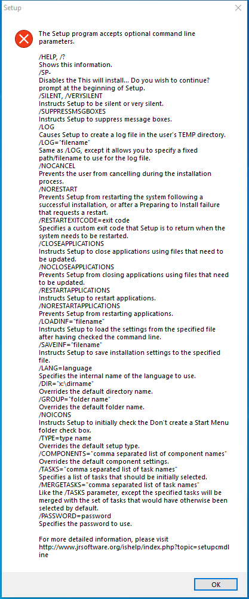

---
title: peazip-configuration.exe | PeaZip configuration Setup                                  
excerpt: What is peazip-configuration.exe?
---

# peazip-configuration.exe 

* File Path: `C:\program files\PeaZip\res\peazip-configuration.exe`
* Description: PeaZip configuration Setup                                  
* Comments: This installation was built with Inno Setup.

## Screenshot

## Hashes

Type | Hash
-- | --
MD5 | `24A4C81CB50CC7F7FC9956B394655953`
SHA1 | `ADF0A01179FED60E3F40EE38AB97C1FBE1597A70`
SHA256 | `65AA98CAB753E34DB7C91606BE961C93915AF03F1CFC08D4699A7E3033401BAE`
SHA384 | `E46638C66F4D654308B1804BE191451ACC48D655753C2F4EF735EC3BA58E095403A17E7038E5D0535AB0722CCBBE2C92`
SHA512 | `CC98FA4263FE65AC6D34F62C3B2BFCA509F313581F2980F56B3C6CD4A5D5561F29E1827B9F9BC811B9F6BD1D1C2959049F9256DE2069C7DF98F015D0F3E122F9`
SSDEEP | `12288:EadLWD++888888888888W88888888888VzBIiGBoT6+5+OP1Heo7JSN0AyUw8DJK:jBWJdIiMK+2deYcSzIDJG/`

## Runtime Data

### Child Processes:
peazip-configuration.tmp

### Window Title:
Setup

### Open Handles:

Path | Type
-- | --
(R-D)   C:\Windows\System32\en-US\KernelBase.dll.mui | File
(R-D)   C:\Windows\System32\en-US\netmsg.dll.mui | File
(RW-)   C:\Users\user\Documents | File
(RW-)   C:\Windows | File
(RW-)   C:\Windows\WinSxS\x86_microsoft.windows.common-controls_6595b64144ccf1df_6.0.19041.1_none_fd031af45b0106f2 | File
\BaseNamedObjects\NLS_CodePage_1252_3_2_0_0 | Section
\BaseNamedObjects\NLS_CodePage_437_3_2_0_0 | Section
\Sessions\1\Windows\Theme4048709601 | Section
\Windows\Theme603176458 | Section

### Loaded Modules:

Path |
-- |
C:\program files\PeaZip\res\peazip-configuration.exe |
C:\Windows\SYSTEM32\ntdll.dll |
C:\Windows\System32\wow64.dll |
C:\Windows\System32\wow64cpu.dll |
C:\Windows\System32\wow64win.dll |

## Signature

* Status: The file C:\program files\PeaZip\res\peazip-configuration.exe is not digitally signed. You cannot run this script on the current system. For more information about running scripts and setting execution policy, see about_Execution_Policies at https:/go.microsoft.com/fwlink/?LinkID=135170
* Serial: ``
* Thumbprint: ``
* Issuer: 
* Subject: 

## File Metadata

* Original Filename: 
* Product Name: PeaZip configuration                                        
* Company Name: Giorgio Tani                                                
* File Version:                     
* Product Version:                                                   
* Language: Language Neutral
* Legal Copyright:                                                                                                     

## File Similarity (ssdeep match)

File | Score
-- | --
[C:\Program Files\PeaZip\res\peazip-configuration.exe](peazip-configuration.exe-3D0D7BD27D3EF365238722121712E9A7.md) | 82
[C:\Program Files\PeaZip\res\peazip-configuration.exe](peazip-configuration.exe-94C1FA1C9085ACD6A5C5C88722F702E9.md) | 85

MIT License. Copyright (c) 2020-2021 Strontic.

