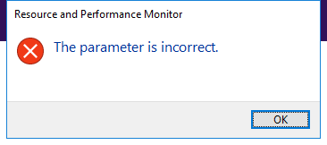

---
title: perfmon.exe | Resource and Performance Monitor
---

# perfmon.exe 

* File Path: `C:\Windows\SysWOW64\perfmon.exe`
* Description: Resource and Performance Monitor

## Screenshot



## Hashes

Type | Hash
-- | --
MD5 | `6284C86A1AE399794C18FBBC86CC8340`
SHA1 | `06D3C338A1C30921DD8544F117F43497AD111E86`
SHA256 | `3FA716B87491BDC9A01EC636F0010A028552D224EEC64334F7669206C69CFFF2`
SHA384 | `F362E0489C49CF03F64FAE91156C18D219DF29374A65FC929C27D90816EC8CE4C91B45DA01C7758DB6583441D0EF7E4E`
SHA512 | `822F9150CFB661897B61D97F15EE2B3B20D6100A5B3976E401176244C1AB63978ECCCEBE313DDBCA99E8F8E66A158026106340BEBA821060C38FA62966977AA1`
SSDEEP | `3072:gHuEgHwz/iUZPGghtYIo9piswTogiqQKy349e:gYHcKUZrhqIo9s37iTK24I`

## Runtime Data

### Usage (stdout):
```cmhg
Argument '-help' is unknown.

```

### Window Title:
Resource and Performance Monitor

### Open Handles:

Path | Type
-- | --
(R-D)   C:\Windows\Fonts\StaticCache.dat | File
(R-D)   C:\Windows\System32\en-US\duser.dll.mui | File
(R-D)   C:\Windows\System32\en-US\KernelBase.dll.mui | File
(R-D)   C:\Windows\System32\en-US\perfmon.exe.mui | File
(R-D)   C:\Windows\SystemResources\imageres.dll.mun | File
(R-D)   C:\Windows\WinSxS\x86_microsoft.windows.c..-controls.resources_6595b64144ccf1df_6.0.19041.1_en-us_130e63d987a738df\comctl32.dll.mui | File
(RW-)   C:\Users\user | File
(RW-)   C:\Windows | File
(RW-)   C:\Windows\WinSxS\x86_microsoft.windows.c..-controls.resources_6595b64144ccf1df_6.0.19041.1_en-us_130e63d987a738df | File
(RW-)   C:\Windows\WinSxS\x86_microsoft.windows.common-controls_6595b64144ccf1df_6.0.19041.1_none_fd031af45b0106f2 | File
\BaseNamedObjects\C:\*ProgramData\*Microsoft\*Windows\*Caches\*{6AF0698E-D558-4F6E-9B3C-3716689AF493}.2.ver0x0000000000000002.db | Section
\BaseNamedObjects\C:\*ProgramData\*Microsoft\*Windows\*Caches\*{DDF571F2-BE98-426D-8288-1A9A39C3FDA2}.2.ver0x0000000000000001.db | Section
\BaseNamedObjects\C:\*ProgramData\*Microsoft\*Windows\*Caches\*cversions.2.ro | Section
\BaseNamedObjects\NLS_CodePage_1252_3_2_0_0 | Section
\BaseNamedObjects\NLS_CodePage_437_3_2_0_0 | Section
\Sessions\1\BaseNamedObjects\C:\*ProgramData\*Microsoft\*Windows\*Caches\*{F79646A6-8BE5-443B-A98F-AD03D667F646}.2.ver0x0000000000000001.db | Section
\Sessions\1\BaseNamedObjects\SessionImmersiveColorPreference | Section
\Sessions\1\Windows\Theme1149834063 | Section
\Windows\Theme2597483563 | Section


### Loaded Modules:

Path |
-- |
C:\Windows\SYSTEM32\ntdll.dll |
C:\Windows\System32\wow64.dll |
C:\Windows\System32\wow64cpu.dll |
C:\Windows\System32\wow64win.dll |
C:\Windows\SysWOW64\perfmon.exe |


## Signature

* Status: Signature verified.
* Serial: `3300000266BD1580EFA75CD6D3000000000266`
* Thumbprint: `A4341B9FD50FB9964283220A36A1EF6F6FAA7840`
* Issuer: CN=Microsoft Windows Production PCA 2011, O=Microsoft Corporation, L=Redmond, S=Washington, C=US
* Subject: CN=Microsoft Windows, O=Microsoft Corporation, L=Redmond, S=Washington, C=US

## File Metadata

* Original Filename: perfmon.exe
* Product Name: Microsoft Windows Operating System
* Company Name: Microsoft Corporation
* File Version: 10.00
* Product Version: 10.00
* Language: English (United States)
* Legal Copyright:  Microsoft Corporation. All rights reserved.

## File Similarity (ssdeep match)

File | Score
-- | --
[C:\Windows\system32\perfmon.exe](perfmon.exe-52BC3295597B70B1380FAA6E32BEFAD3.md) | 66
[C:\WINDOWS\system32\perfmon.exe](perfmon.exe-AE3D54BF0D325BDFB785B86511930E37.md) | 63
[C:\windows\system32\perfmon.exe](perfmon.exe-CB1511A4E14C072450E5A61BD74859E3.md) | 79
[C:\Windows\system32\perfmon.exe](perfmon.exe-D38AA59C3BEA5456BD6F95C73AD3C964.md) | 68
[C:\Windows\system32\perfmon.exe](perfmon.exe-D761794B0779B9951349E2F2507B25BC.md) | 63
[C:\windows\system32\resmon.exe](resmon.exe-6C6E586C858BFE1DE453921F67AA9206.md) | 74
[C:\Windows\system32\resmon.exe](resmon.exe-852ACA89972551B00B110EEE6ADA717A.md) | 72
[C:\Windows\system32\resmon.exe](resmon.exe-A01AB6C669DCC17E87C84C0C07D2CFAE.md) | 74
[C:\Windows\system32\resmon.exe](resmon.exe-C9221473CE8A3EF5C0FB8ABB912786FA.md) | 75
[C:\WINDOWS\system32\resmon.exe](resmon.exe-FF8CA7D9F879E176A1284F16A05A618C.md) | 75
[C:\WINDOWS\SysWOW64\perfmon.exe](perfmon.exe-14ACB06686DC70FAB341DE0721B71BF1.md) | 68
[C:\windows\SysWOW64\perfmon.exe](perfmon.exe-660927A8213F3A9AB378BDFB195E7277.md) | 61
[C:\Windows\SysWOW64\perfmon.exe](perfmon.exe-805F9B64745C730A6BD789083D0EF4E2.md) | 65
[C:\Windows\SysWOW64\perfmon.exe](perfmon.exe-97F73727B423C2FEE513EB7A06E357E5.md) | 66
[C:\windows\SysWOW64\resmon.exe](resmon.exe-0FB8985E4D0F7D37BC366CFD93B73A52.md) | 72
[C:\Windows\SysWOW64\resmon.exe](resmon.exe-29C52C15D2D68A4BBE9A36701D31100E.md) | 75
[C:\Windows\SysWOW64\resmon.exe](resmon.exe-87427E88F06D7C568E3E4A8BD838E380.md) | 74
[C:\WINDOWS\SysWOW64\resmon.exe](resmon.exe-B44E84B38D62E787F5154983A71A864F.md) | 72
[C:\Windows\SysWOW64\resmon.exe](resmon.exe-C182C3463D5E5DFFED8F949D2BB781D3.md) | 75


## Additional Info*

**The information below is copied from [MicrosoftDocs](https://github.com/MicrosoftDocs/windowsserverdocs), which is maintained by [Microsoft](https://opensource.microsoft.com/codeofconduct/). Available under [CC BY 4.0](https://creativecommons.org/licenses/by/4.0/) license.*

---

## perfmon

Start Windows Reliability and Performance Monitor in a specific standalone mode.

### Syntax

```
perfmon </res|report|rel|sys>
```

#### Parameters

| Parameter | Description |
|--|--|
| /res | Starts the Resource View. |
| /report | Starts the System Diagnostics Data Collector Set and displays a report of the results. |
| /rel | Starts the Reliability Monitor. |
| /sys | Starts the Performance Monitor. |

### Additional References

- [Command-Line Syntax Key](https://github.com/MicrosoftDocs/windowsserverdocs/tree/master/WindowsServerDocs/administration/windows-commands/command-line-syntax-key.md)

- [Windows Performance Monitor](/previous-versions/windows/it-pro/windows-server-2008-r2-and-2008/cc749154(v%3dws.11))

---


MIT License. Copyright (c) 2020 Strontic.


