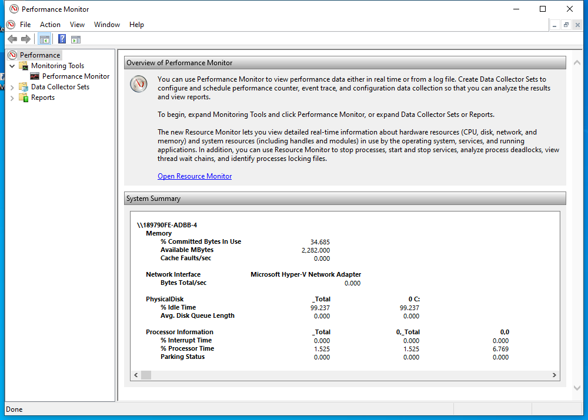

---
title: perfmon.msc | 
excerpt: What is perfmon.msc?
---

# perfmon.msc 

* File Path: `C:\Windows\system32\perfmon.msc`
* Description: Performance Monitor (Window Title)

## Screenshot



## Hashes

Type | Hash
-- | --
MD5 | `9BE46DD971FBA66D84567679D3D414EC`
SHA1 | `3DA0AA3222D3954485239FD3BAA2CBB0525E1468`
SHA256 | `02BC972C747171E9DDC1577538E4EACD417882C34086F042FFA9E8F18E7899A2`
SHA384 | `4D406C1F73D893102BB5E1B080F23CAF15FEB09767BC317EA7B504F35AFDBFF7D08C0109BD762F8EC087B5BE75CAF5FD`
SHA512 | `5DFE0F76D69D7360BFFC1B439D5EC791EF81DF11FD03D0BE65DEFD199C06E0CE3730F03B65EBBFD71BBFAA4FDD96D55C082DDA991904B9829DA3F4286218E421`
SSDEEP | `768:s4NfbQ87bPhOiGmfIktIpvRCmT9da92YYU:TNk87bQiGNfNRCmT9s`
PESHA1 | `3DA0AA3222D3954485239FD3BAA2CBB0525E1468`
PE256 | `02BC972C747171E9DDC1577538E4EACD417882C34086F042FFA9E8F18E7899A2`

## Runtime Data

### Window Title:
Performance Monitor

### Open Handles:

Path | Type
-- | --
(R-D)   C:\Windows\apppatch\DirectXApps_FOD.sdb | File
(R-D)   C:\Windows\Fonts\StaticCache.dat | File
(R-D)   C:\Windows\System32\atl.dll | File
(R-D)   C:\Windows\System32\dxtmsft.dll | File
(R-D)   C:\Windows\System32\dxtrans.dll | File
(R-D)   C:\Windows\System32\en-US\ddraw.dll.mui | File
(R-D)   C:\Windows\System32\en-US\ieframe.dll.mui | File
(R-D)   C:\Windows\System32\en-US\KernelBase.dll.mui | File
(R-D)   C:\Windows\System32\en-US\MFC42u.dll.mui | File
(R-D)   C:\Windows\System32\en-US\mmc.exe.mui | File
(R-D)   C:\Windows\System32\en-US\mmcbase.dll.mui | File
(R-D)   C:\Windows\System32\en-US\mshtml.dll.mui | File
(R-D)   C:\Windows\System32\en-US\sysmon.ocx.mui | File
(R-D)   C:\Windows\System32\en-US\urlmon.dll.mui | File
(R-D)   C:\Windows\System32\en-US\user32.dll.mui | File
(R-D)   C:\Windows\System32\en-US\wdc.dll.mui | File
(R-D)   C:\Windows\System32\en-US\winmm.dll.mui | File
(R-D)   C:\Windows\System32\en-US\wvc.dll.mui | File
(R-D)   C:\Windows\System32\mmc.exe | File
(R-D)   C:\Windows\System32\stdole2.tlb | File
(R-D)   C:\Windows\System32\sysmon.ocx | File
(R-D)   C:\Windows\SystemResources\mmcbase.dll.mun | File
(R-D)   C:\Windows\SystemResources\mmcndmgr.dll.mun | File
(R-D)   C:\Windows\SystemResources\sysmon.ocx.mun | File
(R-D)   C:\Windows\SystemResources\wdc.dll.mun | File
(RW-)   C:\Users\user | File
(RW-)   C:\Windows\WinSxS\amd64_microsoft.windows.common-controls_6595b64144ccf1df_5.82.19041.488_none_4238de57f6b64d28 | File
(RW-)   C:\Windows\WinSxS\amd64_microsoft.windows.common-controls_6595b64144ccf1df_6.0.19041.746_none_ca02b4b61b8320a4 | File
(RWD)   C:\Windows\Fonts\segoeui.ttf | File
\...\Cor_SxSPublic_IPCBlock | Section
\BaseNamedObjects\__ComCatalogCache__ | Section
\BaseNamedObjects\C:\*ProgramData\*Microsoft\*Windows\*Caches\*{6AF0698E-D558-4F6E-9B3C-3716689AF493}.2.ver0x0000000000000002.db | Section
\BaseNamedObjects\C:\*ProgramData\*Microsoft\*Windows\*Caches\*{DDF571F2-BE98-426D-8288-1A9A39C3FDA2}.2.ver0x0000000000000002.db | Section
\BaseNamedObjects\C:\*ProgramData\*Microsoft\*Windows\*Caches\*cversions.2 | Section
\BaseNamedObjects\NLS_CodePage_1252_3_2_0_0 | Section
\BaseNamedObjects\NLS_CodePage_437_3_2_0_0 | Section
\BaseNamedObjects\windows_shell_global_counters | Section
\Sessions\1\BaseNamedObjects\1a30HWNDInterface:2d04a2 | Section
\Sessions\1\BaseNamedObjects\1a30HWNDInterface:4204fe | Section
\Sessions\1\BaseNamedObjects\1a30HWNDInterface:5a057e | Section
\Sessions\1\BaseNamedObjects\1a30HWNDInterface:5f056c | Section
\Sessions\1\BaseNamedObjects\1a30HWNDInterface:670464 | Section
\Sessions\1\BaseNamedObjects\MSIMGSIZECacheMap | Section
\Sessions\1\BaseNamedObjects\SessionImmersiveColorPreference | Section
\Sessions\1\BaseNamedObjects\UrlZonesSM_user | Section
\Sessions\1\BaseNamedObjects\windows_ie_global_counters | Section
\Sessions\1\BaseNamedObjects\windows_shell_global_counters | Section
\Sessions\1\BaseNamedObjects\windows_webcache_counters_{9B6AB5B3-91BC-4097-835C-EA2DEC95E9CC}_S-1-5-21-2047949552-857980807-821054962-504 | Section
\Sessions\1\Windows\Theme3205582532 | Section
\Windows\Theme3800351183 | Section


### Loaded Modules:

Path |
-- |
C:\Windows\SYSTEM32\apphelp.dll |
C:\Windows\System32\KERNEL32.DLL |
C:\Windows\System32\KERNELBASE.dll |
C:\Windows\SYSTEM32\mmc.exe |
C:\Windows\SYSTEM32\ntdll.dll |


## Signature

* Status: Signature verified.
* Serial: `3300000266BD1580EFA75CD6D3000000000266`
* Thumbprint: `A4341B9FD50FB9964283220A36A1EF6F6FAA7840`
* Issuer: CN=Microsoft Windows Production PCA 2011, O=Microsoft Corporation, L=Redmond, S=Washington, C=US
* Subject: CN=Microsoft Windows, O=Microsoft Corporation, L=Redmond, S=Washington, C=US

## File Metadata

* Original Filename: 
* Product Name: 
* Company Name: 
* File Version: 
* Product Version: 
* Language: 
* Legal Copyright: 

## File Scan

* VirusTotal Detections: 0/75
* VirusTotal Link: https://www.virustotal.com/gui/file/02bc972c747171e9ddc1577538e4eacd417882c34086f042ffa9e8f18e7899a2/detection

## File Similarity (ssdeep match)

File | Score
-- | --
[C:\Windows\system32\en-US\perfmon.msc](perfmon.msc-9BE46DD971FBA66D84567679D3D414EC.md) | 100
[C:\Windows\SysWOW64\perfmon.msc](perfmon.msc-9BE46DD971FBA66D84567679D3D414EC.md) | 100


## Additional Info*

**The information below is copied from [MicrosoftDocs](https://github.com/MicrosoftDocs/windowsserverdocs), which is maintained by [Microsoft](https://opensource.microsoft.com/codeofconduct/). Available under [CC BY 4.0](https://creativecommons.org/licenses/by/4.0/) license.*

---

## perfmon

Start Windows Reliability and Performance Monitor in a specific standalone mode.

### Syntax

```
perfmon </res|report|rel|sys>
```

#### Parameters

| Parameter | Description |
|--|--|
| /res | Starts the Resource View. |
| /report | Starts the System Diagnostics Data Collector Set and displays a report of the results. |
| /rel | Starts the Reliability Monitor. |
| /sys | Starts the Performance Monitor. |

### Additional References

- [Command-Line Syntax Key](https://github.com/MicrosoftDocs/windowsserverdocs/tree/master/WindowsServerDocs/administration/windows-commands/command-line-syntax-key.md)

- [Windows Performance Monitor](/previous-versions/windows/it-pro/windows-server-2008-r2-and-2008/cc749154(v%3dws.11))

---


MIT License. Copyright (c) 2020-2021 Strontic.


