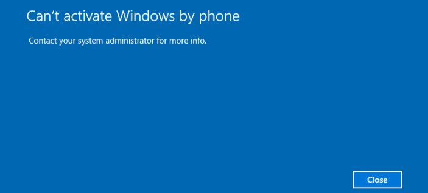

---
title: phoneactivate.exe | Phone Activation UI
excerpt: What is phoneactivate.exe?
---

# phoneactivate.exe 

* File Path: `C:\Windows\system32\phoneactivate.exe`
* Description: Phone Activation UI

## Screenshot

## Hashes

Type | Hash
-- | --
MD5 | `DADF857A0132D0795A52A576E35FED51`
SHA1 | `34A11FB5999E30A92833021F0AF9778CECFCCF2A`
SHA256 | `9310F80D49FC67C792DCFAADBABD84F026619198E7BAC4FD5798548F72A6AF5D`
SHA384 | `8E0E177297B75A35271BD366BBE12BDFFAAB03C3A73B0A35223FB43D3F118BC61CA0A34369F1C8183361DDE87CD71909`
SHA512 | `863C1FE896406318B261AF897BD2D83D67BBE15F591F33B71A5A556A636511BA3949606CA810754DADE2FA8C702A38D1CFC0EFA76CF5B329F18544E7DD740AF8`
SSDEEP | `1536:Bz2qdTHUFZjPchDTzJcS3r16z4n019VtJSBTCnG9ZDTNjGPI1:4qdYTcVlrDQtJ29ZDTkQ1`

## Signature

* Status: Signature verified.
* Serial: `33000001733031072665B8B9B3000000000173`
* Thumbprint: `14590DC5C3AAF238FCFD7785B4B93F4071402C34`
* Issuer: CN=Microsoft Windows Production PCA 2011, O=Microsoft Corporation, L=Redmond, S=Washington, C=US
* Subject: CN=Microsoft Windows, O=Microsoft Corporation, L=Redmond, S=Washington, C=US

## File Metadata

* Original Filename: phoneactivate.exe.mui
* Product Name: Microsoft Windows Operating System
* Company Name: Microsoft Corporation
* File Version: 10.0.14393.0 (rs1_release.160715-1616)
* Product Version: 10.0.14393.0
* Language: English (United States)
* Legal Copyright:  Microsoft Corporation. All rights reserved.

MIT License. Copyright (c) 2020-2021 Strontic.

