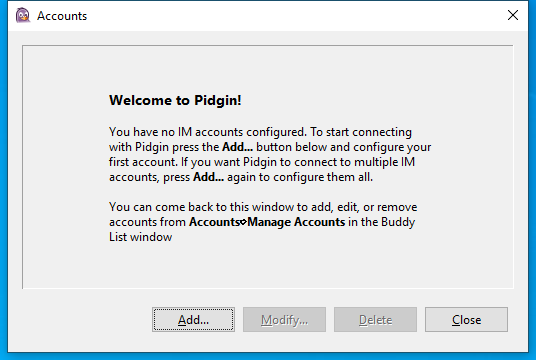

---
title: pidgin.exe | Pidgin
---

# pidgin.exe 

* File Path: `C:\Program Files (x86)\Pidgin\pidgin.exe`
* Description: Pidgin

## Screenshot



## Hashes

Type | Hash
-- | --
MD5 | `8A9A59B52C2D6D34D2924D517C38381B`
SHA1 | `5FCF133CA486E8457B22B24E4830CFF32EEB0732`
SHA256 | `7064162A174E1CB12FA4EF8D0CD0F45FD73BBEED7D9C40F83B2F619CDCA313E5`
SHA384 | `3DADBD46C6D2CE475A018302F62B65EC996FF527B05E5D74F7B889E254C0BE64DD09D6F1A1E07DF31725F4C27BD36A74`
SHA512 | `3CE6D07D836185E0352E4247B9E8CC8348D595A8DE2E56CAED74030E413471040DC6C209C1C0F90FD0590738624791D7DFE43931FD8ECB3F6A2232D367209D79`
SSDEEP | `768:xx507g0w/a5LDei5BCEUyVbVNYVl4NGB51gF:xx5Pv/aLDvCEdbjYVl4NGB5+`

## Runtime Data

### Usage (stdout):
```Batchfile
Loaded exchndl.dll
 Setting exchndl.dll LogFile to C:\Users\WDAGUtilityAccount\AppData\Local\Temp\pidgin.RPT
 Setting exchndl.dll DebugInfoDir to C:\Program Files (x86)\Pidgin\pidgin-2.14.1-dbgsym
GTK+ path found: C:\Program Files (x86)\Pidgin\Gtk\bin
Using SetDllDirectory
Could not open reg subkey: SOFTWARE\pidgin
Error: (2) The system cannot find the file specified.

Setting locale: LANG=en
Pidgin 2.14.1
Usage: C:\Program Files (x86)\Pidgin\pidgin.exe [OPTION]...

  -c, --config=DIR    use DIR for config files
  -d, --debug         print debugging messages to stdout
  -f, --force-online  force online, regardless of network status
  -h, --help          display this help and exit
  -m, --multiple      allow multiple instances
  -n, --nologin       don't automatically login
  -l, --login[=NAME]  enable specified account(s) (optional argument NAME
                      specifies account(s) to use, separated by commas.
                      Without this only the first account will be enabled).
  -v, --version       display the current version and exit

```

### Usage (stderr):
```Batchfile
C:\Program Files (x86)\Pidgin\pidgin.exe: invalid option -- e

```

## Signature

* Status: Signature verified.
* Serial: `0853E240A4892340FD6BA6D7E623DB18`
* Thumbprint: `A8F1E30CA0A49E2D393A55C79715854490425503`
* Issuer: CN=DigiCert SHA2 Assured ID Code Signing CA, OU=www.digicert.com, O=DigiCert Inc, C=US
* Subject: CN=Eion Robb, O=Eion Robb, L=Christchurch, C=NZ

## File Metadata

* Original Filename: pidgin.exe
* Product Name: Pidgin
* Company Name: The Pidgin developer community
* File Version: 2.14.1
* Product Version: 2.14.1
* Language: English (United States)
* Legal Copyright: Copyright (C) 1998-2010 The Pidgin developer community (See the COPYRIGHT file in the source distribution).


MIT License. Copyright (c) 2020 Strontic.


