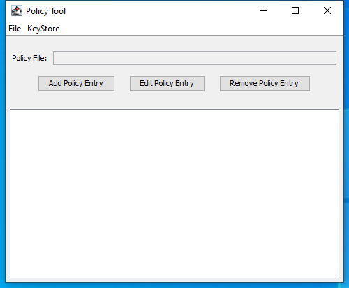

---
title: policytool.exe | OpenJDK Platform binary
excerpt: What is policytool.exe?
---

# policytool.exe 

* File Path: `C:\Program Files\Amazon Corretto\jdk1.8.0_265\bin\policytool.exe`
* Description: OpenJDK Platform binary

## Screenshot



## Hashes

Type | Hash
-- | --
MD5 | `84733E93F92F1C702AD8D51085A0C141`
SHA1 | `2C06EBEBE76169AF5DD8C0E5B9F24BDE821DD9D4`
SHA256 | `C1957FD632F5226F412C85D6021A61DEAFF53385B81FDDC14642C6D722146ADE`
SHA384 | `7D131ADA8DC51C3A80F3304B2FFB7F4AEC53F0103C019272FA2054CD484FAE0D00A446F648030D88CA582C34E8E5CD5C`
SHA512 | `94E1BCBE453C94B65D4C1019CFCCFD18648E843F7AB95B8291A370B5CF6516EC20D3CB3AB4B9FEC9F2EC9A3AB40B52D7766DC4F85D8DB660A3D2304AE4395B73`
SSDEEP | `192:0360yTHTlGKmnIKEfoP4eEBH4yK6CYlLWwsU+OQ+bv4p42a9sgfxIZHvH:03CoKxKNP4eEBNK6jSc242Dgf2hvH`
IMP | `2C43CDA2243B5AF72E180E8D1F09446D`
PESHA1 | `C2DA512821EE648E92958ED6032326E3FEC645C6`
PE256 | `F423CF052165D09285F1A67EC895FCE1931A7BC258A4FF2E0A6F531934BE0BBE`

## Runtime Data

### Usage (stdout):
```cmhg
Usage: policytool [options]

  [-file <file>]    policy file location


```

### Usage (stderr):
```cmhg
Illegal option: --help

```

### Child Processes:
conhost.exe

### Window Title:
Policy Tool

### Open Handles:

Path | Type
-- | --
(R-D)   C:\Users\user\AppData\Local\Temp\hsperfdata_user\7736 | File
(R-D)   C:\Windows\System32\en-US\kernel32.dll.mui | File
(R-D)   C:\Windows\System32\en-US\KernelBase.dll.mui | File
(RW-)   C:\Program Files\Amazon Corretto\jdk1.8.0_265\jre\lib\ext\access-bridge-64.jar | File
(RW-)   C:\Program Files\Amazon Corretto\jdk1.8.0_265\jre\lib\ext\jaccess.jar | File
(RW-)   C:\Program Files\Amazon Corretto\jdk1.8.0_265\jre\lib\ext\jfxrt.jar | File
(RW-)   C:\Program Files\Amazon Corretto\jdk1.8.0_265\jre\lib\ext\sunec.jar | File
(RW-)   C:\Program Files\Amazon Corretto\jdk1.8.0_265\jre\lib\ext\sunmscapi.jar | File
(RW-)   C:\Program Files\Amazon Corretto\jdk1.8.0_265\jre\lib\ext\sunpkcs11.jar | File
(RW-)   C:\Program Files\Amazon Corretto\jdk1.8.0_265\jre\lib\jce.jar | File
(RW-)   C:\Program Files\Amazon Corretto\jdk1.8.0_265\jre\lib\jfr.jar | File
(RW-)   C:\Program Files\Amazon Corretto\jdk1.8.0_265\jre\lib\jsse.jar | File
(RW-)   C:\Program Files\Amazon Corretto\jdk1.8.0_265\jre\lib\resources.jar | File
(RW-)   C:\Program Files\Amazon Corretto\jdk1.8.0_265\jre\lib\rt.jar | File
(RW-)   C:\Windows\Fonts\segoeui.ttf | File
(RW-)   C:\Windows\Fonts\segoeuib.ttf | File
(RW-)   C:\Windows\Fonts\segoeuii.ttf | File
(RW-)   C:\Windows\Fonts\segoeuiz.ttf | File
(RW-)   C:\Windows\Fonts\tahoma.ttf | File
(RW-)   C:\Windows\Fonts\tahomabd.ttf | File
(RW-)   C:\Windows\WinSxS\amd64_microsoft.windows.common-controls_6595b64144ccf1df_6.0.19041.488_none_ca04af081b815d21 | File
(RW-)   C:\xCyclopedia | File
\BaseNamedObjects\__ComCatalogCache__ | Section
\BaseNamedObjects\NLS_CodePage_1252_3_2_0_0 | Section
\BaseNamedObjects\NLS_CodePage_437_3_2_0_0 | Section
\Sessions\1\BaseNamedObjects\1e38HWNDInterface:1005d2 | Section
\Sessions\1\BaseNamedObjects\hsperfdata_user_7736 | Section
\Sessions\1\BaseNamedObjects\windows_shell_global_counters | Section
\Sessions\1\Windows\Theme2547664911 | Section
\Windows\Theme3854699184 | Section


### Loaded Modules:

Path |
-- |
C:\Program Files\Amazon Corretto\jdk1.8.0_265\bin\policytool.exe |
C:\Windows\System32\KERNEL32.DLL |
C:\Windows\System32\KERNELBASE.dll |
C:\Windows\SYSTEM32\ntdll.dll |


## Signature

* Status: Signature verified.
* Serial: `2F83C35B5136353D68CE9EB669FD1B0B`
* Thumbprint: `4BAD227329ADEF18F215B6475FB7948E1629B505`
* Issuer: CN=Symantec Class 3 SHA256 Code Signing CA, OU=Symantec Trust Network, O=Symantec Corporation, C=US
* Subject: CN=Amazon.com Services LLC, OU=Software Services, O=Amazon.com Services LLC, L=Seattle, S=Washington, C=US

## File Metadata

* Original Filename: policytool.exe
* Product Name: OpenJDK Platform 8
* Company Name: Amazon.com Inc.
* File Version: 8.0.2650.1
* Product Version: 8.0.2650.1
* Language: Language Neutral
* Legal Copyright: Copyright  2020
* Machine Type: 64-bit

## File Scan

* VirusTotal Detections: 0/68
* VirusTotal Link: https://www.virustotal.com/gui/file/c1957fd632f5226f412c85d6021a61deaff53385b81fddc14642c6d722146ade/detection/

## File Similarity (ssdeep match)

File | Score
-- | --
[C:\Program Files\Amazon Corretto\jdk1.8.0_265\bin\appletviewer.exe](appletviewer.exe-430C820B9C25F84873606F9577ED885C.md) | 60
[C:\Program Files\Amazon Corretto\jdk1.8.0_265\bin\clhsdb.exe](clhsdb.exe-E1BCE5AE504EC02D6CE72820D5C65104.md) | 54
[C:\Program Files\Amazon Corretto\jdk1.8.0_265\bin\extcheck.exe](extcheck.exe-1558E9C8EB7C811CE72AF08BBDE7BC1C.md) | 60
[C:\Program Files\Amazon Corretto\jdk1.8.0_265\bin\hsdb.exe](hsdb.exe-814D8D11A58015EF79936248A91FF87A.md) | 57
[C:\Program Files\Amazon Corretto\jdk1.8.0_265\bin\idlj.exe](idlj.exe-B8FF03F3747D2220B78EF20F5BDFB1A6.md) | 65
[C:\Program Files\Amazon Corretto\jdk1.8.0_265\bin\jar.exe](jar.exe-FDE3CD0231E7F936B7914D4BC1DEE713.md) | 63
[C:\Program Files\Amazon Corretto\jdk1.8.0_265\bin\jarsigner.exe](jarsigner.exe-916A8B80152B0A5F09F755A6B0F0CEEE.md) | 60
[C:\Program Files\Amazon Corretto\jdk1.8.0_265\bin\javac.exe](javac.exe-E1A9361E0F13035D3450B2E5BF9F565A.md) | 55
[C:\Program Files\Amazon Corretto\jdk1.8.0_265\bin\javadoc.exe](javadoc.exe-D58A3821C950F9A8810571758D454BF3.md) | 60
[C:\Program Files\Amazon Corretto\jdk1.8.0_265\bin\javah.exe](javah.exe-738EEF3648337D35FE7FDDAEDB7A7AE6.md) | 54
[C:\Program Files\Amazon Corretto\jdk1.8.0_265\bin\javap.exe](javap.exe-263625513CED1A2F3CC530A873DA78D8.md) | 55
[C:\Program Files\Amazon Corretto\jdk1.8.0_265\bin\jcmd.exe](jcmd.exe-2F08542DE06EE7A5312A3DA2EE2B24BC.md) | 61
[C:\Program Files\Amazon Corretto\jdk1.8.0_265\bin\jconsole.exe](jconsole.exe-F6A2528FAF7F94C21B6171C7714CF312.md) | 57
[C:\Program Files\Amazon Corretto\jdk1.8.0_265\bin\jdb.exe](jdb.exe-0D18C300EDB8083FE7DF9EBCB73272B7.md) | 58
[C:\Program Files\Amazon Corretto\jdk1.8.0_265\bin\jdeps.exe](jdeps.exe-6160FFF11CB9E55F3A5914649A287D42.md) | 57
[C:\Program Files\Amazon Corretto\jdk1.8.0_265\bin\jfr.exe](jfr.exe-963613DC729D1F04DBFC1AE070C62FBC.md) | 66
[C:\Program Files\Amazon Corretto\jdk1.8.0_265\bin\jhat.exe](jhat.exe-6775B43B078A43741B7A88D7C83E3250.md) | 65
[C:\Program Files\Amazon Corretto\jdk1.8.0_265\bin\jinfo.exe](jinfo.exe-698B44C29D5E55EA17046DB44381EAF7.md) | 60
[C:\Program Files\Amazon Corretto\jdk1.8.0_265\bin\jjs.exe](jjs.exe-59BBE7560FAA914F246C4E3F29662273.md) | 61
[C:\Program Files\Amazon Corretto\jdk1.8.0_265\bin\jmap.exe](jmap.exe-196C8715740CAA592B223567FC81892F.md) | 61
[C:\Program Files\Amazon Corretto\jdk1.8.0_265\bin\jps.exe](jps.exe-3E2339751905B0F23F2B60479567B4C5.md) | 65
[C:\Program Files\Amazon Corretto\jdk1.8.0_265\bin\jrunscript.exe](jrunscript.exe-26D55A136CF4A9375EBC15B1CC1E3A87.md) | 63
[C:\Program Files\Amazon Corretto\jdk1.8.0_265\bin\jsadebugd.exe](jsadebugd.exe-EDD35409A96C24BAA80F32D8A153DBD5.md) | 55
[C:\Program Files\Amazon Corretto\jdk1.8.0_265\bin\jstack.exe](jstack.exe-679B7EBA04F034DBEBF7CF23CE7D96FF.md) | 57
[C:\Program Files\Amazon Corretto\jdk1.8.0_265\bin\jstat.exe](jstat.exe-4D42D198AEA1B89EA69C6C1EB589A5CF.md) | 63
[C:\Program Files\Amazon Corretto\jdk1.8.0_265\bin\jstatd.exe](jstatd.exe-DCB5BED30B4C0C0DBB8909533ECB53FA.md) | 66
[C:\Program Files\Amazon Corretto\jdk1.8.0_265\bin\keytool.exe](keytool.exe-8E9FA6337C05EA19B49857407FE76324.md) | 61
[C:\Program Files\Amazon Corretto\jdk1.8.0_265\bin\klist.exe](klist.exe-46C3EFEFBB84EF261A21CE50DD82538B.md) | 60
[C:\Program Files\Amazon Corretto\jdk1.8.0_265\bin\native2ascii.exe](native2ascii.exe-4E0D48DBD27C912BAA95BB16392B98DA.md) | 63
[C:\Program Files\Amazon Corretto\jdk1.8.0_265\bin\orbd.exe](orbd.exe-88A71D46CF9DAD0A1A922B7A81FF3F94.md) | 58
[C:\Program Files\Amazon Corretto\jdk1.8.0_265\bin\pack200.exe](pack200.exe-194F7DAC4BF0CE689B11E658EE4BE4EC.md) | 60
[C:\Program Files\Amazon Corretto\jdk1.8.0_265\bin\rmid.exe](rmid.exe-B2EC7C7A298A74A6A7FE6994EEA30AEB.md) | 61
[C:\Program Files\Amazon Corretto\jdk1.8.0_265\bin\rmiregistry.exe](rmiregistry.exe-A1B6A0957EDC2CE30464D592058BDCFF.md) | 60
[C:\Program Files\Amazon Corretto\jdk1.8.0_265\bin\schemagen.exe](schemagen.exe-2E0814457A3FA699E49A19A5951071A9.md) | 68
[C:\Program Files\Amazon Corretto\jdk1.8.0_265\bin\serialver.exe](serialver.exe-7E2682A55024756C0D6988648EC46F80.md) | 58
[C:\Program Files\Amazon Corretto\jdk1.8.0_265\bin\servertool.exe](servertool.exe-DA2C531652A2C306B02D9A7598ABFA86.md) | 72
[C:\Program Files\Amazon Corretto\jdk1.8.0_265\bin\tnameserv.exe](tnameserv.exe-B95BD13779CB322743ABB3C3AC406B1D.md) | 57
[C:\Program Files\Amazon Corretto\jdk1.8.0_265\bin\wsgen.exe](wsgen.exe-FE1C1F8495990F2BCB301E53BCAB2B79.md) | 65
[C:\Program Files\Amazon Corretto\jdk1.8.0_265\bin\wsimport.exe](wsimport.exe-1789534F6D671FA68ACD4FB49179C70B.md) | 63
[C:\Program Files\Amazon Corretto\jdk1.8.0_265\bin\xjc.exe](xjc.exe-D7067F41EA6E860CC7EFCEF110406D16.md) | 61
[C:\Program Files\Amazon Corretto\jdk1.8.0_265\jre\bin\java-rmi.exe](java-rmi.exe-2C8BE8549F5A30706D882BF98BA1F593.md) | 60
[C:\Program Files\Amazon Corretto\jdk1.8.0_265\jre\bin\jjs.exe](jjs.exe-83B89AADBE362DAAF3AEFDE9B90A7E70.md) | 65
[C:\Program Files\Amazon Corretto\jdk1.8.0_265\jre\bin\keytool.exe](keytool.exe-E64A133341297033FB908CF0412A32EC.md) | 60
[C:\Program Files\Amazon Corretto\jdk1.8.0_265\jre\bin\kinit.exe](kinit.exe-8279A6B305002709B2FA0E42D508F5B7.md) | 58
[C:\Program Files\Amazon Corretto\jdk1.8.0_265\jre\bin\klist.exe](klist.exe-CB6F44DE9B3831B042E93254E6C90991.md) | 58
[C:\Program Files\Amazon Corretto\jdk1.8.0_265\jre\bin\ktab.exe](ktab.exe-4E10E111BC97C675CFE3BF5A40E0D29F.md) | 60
[C:\Program Files\Amazon Corretto\jdk1.8.0_265\jre\bin\orbd.exe](orbd.exe-B7D6DFE20B64D0E89E2CAAC0918C7ABF.md) | 60
[C:\Program Files\Amazon Corretto\jdk1.8.0_265\jre\bin\pack200.exe](pack200.exe-3BA7B22C46AB4E39C166185B6C5644EB.md) | 61
[C:\Program Files\Amazon Corretto\jdk1.8.0_265\jre\bin\policytool.exe](policytool.exe-9000C71F8C10BE60FDC45CDCBF93D25B.md) | 80
[C:\Program Files\Amazon Corretto\jdk1.8.0_265\jre\bin\rmid.exe](rmid.exe-49EA4C57E276B964B770F36A4ACDD764.md) | 63
[C:\Program Files\Amazon Corretto\jdk1.8.0_265\jre\bin\rmiregistry.exe](rmiregistry.exe-AC45D66B78E93F793F684492A0A3BCF8.md) | 58
[C:\Program Files\Amazon Corretto\jdk1.8.0_265\jre\bin\servertool.exe](servertool.exe-7CC71DC253D94C84121954F54EB18BCA.md) | 69
[C:\program files\Amazon Corretto\jdk11.0.8_10\bin\javadoc.exe](javadoc.exe-0F018693795EEBE8E09C80212FA8F046.md) | 32
[C:\program files\Amazon Corretto\jdk11.0.8_10\bin\jconsole.exe](jconsole.exe-D8C95F3A553D05CB200221FFFB6BA28A.md) | 35
[C:\program files\Amazon Corretto\jdk11.0.8_10\bin\jinfo.exe](jinfo.exe-714D372EF77EB0C6C5F3DA8F7BAFED2F.md) | 33
[C:\Program Files\Amazon Corretto\jre8\bin\java-rmi.exe](java-rmi.exe-ABB442793EFD5B49BCBD985457471CBA.md) | 58
[C:\Program Files\Amazon Corretto\jre8\bin\jjs.exe](jjs.exe-88F2557464000E73373C35FC2F541DBD.md) | 61
[C:\Program Files\Amazon Corretto\jre8\bin\keytool.exe](keytool.exe-5B2EED8BF1F4AD2266D1AB4DACD5EFB5.md) | 61
[C:\Program Files\Amazon Corretto\jre8\bin\kinit.exe](kinit.exe-279AB5BC8B1580FBD051A17B03A105FC.md) | 60
[C:\Program Files\Amazon Corretto\jre8\bin\klist.exe](klist.exe-485D7DCE45873697DD951A75B3358C7A.md) | 61
[C:\Program Files\Amazon Corretto\jre8\bin\ktab.exe](ktab.exe-7273553C79E43A7A0FC111E39B2D7462.md) | 61
[C:\Program Files\Amazon Corretto\jre8\bin\orbd.exe](orbd.exe-D0E99C227083E332225BC7C56D66CC32.md) | 60
[C:\Program Files\Amazon Corretto\jre8\bin\pack200.exe](pack200.exe-A7A5CFDD68743FCA89B2006B483F778F.md) | 60
[C:\Program Files\Amazon Corretto\jre8\bin\policytool.exe](policytool.exe-1F96ACF1BC80FE1A0CAD540611C6EBC2.md) | 82
[C:\Program Files\Amazon Corretto\jre8\bin\rmid.exe](rmid.exe-216048544A1924DDFFD12C96094A23F1.md) | 63
[C:\Program Files\Amazon Corretto\jre8\bin\rmiregistry.exe](rmiregistry.exe-11A6CEF71C782AF4B29951C8EA0C4541.md) | 60
[C:\Program Files\Amazon Corretto\jre8\bin\tnameserv.exe](tnameserv.exe-0D875404AEA73CD0FCD92880DA829E70.md) | 60


MIT License. Copyright (c) 2020 Strontic.


