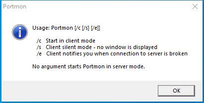

---
title: portmon.exe | Portmon/EE
excerpt: What is portmon.exe?
---

# portmon.exe 

* File Path: `C:\SysinternalsSuite\portmon.exe`
* Description: Portmon/EE

## Screenshot

## Hashes

Type | Hash
-- | --
MD5 | `1276ACF39B37A99EA14E760870025584`
SHA1 | `41E9EDCF56FCD7C6B67256582673BB791BDFCAC7`
SHA256 | `0E848A3911070945CB71803D466BA5A02804957B51B177C52A09AC55280BA6DD`
SHA384 | `1B1EBE720C41D61772BBE425FAE02347D9B720B6DB4F3CCBFE6DAD11D1E7171A9C77D2A498DD08BACCC7F5AC815CA181`
SHA512 | `845FE5A3189A28F318F2369D2669ED2E3949038F325A5EFD0D68EE94095DC531E92019AC29C352386B488EE7E59B99FE5A6357421276291527B64949A7F2B3C4`
SSDEEP | `6144:K95pV/5m+bcFpXrvXAY9OPI2AFWN6EtKhpOFgX5D20zrwqO8mKlqdAUN8wBqU2:+7+9iSFyQhAyJD7m1dAK8wEU2`
IMP | `D7005CC29D297C93F2C852C56BECD356`
PESHA1 | `36513FB395D33FF4A766B97C8623F8B05C5AFECC`
PE256 | `1912C527B59BD4C2CD65920C94EC12D7BA276D40F840FF7EB974BED789A20D06`

## Runtime Data

### Window Title:
Portmon

### Open Handles:

Path | Type
-- | --
(R-D)   C:\Windows\Fonts\StaticCache.dat | File
(RW-)   C:\Windows | File
(RW-)   C:\Windows\WinSxS\x86_microsoft.windows.common-controls_6595b64144ccf1df_5.82.19041.488_none_89e6152f0b32762e | File
(RW-)   C:\xCyclopedia | File
\BaseNamedObjects\NLS_CodePage_1252_3_2_0_0 | Section
\BaseNamedObjects\NLS_CodePage_437_3_2_0_0 | Section
\Sessions\1\Windows\Theme2036293991 | Section
\Windows\Theme1324212991 | Section

### Loaded Modules:

Path |
-- |
C:\SysinternalsSuite\portmon.exe |
C:\Windows\SYSTEM32\ntdll.dll |
C:\Windows\System32\wow64.dll |
C:\Windows\System32\wow64cpu.dll |
C:\Windows\System32\wow64win.dll |

## Signature

* Status: Signature verified.
* Serial: `611AF5EA00000000006A`
* Thumbprint: `8849D1C0F147A3C8327B4038783AEC3E06C76F5B`
* Issuer: CN=Microsoft Code Signing PCA, O=Microsoft Corporation, L=Redmond, S=Washington, C=US
* Subject: CN=Microsoft Corporation, OU=MOPR, O=Microsoft Corporation, L=Redmond, S=Washington, C=US

## File Metadata

* Original Filename: Portmon.exe
* Product Name: SysInternals Portmon
* Company Name: SysInternals
* File Version: 3.03
* Product Version: 3.03
* Language: English (United States)
* Legal Copyright: Copyright  1999-2010 Mark Russinovich
* Machine Type: 32-bit

## File Scan

* VirusTotal Detections: 0/69
* VirusTotal Link: https://www.virustotal.com/gui/file/0e848a3911070945cb71803d466ba5a02804957b51b177c52a09ac55280ba6dd/detection/

MIT License. Copyright (c) 2020-2021 Strontic.

