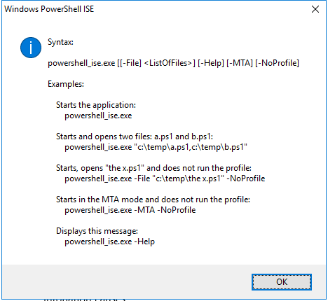

---
title: powershell_ise.exe | Windows PowerShell ISE
---

# powershell_ise.exe 

* File Path: `C:\windows\system32\WindowsPowerShell\v1.0\powershell_ise.exe`
* Description: Windows PowerShell ISE

## Screenshot



## Hashes

Type | Hash
-- | --
MD5 | `FE79F0387DFF3417FFDFAB25E103F8F3`
SHA1 | `B78660955559CC1393F7961CCE6379C388B9F400`
SHA256 | `9F0AA70533741D0B9CA0D23BDF8C6B509844E9EC1776B442A9C0DCF2D99B00BB`
SHA384 | `10437A534907F86ED76A15ED2043917D22C88CD73DE877FAED6B6B2456250EF4EE8CCC2FF75DBCA42071B4C86167FBCE`
SHA512 | `B394F0965F51EFDF58256DD06CBD58B1C9F085A08EDC0F5099D67F1D37EAF7B2F3F11F32A715ECC91EB190F9877DB8CBDD6D8E6245C2427BBDAB8BD895B54184`
SSDEEP | `6144:lC+sE4Due2C+sEQDu0irIuU5pmZbgXooP:ljsfT2jsx085pmZUP`

## Signature

* Status: The file C:\windows\system32\WindowsPowerShell\v1.0\powershell_ise.exe is not digitally signed. You cannot run this script on the current system. For more information about running scripts and setting execution policy, see about_Execution_Policies at http://go.microsoft.com/fwlink/?LinkID=135170
* Serial: ``
* Thumbprint: ``
* Issuer: 
* Subject: 

## File Metadata

* Original Filename: powershell_ise.EXE
* Product Name: Microsoft Windows Operating System
* Company Name: Microsoft Corporation
* File Version: 6.3.9600.17399 (winblue_r4.141010-1702)
* Product Version: 6.3.9600.17399
* Language: English (United States)
* Legal Copyright:  Microsoft Corporation. All rights reserved.

## File Similarity (ssdeep match)

File | Score
-- | --
[C:\windows\SysWOW64\WindowsPowerShell\v1.0\powershell_ise.exe](powershell_ise.exe-579D1F6B52ADDDB09A75094382D3F6BC.md) | 96

## Possible Misuse

*The following table contains possible examples of `powershell_ise.exe` being misused. While `powershell_ise.exe` is **not** inherently malicious, its legitimate functionality can by abused for malicious purposes.*

Source | Source File | Example | License
-- | -- | -- | --
[sigma](https://github.com/Neo23x0/sigma) | [sysmon_in_memory_powershell.yml](https://github.com/Neo23x0/sigma/blob/master/rules/windows/image_load/sysmon_in_memory_powershell.yml) | `            - '\powershell_ise.exe'` | [DRL 1.0](https://github.com/Neo23x0/sigma/blob/master/LICENSE.Detection.Rules.md)
[sigma](https://github.com/Neo23x0/sigma) | [win_renamed_binary.yml](https://github.com/Neo23x0/sigma/blob/master/rules/windows/process_creation/win_renamed_binary.yml) | `            - 'powershell_ise.exe'` | [DRL 1.0](https://github.com/Neo23x0/sigma/blob/master/LICENSE.Detection.Rules.md)
[sigma](https://github.com/Neo23x0/sigma) | [win_renamed_binary.yml](https://github.com/Neo23x0/sigma/blob/master/rules/windows/process_creation/win_renamed_binary.yml) | `            - '\powershell_ise.exe'` | [DRL 1.0](https://github.com/Neo23x0/sigma/blob/master/LICENSE.Detection.Rules.md)
[sigma](https://github.com/Neo23x0/sigma) | [win_renamed_binary_highly_relevant.yml](https://github.com/Neo23x0/sigma/blob/master/rules/windows/process_creation/win_renamed_binary_highly_relevant.yml) | `            - "powershell_ise.exe"` | [DRL 1.0](https://github.com/Neo23x0/sigma/blob/master/LICENSE.Detection.Rules.md)
[sigma](https://github.com/Neo23x0/sigma) | [win_renamed_binary_highly_relevant.yml](https://github.com/Neo23x0/sigma/blob/master/rules/windows/process_creation/win_renamed_binary_highly_relevant.yml) | `            - '*\powershell_ise.exe'` | [DRL 1.0](https://github.com/Neo23x0/sigma/blob/master/LICENSE.Detection.Rules.md)
[sigma](https://github.com/Neo23x0/sigma) | [win_renamed_powershell.yml](https://github.com/Neo23x0/sigma/blob/master/rules/windows/process_creation/win_renamed_powershell.yml) | `            - '*\powershell_ise.exe'` | [DRL 1.0](https://github.com/Neo23x0/sigma/blob/master/LICENSE.Detection.Rules.md)
[sigma](https://github.com/Neo23x0/sigma) | [sysmon_alternate_powershell_hosts_pipe.yml](https://github.com/Neo23x0/sigma/blob/master/rules/windows/sysmon/sysmon_alternate_powershell_hosts_pipe.yml) | `            - '\powershell_ise.exe'` | [DRL 1.0](https://github.com/Neo23x0/sigma/blob/master/LICENSE.Detection.Rules.md)
[atomic-red-team](https://github.com/redcanaryco/atomic-red-team) | [T1059.001.md](https://github.com/redcanaryco/atomic-red-team/blob/master/atomics/T1059.001/T1059.001.md) | 1. Open Powershell_ise as a Privileged Account | [MIT License. © 2018 Red Canary](https://github.com/redcanaryco/atomic-red-team/blob/master/LICENSE.txt)

## Additional Info*

**The information below is copied from [MicrosoftDocs](https://github.com/MicrosoftDocs/windowsserverdocs), which is maintained by [Microsoft](https://opensource.microsoft.com/codeofconduct/). Available under [CC BY 4.0](https://creativecommons.org/licenses/by/4.0/) license.*

---

## PowerShell_ise

Windows PowerShell Integrated Scripting Environment (ISE) is a graphical host application that enables you to read, write, run, debug, and test scripts and modules in a graphic-assisted environment. Key features such as IntelliSense, Show-Command, snippets, tab completion, syntax-coloring, visual debugging, and context-sensitive Help provide a rich scripting experience.

### Using PowerShell.exe

The **PowerShell_ISE.exe** tool starts a Windows PowerShell ISE session. When you use **PowerShell_ISE.exe**, you can use its optional parameters to open files in Windows PowerShell ISE or to start a Windows PowerShell ISE session with no profile or with a multithreaded apartment.

- To start a Windows PowerShell ISE session in a Command Prompt window, in Windows PowerShell, or at the **Start** menu, type:

  ```powershell
  PowerShell_Ise.exe
  ```

- To open a script (.ps1), script module (.psm1), module manifest (.psd1), XML file, or any other supported file in Windows PowerShell ISE, type:

  ```powershell
  PowerShell_Ise.exe <filepath>
  ```

  In Windows PowerShell 3.0, you can use the optional **File** parameter as follows:

  ```powershell
  PowerShell_Ise.exe -file <filepath>
  ```

- To start a Windows PowerShell ISE session without your Windows PowerShell profiles, use the **NoProfile** parameter. (The **NoProfile** parameter is introduced in Windows PowerShell 3.0.), type:

  ```powershell
  PowerShell_Ise.exe -NoProfile
  ```

- To see the PowerShell_ISE.exe help file, type:

    ```powershell
    PowerShell_Ise.exe -help
    PowerShell_Ise.exe -?
    PowerShell_Ise.exe /?
    ```

#### Remarks

- For a complete list of the **PowerShell_ISE.exe** command-line parameters, see [about_PowerShell_Ise.Exe](/powershell/module/microsoft.powershell.core/about/about_powershell_ise_exe).

- For information about other ways to start Windows PowerShell, see [Starting Windows PowerShell](/powershell/scripting/windows-powershell/starting-windows-powershell).

- Windows PowerShell runs on the Server Core installation option of Windows Server operating systems. However, because Windows PowerShell ISE requires a graphic user interface, it does not run on Server Core installations.

### Additional References

- [about_PowerShell_Ise.exe](/powershell/module/microsoft.powershell.core/about/about_powershell_exe)

---


MIT License. Copyright (c) 2020 Strontic.


