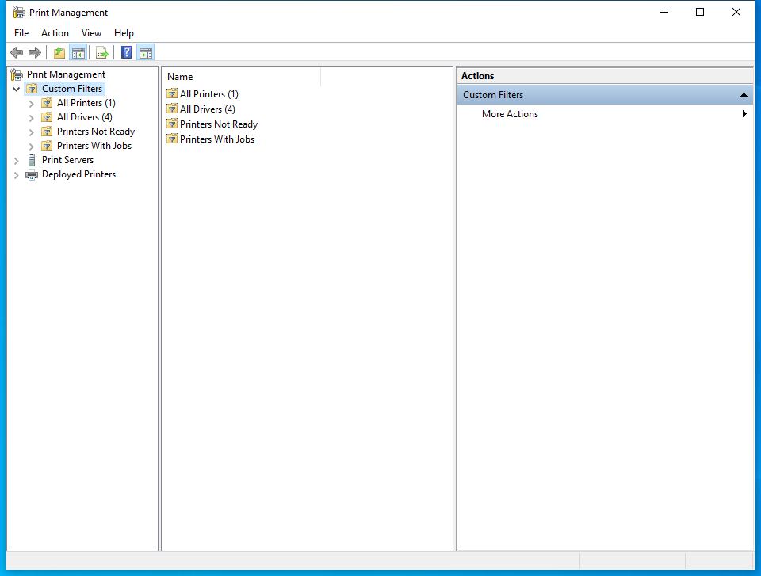

---
title: printmanagement.msc | 
excerpt: What is printmanagement.msc?
---

# printmanagement.msc 

* File Path: `C:\Windows\system32\printmanagement.msc`
* Description: Print Management (Window Title)

## Screenshot

## Hashes

Type | Hash
-- | --
MD5 | `4856202475EFE0D66FA11EE1DCF6D0D3`
SHA1 | `2A7CF58944E283631D498ECBA8DEB88472E7794F`
SHA256 | `F33BCFCD11FF96298C652D6E6443216063DC3707769AF3BE500428425D0E3D24`
SHA384 | `5457B14EE9A0DF651BEC8F2D863E0D8346A76FF78F021A3023B5472F9B1317AD27C8B87102CCF04FFEDD623372540C1A`
SHA512 | `98636E554A589800D36EAF6CBE2EC838EC646EF01CA01B93AB30A002BCB29EFF89ABE8A2C48439F04A28FBC561E7AE6366E1E14A905A9B7EB327C46CD13E87EC`
SSDEEP | `384:4CC4AHsAaX1oJNyBPLYJ7lziOfFcj/T4nrk6QwaNW8/kn6mPHo9dXS79N3xPeMyH:k9fIH0dTCkrB5a7mPI9NMlkH`
PESHA1 | `2A7CF58944E283631D498ECBA8DEB88472E7794F`
PE256 | `F33BCFCD11FF96298C652D6E6443216063DC3707769AF3BE500428425D0E3D24`

## Runtime Data

### Window Title:
Print Management

### Open Handles:

Path | Type
-- | --
(R-D)   C:\Windows\Fonts\StaticCache.dat | File
(R-D)   C:\Windows\System32\en-US\gpedit.dll.mui | File
(R-D)   C:\Windows\System32\en-US\KernelBase.dll.mui | File
(R-D)   C:\Windows\System32\en-US\MFC42u.dll.mui | File
(R-D)   C:\Windows\System32\en-US\mmc.exe.mui | File
(R-D)   C:\Windows\System32\en-US\mmcbase.dll.mui | File
(R-D)   C:\Windows\System32\en-US\pmcsnap.dll.mui | File
(R-D)   C:\Windows\System32\en-US\printui.dll.mui | File
(R-D)   C:\Windows\System32\en-US\puiapi.dll.mui | File
(R-D)   C:\Windows\System32\en-US\user32.dll.mui | File
(R-D)   C:\Windows\SystemResources\mmcbase.dll.mun | File
(R-D)   C:\Windows\SystemResources\mmcndmgr.dll.mun | File
(RW-)   C:\Users\user | File
(RW-)   C:\Windows\WinSxS\amd64_microsoft.windows.common-controls_6595b64144ccf1df_5.82.19041.488_none_4238de57f6b64d28 | File
(RW-)   C:\Windows\WinSxS\amd64_microsoft.windows.common-controls_6595b64144ccf1df_6.0.19041.746_none_ca02b4b61b8320a4 | File
\BaseNamedObjects\__ComCatalogCache__ | Section
\BaseNamedObjects\C:\*ProgramData\*Microsoft\*Windows\*Caches\*{6AF0698E-D558-4F6E-9B3C-3716689AF493}.2.ver0x0000000000000002.db | Section
\BaseNamedObjects\C:\*ProgramData\*Microsoft\*Windows\*Caches\*{DDF571F2-BE98-426D-8288-1A9A39C3FDA2}.2.ver0x0000000000000002.db | Section
\BaseNamedObjects\C:\*ProgramData\*Microsoft\*Windows\*Caches\*cversions.2 | Section
\BaseNamedObjects\NLS_CodePage_1252_3_2_0_0 | Section
\BaseNamedObjects\NLS_CodePage_437_3_2_0_0 | Section
\BaseNamedObjects\windows_shell_global_counters | Section
\Sessions\1\BaseNamedObjects\1ef8HWNDInterface:3704f0 | Section
\Sessions\1\BaseNamedObjects\1ef8HWNDInterface:5305a2 | Section
\Sessions\1\BaseNamedObjects\SessionImmersiveColorPreference | Section
\Sessions\1\BaseNamedObjects\windows_shell_global_counters | Section
\Sessions\1\Windows\Theme3205582532 | Section
\Windows\Theme3800351183 | Section

### Loaded Modules:

Path |
-- |
C:\Windows\SYSTEM32\apphelp.dll |
C:\Windows\System32\KERNEL32.DLL |
C:\Windows\System32\KERNELBASE.dll |
C:\Windows\SYSTEM32\mmc.exe |
C:\Windows\SYSTEM32\ntdll.dll |

## Signature

* Status: Signature verified.
* Serial: `330000023241FB59996DCC4DFF000000000232`
* Thumbprint: `FF82BC38E1DA5E596DF374C53E3617F7EDA36B06`
* Issuer: CN=Microsoft Windows Production PCA 2011, O=Microsoft Corporation, L=Redmond, S=Washington, C=US
* Subject: CN=Microsoft Windows, O=Microsoft Corporation, L=Redmond, S=Washington, C=US

## File Metadata

* Original Filename: 
* Product Name: 
* Company Name: 
* File Version: 
* Product Version: 
* Language: 
* Legal Copyright: 

## File Scan

* VirusTotal Detections: 0/73
* VirusTotal Link: https://www.virustotal.com/gui/file/f33bcfcd11ff96298c652d6e6443216063dc3707769af3be500428425d0e3d24/detection

## File Similarity (ssdeep match)

File | Score
-- | --
[C:\Windows\system32\certlm.msc](certlm.msc-DCCA682FEA47192106EC4F2001EAE182.md) | 44
[C:\Windows\system32\certmgr.msc](certmgr.msc-4C7390A1FF613FBBF59141CA0BE8AE89.md) | 44
[C:\Windows\system32\en-US\certlm.msc](certlm.msc-DCCA682FEA47192106EC4F2001EAE182.md) | 44
[C:\Windows\system32\en-US\certmgr.msc](certmgr.msc-4C7390A1FF613FBBF59141CA0BE8AE89.md) | 44
[C:\Windows\system32\en-US\gpedit.msc](gpedit.msc-6C054DA115C2CA2C523ABD159ED7814B.md) | 33
[C:\Windows\system32\en-US\printmanagement.msc](printmanagement.msc-4856202475EFE0D66FA11EE1DCF6D0D3.md) | 100
[C:\Windows\system32\en-US\tpm.msc](tpm.msc-9359341F78E00134B527814B4868ECD5.md) | 40
[C:\Windows\system32\gpedit.msc](gpedit.msc-6C054DA115C2CA2C523ABD159ED7814B.md) | 33
[C:\Windows\system32\tpm.msc](tpm.msc-9359341F78E00134B527814B4868ECD5.md) | 40
[C:\Windows\SysWOW64\certlm.msc](certlm.msc-DCCA682FEA47192106EC4F2001EAE182.md) | 44
[C:\Windows\SysWOW64\certmgr.msc](certmgr.msc-4C7390A1FF613FBBF59141CA0BE8AE89.md) | 44
[C:\Windows\SysWOW64\en-US\gpedit.msc](gpedit.msc-6C054DA115C2CA2C523ABD159ED7814B.md) | 33
[C:\Windows\SysWOW64\gpedit.msc](gpedit.msc-6C054DA115C2CA2C523ABD159ED7814B.md) | 33
[C:\Windows\SysWOW64\tpm.msc](tpm.msc-9359341F78E00134B527814B4868ECD5.md) | 40

MIT License. Copyright (c) 2020-2021 Strontic.

