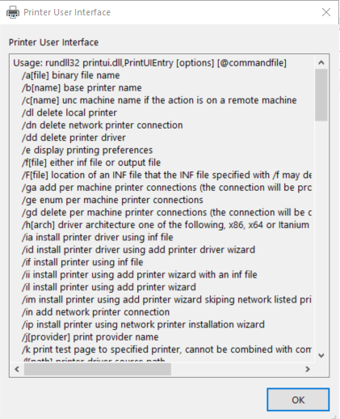

---
title: printui.exe | Change Printing Settings
---

# printui.exe 

* File Path: `C:\Windows\SysWOW64\printui.exe`
* Description: Change Printing Settings

## Screenshot

## Hashes

Type | Hash
-- | --
MD5 | `A33E43C6E26BF582B98B639217639DA6`
SHA1 | `5F0D60CFB3EE1E130F19BC8454F77BC0C5480EBF`
SHA256 | `0FD82B7B6F97DF74DF7C02B2CD79E9AE306AC5B66709874146F5D042AA8C38FC`
SHA384 | `56BDC6681A89C9C4C59FB99D46CC5E906CD728EB10156FACA8845422B21D20145BD176427892C9D04821EF8EE8E2ADDF`
SHA512 | `BA8B7277A6A600930676C3AB4FD216A6CF5779EC899B3FF1D71C7303D996CC4D86D58C4428FAF058959F3E37F6314D5A2DAA251C6592079638F9D3239B218AAA`
SSDEEP | `768:Q0gL0CJheuF5vI1iQfCIWVM9G4qW4ne+S/ly+PKAoXRZX6fbX57UWkCRPPA7/QnA:bCJh1VIPd4n+lbeRZIbSQPPA7t`

## Runtime Data

### Window Title:
Printers

### Open Handles:

Path | Type
-- | --
(R-D)   C:\Windows\Fonts\StaticCache.dat | File
(R-D)   C:\Windows\System32\en-US\duser.dll.mui | File
(R-D)   C:\Windows\System32\en-US\imageres.dll.mui | File
(R-D)   C:\Windows\System32\en-US\printui.dll.mui | File
(R-D)   C:\Windows\System32\en-US\printui.exe.mui | File
(R-D)   C:\Windows\WinSxS\x86_microsoft.windows.c..-controls.resources_6595b64144ccf1df_6.0.17763.1397_en-us_3c2ec4ec946930cf\comctl32.dll.mui | File
(RW-)   C:\Users\Administrator\Documents | File
(RW-)   C:\Windows | File
(RW-)   C:\Windows\WinSxS\x86_microsoft.windows.c..-controls.resources_6595b64144ccf1df_6.0.17763.1397_en-us_3c2ec4ec946930cf | File
(RW-)   C:\Windows\WinSxS\x86_microsoft.windows.common-controls_6595b64144ccf1df_6.0.17763.1397_none_26237c0767c2fee2 | File
\BaseNamedObjects\NLS_CodePage_1252_3_2_0_0 | Section
\BaseNamedObjects\NLS_CodePage_437_3_2_0_0 | Section
\Sessions\2\Windows\Theme4283305886 | Section
\Windows\Theme1956823608 | Section

### Loaded Modules:

Path |
-- |
C:\Windows\SYSTEM32\ntdll.dll |
C:\Windows\System32\wow64.dll |
C:\Windows\System32\wow64cpu.dll |
C:\Windows\System32\wow64win.dll |
C:\Windows\SysWOW64\printui.exe |

## Signature

* Status: Signature verified.
* Serial: `3300000266BD1580EFA75CD6D3000000000266`
* Thumbprint: `A4341B9FD50FB9964283220A36A1EF6F6FAA7840`
* Issuer: CN=Microsoft Windows Production PCA 2011, O=Microsoft Corporation, L=Redmond, S=Washington, C=US
* Subject: CN=Microsoft Windows, O=Microsoft Corporation, L=Redmond, S=Washington, C=US

## File Metadata

* Original Filename: printui.exe
* Product Name: Microsoft Windows Operating System
* Company Name: Microsoft Corporation
* File Version: 10.0.17763.1 (WinBuild.160101.0800)
* Product Version: 10.0.17763.1
* Language: English (United States)
* Legal Copyright:  Microsoft Corporation. All rights reserved.

## File Similarity (ssdeep match)

File | Score
-- | --
[C:\WINDOWS\splwow64.exe](splwow64.exe-906E1DFC3A3A64D3452C5BA124AC9A4C.md) | 44
[C:\Windows\splwow64.exe](splwow64.exe-B73202D296AE4FDB8ECC29CC97F8A444.md) | 43
[C:\windows\splwow64.exe](splwow64.exe-BE96C8815DE31A42E93A3BE09C2EECCC.md) | 47
[C:\Windows\system32\ntprint.exe](ntprint.exe-2E2ECAA11EF51F60ABB73C29AA20002B.md) | 82
[C:\windows\system32\ntprint.exe](ntprint.exe-3FD537782456E540DFB29A7C03D0FC0F.md) | 88
[C:\Windows\system32\ntprint.exe](ntprint.exe-6376E0AC71E2795B8924308C69641D31.md) | 83
[C:\WINDOWS\system32\ntprint.exe](ntprint.exe-7DC74288D09DCA85F8484793F76B373A.md) | 85
[C:\Windows\system32\ntprint.exe](ntprint.exe-CBC3D64B4D65A29843C4D140DE1319B6.md) | 85
[C:\Windows\system32\PrintIsolationHost.exe](PrintIsolationHost.exe-845208306E73B805D5B293DD02CD47D4.md) | 60
[C:\Windows\system32\PrintIsolationHost.exe](PrintIsolationHost.exe-95E50C824C9C9B4362AA3522B8449E29.md) | 55
[C:\Windows\system32\PrintIsolationHost.exe](PrintIsolationHost.exe-A7BF96D6CC09A5012C1EA0F990D65567.md) | 55
[C:\WINDOWS\system32\PrintIsolationHost.exe](PrintIsolationHost.exe-E3D32AA13B48E4A5B17AA618D5C1B395.md) | 60
[C:\windows\system32\PrintIsolationHost.exe](PrintIsolationHost.exe-F1291C9C23C5661F4B371FF214260AE1.md) | 60
[C:\Windows\system32\printui.exe](printui.exe-13554E4D7EFFD6EB9719D884DC5D3D1C.md) | 90
[C:\Windows\system32\printui.exe](printui.exe-3D5F90A02F035FA8804EE3C8B8E2A680.md) | 82
[C:\Windows\system32\printui.exe](printui.exe-89682E5353569213F4F9AA8B8AEFD69C.md) | 83
[C:\WINDOWS\system32\printui.exe](printui.exe-C14B13D2A4DA60A016D90D395C4136E3.md) | 86
[C:\windows\system32\printui.exe](printui.exe-CDF8D88B46FC4FA140B5F8B8B06192ED.md) | 86
[C:\Windows\system32\printui.exe](printui.exe-FBA9678D2749E85B086F8CBF21757A32.md) | 86
[C:\windows\SysWOW64\ntprint.exe](ntprint.exe-0277A8F8A620D608A89B6A5F4EBFC7D8.md) | 86
[C:\Windows\SysWOW64\ntprint.exe](ntprint.exe-68214347E67BC0450711A23BDFAA3D8E.md) | 83
[C:\WINDOWS\SysWOW64\ntprint.exe](ntprint.exe-9D0B2E76744FF23D3696883DE96C3EA7.md) | 83
[C:\Windows\SysWOW64\ntprint.exe](ntprint.exe-A54667054FC769A3888C2F1A0853E93D.md) | 85
[C:\Windows\SysWOW64\ntprint.exe](ntprint.exe-DB649341DCBF95A8D898BDF09BC8D96D.md) | 86
[C:\WINDOWS\SysWOW64\printui.exe](printui.exe-129FDFE38DCD2DF182311890F0366931.md) | 86
[C:\Windows\SysWOW64\printui.exe](printui.exe-1A6A8EE565EA78DB660DB63960D2334F.md) | 86
[C:\Windows\SysWOW64\printui.exe](printui.exe-2819DD02A22EEAE743D2C059BF8A7284.md) | 88
[C:\windows\SysWOW64\printui.exe](printui.exe-4B9586A61E98A403DAE98D4E62860081.md) | 88
[C:\Windows\SysWOW64\printui.exe](printui.exe-E73BC2E6C64861430CEA5D9C784BB6F7.md) | 86

MIT License. Copyright (c) 2020 Strontic.

