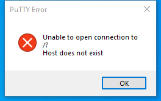

---
title: putty.exe | SSH, Telnet and Rlogin client
excerpt: What is putty.exe?
---

# putty.exe 

* File Path: `C:\Program Files\PuTTY\putty.exe`
* Description: SSH, Telnet and Rlogin client

## Screenshot

## Hashes

Type | Hash
-- | --
MD5 | `AA8F39DFDF0CA430002CE3820A002324`
SHA1 | `70329E3F10AB96FCD1461D46B3B78D80DD1474E6`
SHA256 | `DCF66ED0D39BB3C1CD154D595BFA39D18148B3E1E68B8F18DD89221CF66FF4BA`
SHA384 | `2DE89C02082BDEE25522E7A17B644A4568782C209E30BA7E5524DDB5BD68DF6F4AC828208C02B13C40EB946A129C41C2`
SHA512 | `1C31A29219EB1D35D0B1BF1BDCE5AFB39D4B0F31DE4562D9936D71116FD53DE7DEA4C4745E4C12C885DC07163117262CC4A2D925E14AA9844A638991D5EE0744`
SSDEEP | `12288:cKqC57Zz7Q+XAIsAbt19684P/c4Tsv9Ed9KIAH656mOleOB6Wex:pqCNNE4AhDRkBvGd9a656mW8`
IMP | `2E3215ACC61253E5FA73A840384E9720`
PESHA1 | `CFC56D6C39FCEB9A1990CFA1E3499321934AA288`
PE256 | `E8F327A7ABA6B2DD1A7A24E544555969D14BD17CA3559F36EF4E511092B4BA71`

## Runtime Data

### Window Title:
PuTTY Command Line Error

### Open Handles:

Path | Type
-- | --
(R-D)   C:\Windows\System32\en-US\user32.dll.mui | File
(RW-)   C:\Users\user\Documents | File
(RW-)   C:\Windows\WinSxS\amd64_microsoft.windows.common-controls_6595b64144ccf1df_5.82.19041.488_none_4238de57f6b64d28 | File
(RW-)   C:\Windows\WinSxS\amd64_microsoft.windows.common-controls_6595b64144ccf1df_6.0.19041.488_none_ca04af081b815d21 | File
\BaseNamedObjects\NLS_CodePage_1252_3_2_0_0 | Section
\BaseNamedObjects\NLS_CodePage_437_3_2_0_0 | Section
\Sessions\1\BaseNamedObjects\windows_shell_global_counters | Section
\Sessions\1\Windows\Theme64749523 | Section
\Windows\Theme1120315852 | Section

### Loaded Modules:

Path |
-- |
C:\Program Files\PuTTY\putty.exe |
C:\Windows\System32\ADVAPI32.dll |
C:\Windows\System32\combase.dll |
C:\Windows\System32\COMDLG32.dll |
C:\Windows\System32\GDI32.dll |
C:\Windows\System32\gdi32full.dll |
C:\Windows\System32\IMM32.dll |
C:\Windows\System32\KERNEL32.DLL |
C:\Windows\System32\KERNELBASE.dll |
C:\Windows\System32\msvcp_win.dll |
C:\Windows\System32\msvcrt.dll |
C:\Windows\SYSTEM32\ntdll.dll |
C:\Windows\System32\ole32.dll |
C:\Windows\System32\RPCRT4.dll |
C:\Windows\System32\sechost.dll |
C:\Windows\System32\shcore.dll |
C:\Windows\System32\SHELL32.dll |
C:\Windows\System32\SHLWAPI.dll |
C:\Windows\System32\ucrtbase.dll |
C:\Windows\System32\USER32.dll |
C:\Windows\system32\uxtheme.dll |
C:\Windows\System32\win32u.dll |
C:\Windows\System32\ws2_32.dll |
C:\Windows\WinSxS\amd64_microsoft.windows.common-controls_6595b64144ccf1df_5.82.19041.488_none_4238de57f6b64d28\comctl32.dll |
C:\Windows\WinSxS\amd64_microsoft.windows.common-controls_6595b64144ccf1df_6.0.19041.488_none_ca04af081b815d21\COMCTL32.dll |

## Signature

* Status: Signature verified.
* Serial: `7C1118CBBADC95DA3752C46E47A27438`
* Thumbprint: `5B9E273CF11941FD8C6BE3F038C4797BBE884268`
* Issuer: CN=COMODO RSA Code Signing CA, O=COMODO CA Limited, L=Salford, S=Greater Manchester, C=GB
* Subject: CN=Simon Tatham, O=Simon Tatham, L=Cambridge, S=Cambridgeshire, C=GB

## File Metadata

* Original Filename: PuTTY
* Product Name: PuTTY suite
* Company Name: Simon Tatham
* File Version: Release 0.74 (without embedded help)
* Product Version: Release 0.74
* Language: English (United Kingdom)
* Legal Copyright: Copyright  1997-2020 Simon Tatham.
* Machine Type: 64-bit

## File Scan

* VirusTotal Detections: 0/70
* VirusTotal Link: https://www.virustotal.com/gui/file/dcf66ed0d39bb3c1cd154d595bfa39d18148b3e1e68b8f18dd89221cf66ff4ba/detection/

## Possible Misuse

*The following table contains possible examples of `putty.exe` being misused. While `putty.exe` is **not** inherently malicious, its legitimate functionality can by abused for malicious purposes.*

Source | Source File | Example | License
-- | -- | -- | --
[sigma](https://github.com/Neo23x0/sigma) | [win_apt_wocao.yml](https://github.com/Neo23x0/sigma/blob/master/rules/windows/process_creation/win_apt_wocao.yml) | `- 'reg query HKEY_CURRENT_USER\Software\\*\PuTTY\Sessions\'` | [DRL 1.0](https://github.com/Neo23x0/sigma/blob/master/LICENSE.Detection.Rules.md)
[atomic-red-team](https://github.com/redcanaryco/atomic-red-team) | [index.md](https://github.com/redcanaryco/atomic-red-team/blob/master/atomics/Indexes/Indexes-Markdown/index.md) | - Atomic Test #2: Enumeration for PuTTY Credentials in Registry [windows] | [MIT License. © 2018 Red Canary](https://github.com/redcanaryco/atomic-red-team/blob/master/LICENSE.txt)
[atomic-red-team](https://github.com/redcanaryco/atomic-red-team) | [windows-index.md](https://github.com/redcanaryco/atomic-red-team/blob/master/atomics/Indexes/Indexes-Markdown/windows-index.md) | - Atomic Test #2: Enumeration for PuTTY Credentials in Registry [windows] | [MIT License. © 2018 Red Canary](https://github.com/redcanaryco/atomic-red-team/blob/master/LICENSE.txt)
[atomic-red-team](https://github.com/redcanaryco/atomic-red-team) | [T1552.002.md](https://github.com/redcanaryco/atomic-red-team/blob/master/atomics/T1552.002/T1552.002.md) | - [Atomic Test #2 - Enumeration for PuTTY Credentials in Registry](#atomic-test-2---enumeration-for-putty-credentials-in-registry) | [MIT License. © 2018 Red Canary](https://github.com/redcanaryco/atomic-red-team/blob/master/LICENSE.txt)
[atomic-red-team](https://github.com/redcanaryco/atomic-red-team) | [T1552.002.md](https://github.com/redcanaryco/atomic-red-team/blob/master/atomics/T1552.002/T1552.002.md) | ## Atomic Test #2 - Enumeration for PuTTY Credentials in Registry | [MIT License. © 2018 Red Canary](https://github.com/redcanaryco/atomic-red-team/blob/master/LICENSE.txt)
[atomic-red-team](https://github.com/redcanaryco/atomic-red-team) | [T1552.002.md](https://github.com/redcanaryco/atomic-red-team/blob/master/atomics/T1552.002/T1552.002.md) | Queries to enumerate for PuTTY credentials in the Registry. PuTTY must be installed for this test to work. If any registry | [MIT License. © 2018 Red Canary](https://github.com/redcanaryco/atomic-red-team/blob/master/LICENSE.txt)
[atomic-red-team](https://github.com/redcanaryco/atomic-red-team) | [T1552.002.md](https://github.com/redcanaryco/atomic-red-team/blob/master/atomics/T1552.002/T1552.002.md) | reg query HKCU\Software\SimonTatham\PuTTY\Sessions /t REG_SZ /s | [MIT License. © 2018 Red Canary](https://github.com/redcanaryco/atomic-red-team/blob/master/LICENSE.txt)
[signature-base](https://github.com/Neo23x0/signature-base) | [generic_anomalies.yar](https://github.com/Neo23x0/signature-base/blob/master/yara/generic_anomalies.yar) | description = "Detects a putty version with a size different than the one provided by Simon Tatham (could be caused by an additional signature or malware)" | [CC BY-NC 4.0](https://github.com/Neo23x0/signature-base/blob/master/LICENSE)

MIT License. Copyright (c) 2020 Strontic.

