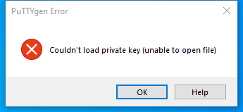

---
title: puttygen.exe | PuTTY SSH key generation utility
excerpt: What is puttygen.exe?
---

# puttygen.exe 

* File Path: `C:\Program Files (x86)\WinSCP\PuTTY\puttygen.exe`
* Description: PuTTY SSH key generation utility

## Screenshot

## Hashes

Type | Hash
-- | --
MD5 | `9B3403397029D00B050C67CC7F7BC21E`
SHA1 | `4F326923C436D0FA39EF30BE0A388FD5E507E360`
SHA256 | `1F9C019BFD95191F41054357D9009D8DCFD45072D0C88975BFA98D9CA1336DA7`
SHA384 | `A74842FEF6D2CF9E57E6DFD059956DE4D3166BC74842246D194BCF585652F965006032CAFE57AECC659A151E957D10B9`
SHA512 | `632588DA44A48CF2E15D8F85B8B290D118EE1A3DCD766BA5C6E41F12F2144C1F038F864ECBCDAB7DA922EE46FF7D239E73E9F9337DDEA8EA392B42F623076C28`
SSDEEP | `6144:kG3D6/d0A0IP+Q28wzcXCN3nbsof4StFv0U1GwWkLl3TBHB:N3D6/d0DwOwof4ScUjWQBHB`
IMP | `E9EF6F4211BD7A3046E5B55AEB978C6B`
PESHA1 | `83A833A24112E078CF0FDFA3BC5A2BE2A33C18BE`
PE256 | `CE95F8546663EAFEAF1D24B2CF2CBEDE19A0E28051B6A63FAA7091CB9559A6F4`

## Runtime Data

### Window Title:
PuTTYgen Error

### Open Handles:

Path | Type
-- | --
(R-D)   C:\Windows\Fonts\StaticCache.dat | File
(R-D)   C:\Windows\SystemResources\imageres.dll.mun | File
(RW-)   C:\Windows | File
(RW-)   C:\Windows\WinSxS\x86_microsoft.windows.common-controls_6595b64144ccf1df_5.82.19041.488_none_89e6152f0b32762e | File
(RW-)   C:\Windows\WinSxS\x86_microsoft.windows.common-controls_6595b64144ccf1df_6.0.19041.488_none_11b1e5df2ffd8627 | File
(RW-)   C:\xCyclopedia | File
\BaseNamedObjects\NLS_CodePage_1252_3_2_0_0 | Section
\BaseNamedObjects\NLS_CodePage_437_3_2_0_0 | Section
\Sessions\1\BaseNamedObjects\windows_shell_global_counters | Section
\Sessions\1\Windows\Theme2547664911 | Section
\Windows\Theme3854699184 | Section

### Loaded Modules:

Path |
-- |
C:\Program Files (x86)\WinSCP\PuTTY\puttygen.exe |
C:\Windows\SYSTEM32\ntdll.dll |
C:\Windows\System32\wow64.dll |
C:\Windows\System32\wow64cpu.dll |
C:\Windows\System32\wow64win.dll |

## Signature

* Status: Signature verified.
* Serial: `7C1118CBBADC95DA3752C46E47A27438`
* Thumbprint: `5B9E273CF11941FD8C6BE3F038C4797BBE884268`
* Issuer: CN=COMODO RSA Code Signing CA, O=COMODO CA Limited, L=Salford, S=Greater Manchester, C=GB
* Subject: CN=Simon Tatham, O=Simon Tatham, L=Cambridge, S=Cambridgeshire, C=GB

## File Metadata

* Original Filename: PuTTYgen
* Product Name: PuTTY suite
* Company Name: Simon Tatham
* File Version: Release 0.73 (without embedded help)
* Product Version: Release 0.73
* Language: English (United Kingdom)
* Legal Copyright: Copyright  1997-2019 Simon Tatham.
* Machine Type: 32-bit

## File Scan

* VirusTotal Detections: 0/68
* VirusTotal Link: https://www.virustotal.com/gui/file/1f9c019bfd95191f41054357d9009d8dcfd45072d0c88975bfa98d9ca1336da7/detection/

MIT License. Copyright (c) 2020 Strontic.

