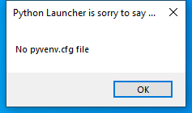

---
title: pythonw.exe | Python
---

# pythonw.exe 

* File Path: `C:\program files\Inkscape\bin\pythonw.exe`
* Description: Python

## Screenshot



## Hashes

Type | Hash
-- | --
MD5 | `9E945D60BBB4991F4E436E7351F3D5C6`
SHA1 | `A20968A071733E56168ACC8B997B847F95C6C617`
SHA256 | `9AD526FF7EE61DD2C312F84963ECF5C636C52E5891E9208C0BA5EC1CEC1BACD3`
SHA384 | `0FE3A5432F295C293DE35872B02B5C3704D4EFD63A796FAB4B08C03CE59685724D53B7F1A74BB2A4193DE686B0D23FC8`
SHA512 | `5DF6D97B68E18AC9315CEDB356EB8D6CAE1D67F2FF2B4AC49C076524EE021FF67C65D8506022423D141B35CA0102CAB9B9CB8924E4028D8549BEE6F90A3090CA`
SSDEEP | `1536:HANPgB3IxHHWMpdPa5wiE21M8kJIGFvb1Cwz/Z3se0I:HANPlwMpdCq/IM8uIGfJ/Z3s9`

## Runtime Data

### Usage (stdout):
```cmhg
usage: C:\program files\Inkscape\bin\pythonw.exe [option] ... [-c cmd | -m mod | file | -] [arg] ...
Options and arguments (and corresponding environment variables):
-b     : issue warnings about str(bytes_instance), str(bytearray_instance)
         and comparing bytes/bytearray with str. (-bb: issue errors)
-B     : don't write .pyc files on import; also PYTHONDONTWRITEBYTECODE=x
-c cmd : program passed in as string (terminates option list)
-d     : debug output from parser; also PYTHONDEBUG=x
-E     : ignore PYTHON* environment variables (such as PYTHONPATH)
-h     : print this help message and exit (also --help)
-i     : inspect interactively after running script; forces a prompt even
         if stdin does not appear to be a terminal; also PYTHONINSPECT=x
-I     : isolate Python from the user's environment (implies -E and -s)
-m mod : run library module as a script (terminates option list)
-O     : remove assert and __debug__-dependent statements; add .opt-1 before
         .pyc extension; also PYTHONOPTIMIZE=x
-OO    : do -O changes and also discard docstrings; add .opt-2 before
         .pyc extension
-q     : don't print version and copyright messages on interactive startup
-s     : don't add user site directory to sys.path; also PYTHONNOUSERSITE
-S     : don't imply 'import site' on initialization
-u     : force the stdout and stderr streams to be unbuffered;
         this option has no effect on stdin; also PYTHONUNBUFFERED=x
-v     : verbose (trace import statements); also PYTHONVERBOSE=x
         can be supplied multiple times to increase verbosity
-V     : print the Python version number and exit (also --version)
         when given twice, print more information about the build
-W arg : warning control; arg is action:message:category:module:lineno
         also PYTHONWARNINGS=arg
-x     : skip first line of source, allowing use of non-Unix forms of #!cmd
-X opt : set implementation-specific option. The following options are available:

         -X faulthandler: enable faulthandler
         -X showrefcount: output the total reference count and number of used
             memory blocks when the program finishes or after each statement in the
             interactive interpreter. This only works on debug builds
         -X tracemalloc: start tracing Python memory allocations using the
             tracemalloc module. By default, only the most recent frame is stored in a
             traceback of a trace. Use -X tracemalloc=NFRAME to start tracing with a
             traceback limit of NFRAME frames
         -X showalloccount: output the total count of allocated objects for each
             type when the program finishes. This only works when Python was built with
             COUNT_ALLOCS defined
         -X importtime: show how long each import takes. It shows module name,
             cumulative time (including nested imports) and self time (excluding
             nested imports). Note that its output may be broken in multi-threaded
             application. Typical usage is python3 -X importtime -c 'import asyncio'
         -X dev: enable CPythons development mode, introducing additional runtime
             checks which are too expensive to be enabled by default. Effect of the
             developer mode:
                * Add default warning filter, as -W default
                * Install debug hooks on memory allocators: see the PyMem_SetupDebugHooks() C function
                * Enable the faulthandler module to dump the Python traceback on a crash
                * Enable asyncio debug mode
                * Set the dev_mode attribute of sys.flags to True
                * io.IOBase destructor logs close() exceptions
         -X utf8: enable UTF-8 mode for operating system interfaces, overriding the default
             locale-aware mode. -X utf8=0 explicitly disables UTF-8 mode (even when it would
             otherwise activate automatically)
         -X pycache_prefix=PATH: enable writing .pyc files to a parallel tree rooted at the
             given directory instead of to the code tree

--check-hash-based-pycs always|default|never:
    control how Python invalidates hash-based .pyc files
file   : program read from script file
-      : program read from stdin (default; interactive mode if a tty)
arg ...: arguments passed to program in sys.argv[1:]

Other environment variables:
PYTHONSTARTUP: file executed on interactive startup (no default)
PYTHONPATH   : ';'-separated list of directories prefixed to the
               default module search path.  The result is sys.path.
PYTHONHOME   : alternate <prefix> directory (or <prefix>;<exec_prefix>).
               The default module search path uses <prefix>/lib/pythonX.X.
PYTHONCASEOK : ignore case in 'import' statements (Windows).
PYTHONUTF8: if set to 1, enable the UTF-8 mode.
PYTHONIOENCODING: Encoding[:errors] used for stdin/stdout/stderr.
PYTHONFAULTHANDLER: dump the Python traceback on fatal errors.
PYTHONHASHSEED: if this variable is set to 'random', a random value is used
   to seed the hashes of str and bytes objects.  It can also be set to an
   integer in the range [0,4294967295] to get hash values with a
   predictable seed.
PYTHONMALLOC: set the Python memory allocators and/or install debug hooks
   on Python memory allocators. Use PYTHONMALLOC=debug to install debug
   hooks.
PYTHONCOERCECLOCALE: if this variable is set to 0, it disables the locale
   coercion behavior. Use PYTHONCOERCECLOCALE=warn to request display of
   locale coercion and locale compatibility warnings on stderr.
PYTHONBREAKPOINT: if this variable is set to 0, it disables the default
   debugger. It can be set to the callable of your debugger of choice.
PYTHONDEVMODE: enable the development mode.
PYTHONPYCACHEPREFIX: root directory for bytecode cache (pyc) files.

```

### Usage (stderr):
```cmhg
C:\program files\Inkscape\bin\pythonw.exe: can't open file 'help': [Errno 2] No such file or directory

```

### Loaded Modules:

Path |
-- |
C:\program files\Inkscape\bin\libpython3.8.dll |
C:\program files\Inkscape\bin\pythonw.exe |
C:\Windows\System32\ADVAPI32.dll |
C:\Windows\System32\KERNEL32.DLL |
C:\Windows\System32\KERNELBASE.dll |
C:\Windows\System32\msvcrt.dll |
C:\Windows\SYSTEM32\ntdll.dll |
C:\Windows\System32\sechost.dll |


## Signature

* Status: The file C:\program files\Inkscape\bin\pythonw.exe is not digitally signed. You cannot run this script on the current system. For more information about running scripts and setting execution policy, see about_Execution_Policies at https:/go.microsoft.com/fwlink/?LinkID=135170
* Serial: ``
* Thumbprint: ``
* Issuer: 
* Subject: 

## File Metadata

* Original Filename: pythonw.exe
* Product Name: Python
* Company Name: Python Software Foundation
* File Version: 3.8.2
* Product Version: 3.8.2
* Language: Language Neutral
* Legal Copyright: Copyright  2001-2016 Python Software Foundation. Copyright  2000 BeOpen.com. Copyright  1995-2001 CNRI. Copyright  1991-1995 SMC.

## File Similarity (ssdeep match)

File | Score
-- | --
[C:\program files (x86)\Python38-32\pythonw.exe](pythonw.exe-22A73968F535CD1042A5AA301C2A537B.md) | 72
[C:\program files\Python38\pythonw.exe](pythonw.exe-B37D95BFD4A51E2847F3EB6A2F8A427E.md) | 75


MIT License. Copyright (c) 2020 Strontic.


