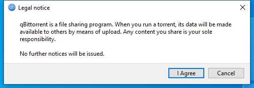
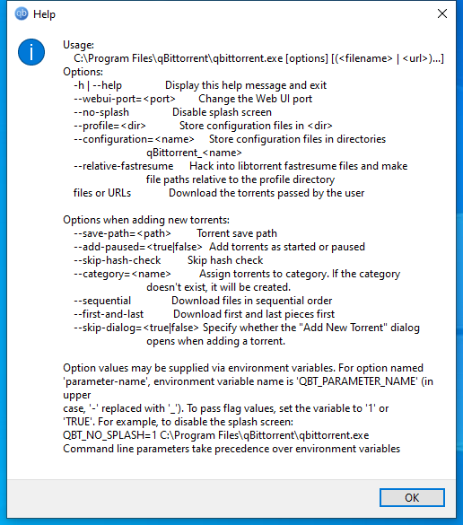

---
title: qbittorrent.exe | qBittorrent - A Bittorrent Client
---

# qbittorrent.exe 

* File Path: `C:\Program Files\qBittorrent\qbittorrent.exe`
* Description: qBittorrent - A Bittorrent Client

## Screenshot

## Hashes

Type | Hash
-- | --
MD5 | `0374AC4F18E909F5B67297FB3F19E650`
SHA1 | `AA35ACC732C03BAA7AD37508A7B784EE7F7F54B5`
SHA256 | `BB57F39E877F9099616E8734064B74E804B51CF7F4D03AA27B3E088E46CC39B1`
SHA384 | `CC702A7705009B8CDB373D66F6DCDACBBF370ED9D6FD3C64F19C27D957622610AA553CB9A4EEE121D64752E19288CEB6`
SHA512 | `0CC90F08D41B39D0BB440D428027A6723EF9A0B459E9F701E91F4F9A90C412AA161C466987421AA6BFAF5915694A9055BAEFAC9ADF23CA09BDFD4BF8202FBE41`
SSDEEP | `393216:9B7YCclpjm1TVg9Spt19Ck8PQqeCo72ZlQUNX5sm+PQ8Jsv6tWKFdu9C7uSF:96C519L8AisUNXt1MNF`

## Signature

* Status: The file C:\Program Files\qBittorrent\qbittorrent.exe is not digitally signed. You cannot run this script on the current system. For more information about running scripts and setting execution policy, see about_Execution_Policies at https:/go.microsoft.com/fwlink/?LinkID=135170
* Serial: ``
* Thumbprint: ``
* Issuer: 
* Subject: 

## File Metadata

* Original Filename: qbittorrent.exe
* Product Name: qBittorrent
* Company Name: The qBittorrent Project
* File Version: v4.2.5
* Product Version: v4.2.5
* Language: English (United States)
* Legal Copyright: Copyright 2006-2020 The qBittorrent Project

MIT License. Copyright (c) 2020 Strontic.

