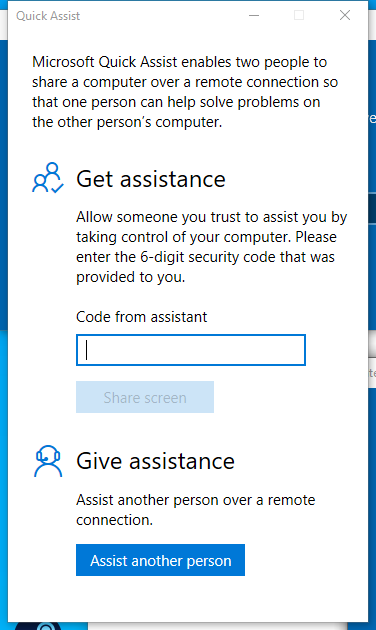

---
title: quickassist.exe | Quick Assist
excerpt: What is quickassist.exe?
---

# quickassist.exe 

* File Path: `C:\Windows\SysWOW64\quickassist.exe`
* Description: Quick Assist

## Screenshot

## Hashes

Type | Hash
-- | --
MD5 | `F0F3390CF55DB6E7DA129BCE57EEE967`
SHA1 | `58E24C9C74FB0CF4C4FFBD20EE124979BFD8D9E9`
SHA256 | `023155542B86DC9E1DEDAADC2FCA0F5DE90153C529508C25C63A7E3B3FBA958C`
SHA384 | `D5F2E548ACCD7554D7EA5EB6017AC7A73C03E5497E94FD3BA93C741873BB38B07E42514776272BFCED94D769595D757A`
SHA512 | `910D3D877B368D375D41A2C1657295D7A792DC6BC0BD3C0568A9BCC66C345D38C8F25B00A0AC13B10E8C23429DA58416567C8AF6CE0249A9E87CD77C686ABDF8`
SSDEEP | `6144:Fv8MWXWlPSrhGwtSD+UCytmwa8QprGDYjeB+NYXW:Fv8MWXWlqrRkDqsYrUIeBvX`
IMP | `298CE2E246AD0C8FF2AB8F20C2FEB4E0`
PESHA1 | `11681024C6B9FF9F89F1EDAE2CDC761FAD5F6DE3`
PE256 | `54D841834757008C26DD0980E4CDD34CD2D6CFBC0250A4A949AFAB5BA20CD3B5`

## Runtime Data

### Window Title:
Quick Assist

### Open Handles:

Path | Type
-- | --
(R-D)   C:\Windows\apppatch\DirectXApps_FOD.sdb | File
(R-D)   C:\Windows\System32\en-US\crypt32.dll.mui | File
(R-D)   C:\Windows\System32\en-US\ieframe.dll.mui | File
(R-D)   C:\Windows\System32\en-US\mshtml.dll.mui | File
(R-D)   C:\Windows\System32\en-US\mswsock.dll.mui | File
(R-D)   C:\Windows\SysWOW64\en-US\jscript9.dll.mui | File
(R-D)   C:\Windows\SysWOW64\en-US\quickassist.exe.mui | File
(R-D)   C:\Windows\SysWOW64\en-US\urlmon.dll.mui | File
(R-D)   C:\Windows\SysWOW64\en-US\user32.dll.mui | File
(RW-)   C:\Users\user | File
(RW-)   C:\Users\user\AppData\Local\Microsoft\Windows\INetCache\ie\3X3M6V65\MemMDL2.1.62[1].eot | File
(RW-)   C:\Users\user\AppData\Local\Microsoft\Windows\INetCache\ie\3X3M6V65\RemtMDL2[1].eot | File
(RW-)   C:\Users\user\AppData\Local\Microsoft\Windows\INetCache\ie\AU189C9G\DevCMDL2.1.62[1].eot | File
(RW-)   C:\Users\user\AppData\Local\Microsoft\Windows\INetCache\ie\AU189C9G\IET0LU2J.htm | File
(RW-)   C:\Users\user\AppData\Local\Microsoft\Windows\INetCache\ie\X4THQAJB\StrgMDL2.1.58[1].eot | File
(RW-)   C:\Windows | File
(RW-)   C:\Windows\WinSxS\x86_microsoft.windows.common-controls_6595b64144ccf1df_6.0.19041.488_none_11b1e5df2ffd8627 | File
(RW-)   C:\Windows\WinSxS\x86_microsoft.windows.gdiplus_6595b64144ccf1df_1.1.19041.685_none_4299dbb28a92ae3e | File
(RWD)   C:\Windows\Fonts | File
(RWD)   C:\Windows\Fonts\segoeui.ttf | File
\BaseNamedObjects\__ComCatalogCache__ | Section
\BaseNamedObjects\C:\*ProgramData\*Microsoft\*Windows\*Caches\*{6AF0698E-D558-4F6E-9B3C-3716689AF493}.2.ver0x0000000000000002.db | Section
\BaseNamedObjects\C:\*ProgramData\*Microsoft\*Windows\*Caches\*{DDF571F2-BE98-426D-8288-1A9A39C3FDA2}.2.ver0x0000000000000002.db | Section
\BaseNamedObjects\C:\*ProgramData\*Microsoft\*Windows\*Caches\*cversions.2 | Section
\BaseNamedObjects\F932B6C7-3A20-46A0-B8A0-8894AA421973 | Section
\BaseNamedObjects\NLS_CodePage_1252_3_2_0_0 | Section
\BaseNamedObjects\NLS_CodePage_437_3_2_0_0 | Section
\BaseNamedObjects\windows_shell_global_counters | Section
\Sessions\1\BaseNamedObjects\ae4HWNDInterface:2e0420 | Section
\Sessions\1\BaseNamedObjects\ae4HWNDInterface:4902f2 | Section
\Sessions\1\BaseNamedObjects\MSIMGSIZECacheMap | Section
\Sessions\1\BaseNamedObjects\UrlZonesSM_user | Section
\Sessions\1\BaseNamedObjects\windows_ie_global_counters | Section
\Sessions\1\BaseNamedObjects\windows_shell_global_counters | Section
\Sessions\1\BaseNamedObjects\windows_webcache_counters_{9B6AB5B3-91BC-4097-835C-EA2DEC95E9CC}_S-1-5-21-2047949552-857980807-821054962-504 | Section
\Sessions\1\Windows\Theme1175649999 | Section
\Windows\Theme601709542 | Section

### Loaded Modules:

Path |
-- |
C:\Windows\SYSTEM32\ntdll.dll |
C:\Windows\System32\wow64.dll |
C:\Windows\System32\wow64cpu.dll |
C:\Windows\System32\wow64win.dll |
C:\Windows\SysWOW64\quickassist.exe |

## Signature

* Status: Signature verified.
* Serial: `330000023241FB59996DCC4DFF000000000232`
* Thumbprint: `FF82BC38E1DA5E596DF374C53E3617F7EDA36B06`
* Issuer: CN=Microsoft Windows Production PCA 2011, O=Microsoft Corporation, L=Redmond, S=Washington, C=US
* Subject: CN=Microsoft Windows, O=Microsoft Corporation, L=Redmond, S=Washington, C=US

## File Metadata

* Original Filename: QuickAssist.exe.mui
* Product Name: Microsoft Windows Operating System
* Company Name: Microsoft Corporation
* File Version: 10.0.19041.1 (WinBuild.160101.0800)
* Product Version: 10.0.19041.1
* Language: Language Neutral
* Legal Copyright:  Microsoft Corporation. All rights reserved.
* Machine Type: 32-bit

## File Scan

* VirusTotal Detections: 0/75
* VirusTotal Link: https://www.virustotal.com/gui/file/023155542b86dc9e1dedaadc2fca0f5de90153c529508c25c63a7e3b3fba958c/detection

## Possible Misuse

*The following table contains possible examples of `quickassist.exe` being misused. While `quickassist.exe` is **not** inherently malicious, its legitimate functionality can be abused for malicious purposes.*

Source | Source File | Example | License
-- | -- | -- | --
[signature-base](https://github.com/Neo23x0/signature-base) | [apt_middle_east_talosreport.yar](https://github.com/Neo23x0/signature-base/blob/master/yara/apt_middle_east_talosreport.yar) | $s1 = "QuickAssist.exe" fullword wide | [CC BY-NC 4.0](https://github.com/Neo23x0/signature-base/blob/master/LICENSE)
[signature-base](https://github.com/Neo23x0/signature-base) | [apt_middle_east_talosreport.yar](https://github.com/Neo23x0/signature-base/blob/master/yara/apt_middle_east_talosreport.yar) | $s4 = "name=\"QuickAssist\" " fullword ascii | [CC BY-NC 4.0](https://github.com/Neo23x0/signature-base/blob/master/LICENSE)

MIT License. Copyright (c) 2020 Strontic.

