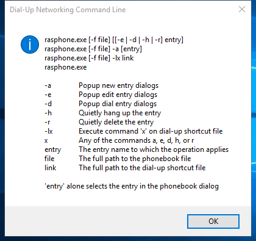

---
title: rasphone.exe | Remote Access Phonebook
excerpt: What is rasphone.exe?
---

# rasphone.exe 

* File Path: `C:\WINDOWS\SysWOW64\rasphone.exe`
* Description: Remote Access Phonebook

## Screenshot

## Hashes

Type | Hash
-- | --
MD5 | `8FF635FA03C8E59055E84EBB8D626D85`
SHA1 | `92778AD68259F69F31ABD7E8BC6B17A987C0C9D5`
SHA256 | `26B3F14407E5318B462FCC97ABF9A07DAE0D58D210CB6B92E8274D77C86884F6`
SHA384 | `0604931D9FCC0D876D6D8D11EF58204E8D6BE4E2AD8B3FFDB6BD4400D22CBD61F71906C53B9EE6FA04B5FF31E59D4995`
SHA512 | `79D0D3C3BC12428E4563565348DED3B080E3D87FE4730CE40FF0F5F9248DD0169778C2585461268CA6F8BC108657691187104C4818B08917E6FA2A2E6558D9A4`
SSDEEP | `768:NZ5EuHYe3vHrth2AdMoECOFOm/BMXAkw:HGu4m2gWWXA`
IMP | `0302ECBA04EF80AC3C7F61AE778C5010`
PESHA1 | `274E0256B85E62A8D34BB5583B92F6FC20279428`
PE256 | `A1D2266CBC51251B058EA2D4628BC7B23BF4EB6EE23BABF6CE4704A217EE1D21`

## Runtime Data

### Window Title:
Dial-Up Networking Command Line

### Open Handles:

Path | Type
-- | --
(R-D)   C:\Windows\Fonts\StaticCache.dat | File
(R-D)   C:\Windows\System32\en-US\rasphone.exe.mui | File
(R-D)   C:\Windows\SystemResources\imageres.dll.mun | File
(RW-)   C:\Windows | File
(RW-)   C:\Windows\SysWOW64 | File
(RW-)   C:\Windows\WinSxS\x86_microsoft.windows.common-controls_6595b64144ccf1df_6.0.22000.120_none_e541a94fcce8ed6d | File
\BaseNamedObjects\C:\*ProgramData\*Microsoft\*Windows\*Caches\*{6AF0698E-D558-4F6E-9B3C-3716689AF493}.2.ver0x0000000000000001.db | Section
\BaseNamedObjects\C:\*ProgramData\*Microsoft\*Windows\*Caches\*{DDF571F2-BE98-426D-8288-1A9A39C3FDA2}.2.ver0x0000000000000001.db | Section
\BaseNamedObjects\C:\*ProgramData\*Microsoft\*Windows\*Caches\*cversions.2.ro | Section
\Sessions\2\BaseNamedObjects\NLS_CodePage_1252_3_2_0_0 | Section
\Sessions\2\BaseNamedObjects\NLS_CodePage_437_3_2_0_0 | Section
\Sessions\2\Windows\Theme1077709572 | Section
\Windows\Theme3461253685 | Section

### Loaded Modules:

Path |
-- |
C:\WINDOWS\SYSTEM32\ntdll.dll |
C:\WINDOWS\System32\wow64.dll |
C:\WINDOWS\System32\wow64base.dll |
C:\WINDOWS\System32\wow64con.dll |
C:\WINDOWS\System32\wow64cpu.dll |
C:\WINDOWS\System32\wow64win.dll |
C:\WINDOWS\SysWOW64\rasphone.exe |

## Signature

* Status: Signature verified.
* Serial: `33000002ED2C45E4C145CF48440000000002ED`
* Thumbprint: `312860D2047EB81F8F58C29FF19ECDB4C634CF6A`
* Issuer: CN=Microsoft Windows Production PCA 2011, O=Microsoft Corporation, L=Redmond, S=Washington, C=US
* Subject: CN=Microsoft Windows, O=Microsoft Corporation, L=Redmond, S=Washington, C=US

## File Metadata

* Original Filename: rasphone.exe
* Product Name: Microsoft Windows Operating System
* Company Name: Microsoft Corporation
* File Version: 10.0.22000.1 (WinBuild.160101.0800)
* Product Version: 10.0.22000.1
* Language: English (United States)
* Legal Copyright:  Microsoft Corporation. All rights reserved.
* Machine Type: 32-bit

## File Scan

* VirusTotal Detections: 0/73
* VirusTotal Link: https://www.virustotal.com/gui/file/26b3f14407e5318b462fcc97abf9a07dae0d58d210cb6b92e8274d77c86884f6/detection

MIT License. Copyright (c) 2020-2021 Strontic.

