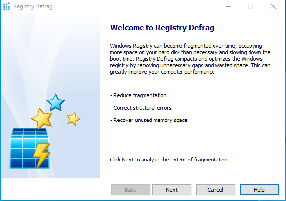

---
title: regdefrag.exe | Registry Defrag 
excerpt: What is regdefrag.exe?
---

# regdefrag.exe 

* File Path: `C:\Program Files (x86)\Glary Utilities 5\regdefrag.exe`
* Description: Registry Defrag 

## Screenshot

## Hashes

Type | Hash
-- | --
MD5 | `1F5F99AAC7EF9D099464C04CA4719731`
SHA1 | `F2EFC498860A37F762B0137D9D66EA9E2CE8BFF0`
SHA256 | `47FE208C1AB917B14EE03646BE6EE45D8DD06D924070C763898D0BA6A4AF1E80`
SHA384 | `098D00C7F911BF4C835952814DEE7CD3EA4607717E99F7358AB68946D980F09F6C6C7EF820D897C63683637AA2CE78D3`
SHA512 | `0F632A14AFACA9B093568BF8FF26D96445A054C0C1A588AA6A7655D90D46FD21852BE834E0F1A698F2FBF2E2182B5A9F5A896B8CF67EB07B0461E33519501563`
SSDEEP | `1536://zmpeB8PQBgVQQv2bm4Sr8TwJOVWXFYPgz+OzJzhGzzz+Tzn4zoTzbzhGz2zBKU:zlBgVQU+Sr8TwJOVWVqzhBzubqMV9`

## Signature

* Status: Signature verified.
* Serial: `0F05AE21CDC17B9F3CF09D7BFC659BA3`
* Thumbprint: `362EBB303E088105BDCC07D94E6B7875D30C0D06`
* Issuer: CN=DigiCert Assured ID Code Signing CA-1, OU=www.digicert.com, O=DigiCert Inc, C=US
* Subject: CN=Glarysoft LTD, O=Glarysoft LTD, S=Beijing, C=CN

## File Metadata

* Original Filename: RegDefrag.exe
* Product Name: Glary Utilities
* Company Name: Glarysoft Ltd
* File Version: 5.0.0.18
* Product Version: 5.0.0.18
* Language: Chinese (Simplified, China)
* Legal Copyright: Copyright (c) 2003-2020 Glarysoft Ltd

## File Similarity (ssdeep match)

File | Score
-- | --
[C:\program files (x86)\Glary Utilities 5\regdefrag.exe](regdefrag.exe-0DC10FD83089A94A9FB03B5707CCE194.md) | 97
[C:\Program Files (x86)\Glary Utilities 5\regdefrag.exe](regdefrag.exe-ACCD55195B958A893E2E71A287614AFF.md) | 97

MIT License. Copyright (c) 2020-2021 Strontic.

