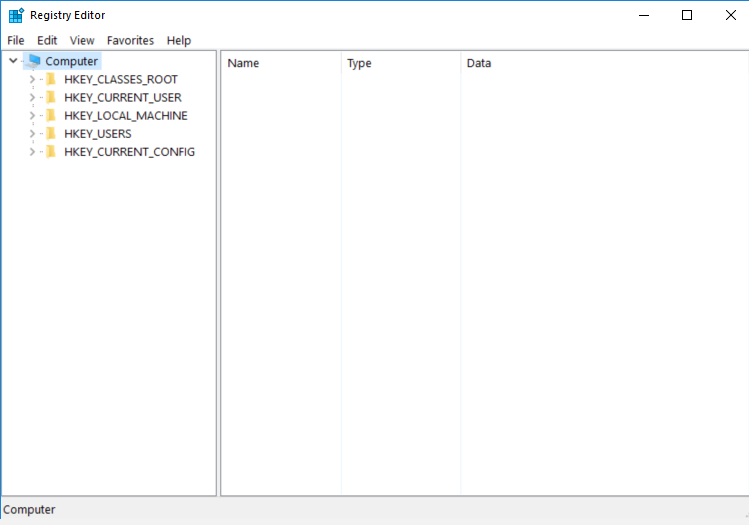
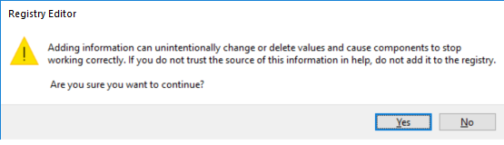

---
title: regedit.exe | Registry Editor
---

# regedit.exe 

* File Path: `C:\windows\regedit.exe`
* Description: Registry Editor

## Screenshot

## Hashes

Type | Hash
-- | --
MD5 | `B67DB709F5FDAA89CA6C2CB6C1E39B3B`
SHA1 | `7BD11624F84C992481DAE9F96EA6744BB7AD40C9`
SHA256 | `DCE18E2279073BA64A6F35D17120FDCA9A4902FAEF0C99CD96A5D673209E132F`
SHA384 | `1559C16DCDB62206F25F2C97083D610AAF35A78C7DA3D787D1B678489285A156202C2556FCA4F7DF7894AF25BCB23F61`
SHA512 | `11BEAA5D806F712CD6333B606986E7116490F4ADA87920B4029BB0AAFBF30D55449847C73058BBC11E4DB6CA09B1CB6DC4EFB49E6575AB1C23CEB8C01CC5D31A`
SSDEEP | `3072:8BELTnC0NTvQRIxqq5iggYNf28JdVgpgw073s7jKQCL1f:8BEXvaRIUqce0iP73s7jZG`

## Signature

* Status: The file C:\windows\regedit.exe is not digitally signed. You cannot run this script on the current system. For more information about running scripts and setting execution policy, see about_Execution_Policies at http://go.microsoft.com/fwlink/?LinkID=135170
* Serial: ``
* Thumbprint: ``
* Issuer: 
* Subject: 

## File Metadata

* Original Filename: REGEDIT.EXE.MUI
* Product Name: Microsoft Windows Operating System
* Company Name: Microsoft Corporation
* File Version: 6.3.9600.16384 (winblue_rtm.130821-1623)
* Product Version: 6.3.9600.16384
* Language: English (United States)
* Legal Copyright:  Microsoft Corporation. All rights reserved.

## File Similarity (ssdeep match)

File | Score
-- | --
[C:\windows\SysWOW64\regedit.exe](regedit.exe-2F3FED31AC2846D8AD5DBC396A7E3DF1.md) | 100

## Possible Misuse

*The following table contains possible examples of `regedit.exe` being misused. While `regedit.exe` is **not** inherently malicious, its legitimate functionality can by abused for malicious purposes.*

Source | Source File | Example | License
-- | -- | -- | --
[LOLBAS](https://github.com/LOLBAS-Project/LOLBAS) | [Regedit.yml](https://github.com/LOLBAS-Project/LOLBAS/blob/master/yml/OSBinaries/Regedit.yml) | `Name: Regedit.exe` | 
[LOLBAS](https://github.com/LOLBAS-Project/LOLBAS) | [Regedit.yml](https://github.com/LOLBAS-Project/LOLBAS/blob/master/yml/OSBinaries/Regedit.yml) | `- Command: regedit /E c:\ads\file.txt:regfile.reg HKEY_CURRENT_USER\MyCustomRegKey` | 
[LOLBAS](https://github.com/LOLBAS-Project/LOLBAS) | [Regedit.yml](https://github.com/LOLBAS-Project/LOLBAS/blob/master/yml/OSBinaries/Regedit.yml) | `- Command: regedit C:\ads\file.txt:regfile.reg` | 
[LOLBAS](https://github.com/LOLBAS-Project/LOLBAS) | [Regedit.yml](https://github.com/LOLBAS-Project/LOLBAS/blob/master/yml/OSBinaries/Regedit.yml) | `- Path: C:\Windows\System32\regedit.exe` | 
[LOLBAS](https://github.com/LOLBAS-Project/LOLBAS) | [Regedit.yml](https://github.com/LOLBAS-Project/LOLBAS/blob/master/yml/OSBinaries/Regedit.yml) | `- Path: C:\Windows\SysWOW64\regedit.exe` | 
[LOLBAS](https://github.com/LOLBAS-Project/LOLBAS) | [Regedit.yml](https://github.com/LOLBAS-Project/LOLBAS/blob/master/yml/OSBinaries/Regedit.yml) | `- IOC: regedit.exe reading and writing to alternate data stream` | 
[LOLBAS](https://github.com/LOLBAS-Project/LOLBAS) | [Regedit.yml](https://github.com/LOLBAS-Project/LOLBAS/blob/master/yml/OSBinaries/Regedit.yml) | `- IOC: regedit.exe should normally not be executed by end-users` | 
[malware-ioc](https://github.com/eset/malware-ioc) | [misp_invisimole.json](https://github.com/eset/malware-ioc/blob/master/invisimole/misp_invisimole.json) | `"description": "Masquerading occurs when the name or location of an executable, legitimate or malicious, is manipulated or abused for the sake of evading defenses and observation. Several different variations of this technique have been observed.\n\nOne variant is for an executable to be placed in a commonly trusted directory or given the name of a legitimate, trusted program. Alternatively, the filename given may be a close approximation of legitimate programs or something innocuous. An example of this is when a common system utility or program is moved and renamed to avoid detection based on its usage.(Citation: FireEye APT10 Sept 2018) This is done to bypass tools that trust executables by relying on file name or path, as well as to deceive defenders and system administrators into thinking a file is benign by associating the name with something that is thought to be legitimate.\n\nA third variant uses the right-to-left override (RTLO or RLO) character (U+202E) as a means of tricking a user into executing what they think is a benign file type but is actually executable code. RTLO is a non-printing character that causes the text that follows it to be displayed in reverse.(Citation: Infosecinstitute RTLO Technique) For example, a Windows screensaver file named <code>March 25 \\u202Excod.scr</code> will display as <code>March 25 rcs.docx</code>. A JavaScript file named <code>photo_high_re\\u202Egnp.js</code> will be displayed as <code>photo_high_resj.png</code>. A common use of this technique is with spearphishing attachments since it can trick both end users and defenders if they are not aware of how their tools display and render the RTLO character. Use of the RTLO character has been seen in many targeted intrusion attempts and criminal activity.(Citation: Trend Micro PLEAD RTLO)(Citation: Kaspersky RTLO Cyber Crime) RTLO can be used in the Windows Registry as well, where regedit.exe displays the reversed characters but the command line tool reg.exe does not by default. \n\nAdversaries may modify a binary's metadata, including such fields as icons, version, name of the product, description, and copyright, to better blend in with the environment and increase chances of deceiving a security analyst or product.(Citation: Threatexpress MetaTwin 2017)\n\n### Windows\nIn another variation of this technique, an adversary may use a renamed copy of a legitimate utility, such as rundll32.exe. (Citation: Endgame Masquerade Ball) An alternative case occurs when a legitimate utility is moved to a different directory and also renamed to avoid detections based on system utilities executing from non-standard paths. (Citation: F-Secure CozyDuke)\n\nAn example of abuse of trusted locations in Windows would be the <code>C:\\Windows\\System32</code> directory. Examples of trusted binary names that can be given to malicious binares include \"explorer.exe\" and \"svchost.exe\".\n\n### Linux\nAnother variation of this technique includes malicious binaries changing the name of their running process to that of a trusted or benign process, after they have been launched as opposed to before. (Citation: Remaiten)\n\nAn example of abuse of trusted locations in Linux  would be the <code>/bin</code> directory. Examples of trusted binary names that can be given to malicious binaries include \"rsyncd\" and \"dbus-inotifier\". (Citation: Fysbis Palo Alto Analysis)  (Citation: Fysbis Dr Web Analysis)",` | [© ESET 2014-2018](https://github.com/eset/malware-ioc/blob/master/LICENSE)
[malware-ioc](https://github.com/eset/malware-ioc) | [rtm](https://github.com/eset/malware-ioc/blob/master/rtm/README.adoc) | `regedit.exe` | [© ESET 2014-2018](https://github.com/eset/malware-ioc/blob/master/LICENSE)
[atomic-red-team](https://github.com/redcanaryco/atomic-red-team) | [T1564.004.md](https://github.com/redcanaryco/atomic-red-team/blob/master/atomics/T1564.004/T1564.004.md) | regedit /E #{path}\file.txt:regfile.reg HKEY_CURRENT_USER\MyCustomRegKey | [MIT License. © 2018 Red Canary](https://github.com/redcanaryco/atomic-red-team/blob/master/LICENSE.txt)
[signature-base](https://github.com/Neo23x0/signature-base) | [apt_area1_phishing_diplomacy.yar](https://github.com/Neo23x0/signature-base/blob/master/yara/apt_area1_phishing_diplomacy.yar) |       $regedit = { c7 06 23 01 12 20 c7 46 04 01 90 00 00 89 5e 0c 89 5e 08 e8 | [CC BY-NC 4.0](https://github.com/Neo23x0/signature-base/blob/master/LICENSE)
[signature-base](https://github.com/Neo23x0/signature-base) | [apt_project_sauron_extras.yar](https://github.com/Neo23x0/signature-base/blob/master/yara/apt_project_sauron_extras.yar) | 		$x1 = "local t = w.exec2str(\"regedit " | [CC BY-NC 4.0](https://github.com/Neo23x0/signature-base/blob/master/LICENSE)
[signature-base](https://github.com/Neo23x0/signature-base) | [crime_cn_campaign_njrat.yar](https://github.com/Neo23x0/signature-base/blob/master/yara/crime_cn_campaign_njrat.yar) |       $a4 = "taskkill /f /im regedit.exe" fullword ascii | [CC BY-NC 4.0](https://github.com/Neo23x0/signature-base/blob/master/LICENSE)
[signature-base](https://github.com/Neo23x0/signature-base) | [gen_recon_indicators.yar](https://github.com/Neo23x0/signature-base/blob/master/yara/gen_recon_indicators.yar) |       $s9 = "regedit -e " ascii | [CC BY-NC 4.0](https://github.com/Neo23x0/signature-base/blob/master/LICENSE)

MIT License. Copyright (c) 2020 Strontic.

