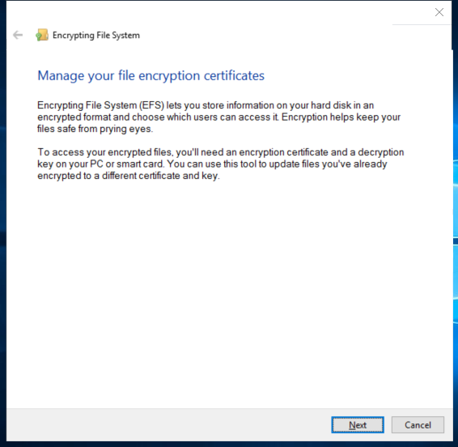

---
title: rekeywiz.exe | EFS REKEY wizard
---

# rekeywiz.exe 

* File Path: `C:\Windows\SysWOW64\rekeywiz.exe`
* Description: EFS REKEY wizard
* Comments: 

## Screenshot



## Hashes

Type | Hash
-- | --
MD5 | `C0B0EB11C9B90C4B99D067AF64726344`
SHA1 | `FC23C6A268B9C07547719BB011EEA886C5713FAA`
SHA256 | `1FD493E3FDED8E64F7C9B50EAB2E2062441728F4D3AEA8CA9FDC654C493794FF`
SHA384 | `D89F39292B6AF6A9F9BEEB776D587D211285D7CD19B1B84618C956F05CBAE885E2D7A3C9DCC93FE5EC32346AD72FFC31`
SHA512 | `FF179CB0936C16F591DA0F448C42CAABDBDA5F366944D7A4321DF2BB7B4956314CDB7D66100964C8C4380A0F1481D5F8803ED5102271E6ACCD775BEBAF14737E`
SSDEEP | `3072:fLvkQJ83UspFxd80BbZnXM27uP27ucBOitbBbP5QtvRBdh:jJJOTz2tvRBd`

## Runtime Data

### Usage (stdout):
```Batchfile

```

### Usage (stderr):
```Batchfile

```

### Child Processes:


## Signature

* Status: Signature verified.
* Serial: `3300000266BD1580EFA75CD6D3000000000266`
* Thumbprint: `A4341B9FD50FB9964283220A36A1EF6F6FAA7840`
* Issuer: CN=Microsoft Windows Production PCA 2011, O=Microsoft Corporation, L=Redmond, S=Washington, C=US
* Subject: CN=Microsoft Windows, O=Microsoft Corporation, L=Redmond, S=Washington, C=US

## File Metadata

* Original Filename: rekeywiz.exe
* Product Name: Microsoft Windows Operating System
* Company Name: Microsoft Corporation
* File Version: 10.0.19041.1 (WinBuild.160101.0800)
* Product Version: 10.0.19041.1
* Language: English (United States)
* Legal Copyright:  Microsoft Corporation. All rights reserved.


MIT License. Copyright (c) 2020 Strontic.


