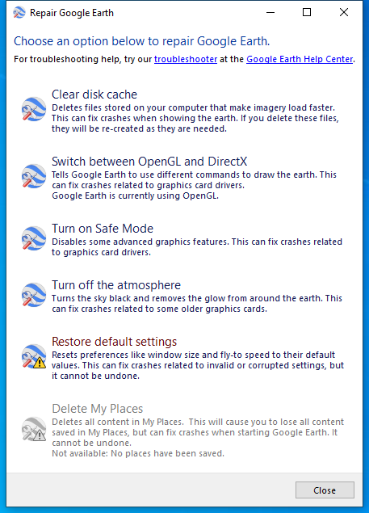

---
title: repair_tool.exe | 
---

# repair_tool.exe 

* File Path: `C:\program files (x86)\Google\Google Earth Pro\client\repair_tool.exe`

## Screenshot

## Hashes

Type | Hash
-- | --
MD5 | `1C2EB26D983EF35A66D0F721CB255951`
SHA1 | `53FAF23C3E071FF4F099F81D3E72344A2DDEDCCF`
SHA256 | `9559563F06A891BC5556E8C38DB688440C933A02069519BE7E4410BCC0465C0A`
SHA384 | `1D8F686A8E440FB06E2891B43E5209D51B06AB963B9E6A80DA78FB10E3F5269BA118A81686147FEC2EF4E21904E850CB`
SHA512 | `7D21D4B0527686B2824AF5A71EE124784B06495F7974415D7BEBC9AA7FC7B471593D20F896FBCB22D32BDA5F857059A013E47781E80CD3F86B012626E7B5167A`
SSDEEP | `6144:eTfe+grsA32YhsJR/qpi/m4yPgY0lDG51prhvHvME34q6uviTtPtT/uatjk:Ue+grsAGxJRypi/UgY581PtA`

## Runtime Data

### Window Title:
Repair Google Earth

### Open Handles:

Path | Type
-- | --
(R-D)   C:\Windows\System32\en-US\kernel32.dll.mui | File
(R-D)   C:\Windows\SysWOW64\en-US\user32.dll.mui | File
(RW-)   C:\Users\user\Documents | File
(RW-)   C:\Windows | File
\BaseNamedObjects\__ComCatalogCache__ | Section
\BaseNamedObjects\NLS_CodePage_1252_3_2_0_0 | Section
\BaseNamedObjects\NLS_CodePage_437_3_2_0_0 | Section
\Sessions\1\BaseNamedObjects\fc4HWNDInterface:8805ce | Section
\Sessions\1\BaseNamedObjects\windows_shell_global_counters | Section
\Sessions\1\Windows\Theme4048709601 | Section
\Windows\Theme603176458 | Section

### Loaded Modules:

Path |
-- |
C:\program files (x86)\Google\Google Earth Pro\client\repair_tool.exe |
C:\Windows\SYSTEM32\ntdll.dll |
C:\Windows\System32\wow64.dll |
C:\Windows\System32\wow64cpu.dll |
C:\Windows\System32\wow64win.dll |

## Signature

* Status: Signature verified.
* Serial: `0C15BE4A15BB0903C901B1D6C265302F`
* Thumbprint: `CB7E84887F3C6015FE7EDFB4F8F36DF7DC10590E`
* Issuer: CN=DigiCert SHA2 Assured ID Code Signing CA, OU=www.digicert.com, O=DigiCert Inc, C=US
* Subject: CN=Google LLC, O=Google LLC, L=Mountain View, S=ca, C=US

## File Metadata

* Original Filename: 
* Product Name: 
* Company Name: 
* File Version: 
* Product Version: 
* Language: 
* Legal Copyright: 

MIT License. Copyright (c) 2020 Strontic.

