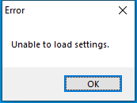

---
title: reporter.exe | Winamp Error Reporter
---

# reporter.exe 

* File Path: `C:\Program Files (x86)\Winamp\reporter.exe`
* Description: Winamp Error Reporter

## Screenshot

## Hashes

Type | Hash
-- | --
MD5 | `72B222158B729EA96823BCDAE3EFC771`
SHA1 | `0954AAE5102DB7D1FC9D60C1A476225AC95A5AAA`
SHA256 | `7C75B5878ADEC11AABE7C2FAEFFA054ADAC25EEB9655CC944F079BA6A328DD67`
SHA384 | `9C1786B7615948F7A434CA42946299DDBDBE7AF56009E2EEA8AC97615ACC03A685C3CD8C4D66D8F1EB6A12388B40B4F3`
SHA512 | `F74D93D77AC2E1AE00BC649854D16D217A6FFCBE81AA4D4F1AF63256A92A90215CAC060F823FAB2AD5604FE07B821CA9404BDDC320363E38BBF1D381B4BEA312`
SSDEEP | `3072:CxEprtOvJbOdtzfeuCcLUd+kNfXTmTMKWnD+HYy57eVue/mCW:PrtuJwzfeu3LafwMgY3`

## Signature

* Status: Signature verified.
* Serial: `3BA0DE68EE9CCED6F60B4FCD75203C05`
* Thumbprint: `C334E08D86580284EAA279348DA89415E917D660`
* Issuer: CN=thawte SHA256 Code Signing CA, O="thawte, Inc.", C=US
* Subject: CN=Winamp SA, O=Winamp SA, L=Bruxelles, C=BE

## File Metadata

* Original Filename: feedback.exe
* Product Name: Winamp
* Company Name: Winamp SA
* File Version: 5,8,0,3660
* Product Version: 5,8,0,3660
* Language: English (United States)
* Legal Copyright: Copyright  2005-2019 Winamp SA

## Possible Misuse

*The following table contains possible examples of `reporter.exe` being misused. While `reporter.exe` is **not** inherently malicious, its legitimate functionality can by abused for malicious purposes.*

Source | Source File | Example | License
-- | -- | -- | --
[atomic-red-team](https://github.com/redcanaryco/atomic-red-team) | [CODE_OF_CONDUCT.md](https://github.com/redcanaryco/atomic-red-team/blob/master/CODE_OF_CONDUCT.md) | Instances of abusive, harassing, or otherwise unacceptable behavior may be reported by contacting the project team at research at redcanary.com. The project team will review and investigate all complaints, and will respond in a way that it deems appropriate to the circumstances. The project team is obligated to maintain confidentiality with regard to the reporter of an incident. Further details of specific enforcement policies may be posted separately. | [MIT License. © 2018 Red Canary](https://github.com/redcanaryco/atomic-red-team/blob/master/LICENSE.txt)

MIT License. Copyright (c) 2020 Strontic.

