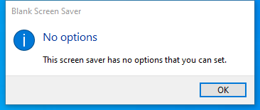

---
title: scrnsave.scr | Blank Screen Saver
excerpt: What is scrnsave.scr?
---

# scrnsave.scr 

* File Path: `C:\Windows\SysWOW64\scrnsave.scr`
* Description: Blank Screen Saver

## Screenshot

## Hashes

Type | Hash
-- | --
MD5 | `4F5B56F1A6B259FA15D0B77FF625D41F`
SHA1 | `11A04C52536A14652E3DE300EC9AFCCD9F78BE6F`
SHA256 | `32E047D1029404ED1D41D324D4819FD16327D803A61A7FD7F573E0AFFE67296D`
SHA384 | `6B4C862A99F34A662C5033AD0409E139AF80646A90359CFFC9A60227E30421BCBE319DFA31325FC72B3B8A295D73FD6F`
SHA512 | `5F5FC780362CF26B6507454D9F20C557A11E5F24805157DC95BAAF8DFE3289F1261E6F2685E639D4ECA0BFDDABB6F2E6260B97E298F9AEF9E0B348702BA5F9E3`
SSDEEP | `384:rycQHVX4hBfKL+ZDMOVNwE2iGFcAMkpplkxMlvVXA1OWiZ/aOvSj27lNICeWSl2h:rycPLSOIEsVMMpSS38UhIclNICuc`
IMP | `4D46E014C69A115F410E9BAB963E857F`
PESHA1 | `D777DC21E64D5210C0C492C024103E32D5114B36`
PE256 | `CAD3A06DF6350DC06BF340E306F1E856FD804FDE117B140A1B9C94A0DDE51FA5`

## Runtime Data

### Window Title:
Blank Screen Saver

### Open Handles:

Path | Type
-- | --
(R-D)   C:\Windows\Fonts\StaticCache.dat | File
(R-D)   C:\Windows\System32\en-US\duser.dll.mui | File
(R-D)   C:\Windows\SystemResources\imageres.dll.mun | File
(R-D)   C:\Windows\SysWOW64\en-US\scrnsave.scr.mui | File
(R-D)   C:\Windows\WinSxS\x86_microsoft.windows.c..-controls.resources_6595b64144ccf1df_6.0.19041.1_en-us_130e63d987a738df\comctl32.dll.mui | File
(RW-)   C:\Users\user | File
(RW-)   C:\Windows | File
(RW-)   C:\Windows\WinSxS\x86_microsoft.windows.c..-controls.resources_6595b64144ccf1df_6.0.19041.1_en-us_130e63d987a738df | File
(RW-)   C:\Windows\WinSxS\x86_microsoft.windows.common-controls_6595b64144ccf1df_6.0.19041.746_none_11afeb8d2fff49aa | File
\BaseNamedObjects\C:\*ProgramData\*Microsoft\*Windows\*Caches\*{6AF0698E-D558-4F6E-9B3C-3716689AF493}.2.ver0x0000000000000002.db | Section
\BaseNamedObjects\C:\*ProgramData\*Microsoft\*Windows\*Caches\*{DDF571F2-BE98-426D-8288-1A9A39C3FDA2}.2.ver0x0000000000000002.db | Section
\BaseNamedObjects\C:\*ProgramData\*Microsoft\*Windows\*Caches\*cversions.2 | Section
\BaseNamedObjects\NLS_CodePage_1252_3_2_0_0 | Section
\BaseNamedObjects\NLS_CodePage_437_3_2_0_0 | Section
\Sessions\1\Windows\Theme3205582532 | Section
\Windows\Theme3800351183 | Section

### Loaded Modules:

Path |
-- |
C:\Windows\SYSTEM32\ntdll.dll |
C:\Windows\System32\wow64.dll |
C:\Windows\System32\wow64cpu.dll |
C:\Windows\System32\wow64win.dll |
C:\Windows\SysWOW64\scrnsave.scr |

## Signature

* Status: Signature verified.
* Serial: `3300000266BD1580EFA75CD6D3000000000266`
* Thumbprint: `A4341B9FD50FB9964283220A36A1EF6F6FAA7840`
* Issuer: CN=Microsoft Windows Production PCA 2011, O=Microsoft Corporation, L=Redmond, S=Washington, C=US
* Subject: CN=Microsoft Windows, O=Microsoft Corporation, L=Redmond, S=Washington, C=US

## File Metadata

* Original Filename: scrnsave
* Product Name: Microsoft Windows Operating System
* Company Name: Microsoft Corporation
* File Version: 10.0.19041.1 (WinBuild.160101.0800)
* Product Version: 10.0.19041.1
* Language: English (United States)
* Legal Copyright:  Microsoft Corporation. All rights reserved.
* Machine Type: 32-bit

## File Scan

* VirusTotal Detections: 0/76
* VirusTotal Link: https://www.virustotal.com/gui/file/32e047d1029404ed1d41d324d4819fd16327d803a61a7fd7f573e0affe67296d/detection

## Possible Misuse

*The following table contains possible examples of `scrnsave.scr` being misused. While `scrnsave.scr` is **not** inherently malicious, its legitimate functionality can be abused for malicious purposes.*

Source | Source File | Example | License
-- | -- | -- | --
[atomic-red-team](https://github.com/redcanaryco/atomic-red-team) | [T1546.002.md](https://github.com/redcanaryco/atomic-red-team/blob/master/atomics/T1546.002/T1546.002.md) | <blockquote>Adversaries may establish persistence by executing malicious content triggered by user inactivity. Screensavers are programs that execute after a configurable time of user inactivity and consist of Portable Executable (PE) files with a .scr file extension.(Citation: Wikipedia Screensaver) The Windows screensaver application scrnsave.scr is located in <code>C:\Windows\System32\</code>, and <code>C:\Windows\sysWOW64\</code>  on 64-bit Windows systems, along with screensavers included with base Windows installations. | [MIT License. © 2018 Red Canary](https://github.com/redcanaryco/atomic-red-team/blob/master/LICENSE.txt)

MIT License. Copyright (c) 2020-2021 Strontic.

