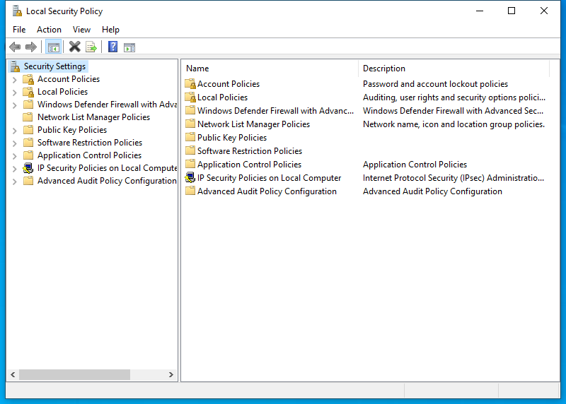

---
title: secpol.msc | 
excerpt: What is secpol.msc?
---

# secpol.msc 

* File Path: `C:\Windows\system32\secpol.msc`
* Description: Local Security Policy (Window Title)

## Screenshot

## Hashes

Type | Hash
-- | --
MD5 | `2BC2546831B054680C6F59888F295E44`
SHA1 | `803FE601EF245A0CEED55341FDD4381DA9C47E1F`
SHA256 | `7A87409FA7585554FD0F715B84FADFFF75B810FCC3AA6BAFE813F57E601F9E5E`
SHA384 | `B3C7A12ECE75F9DB076826175AF17AE5F847C55569845DB45EE0D4909874804E1F3B1C11E8E287E36B9701B8300463DF`
SHA512 | `4337B30D7CA06B8149B12ABABDDEB66369CCFD9CDEA4CF0D54C7E146624D0792951616800FAB4334BBBE4BB5AE6DF0A8E49F8B2DE4D8C8201810D6C04E70804C`
SSDEEP | `768:kBgicLZRdKYKEcAJpuC80TLKGrvlcana5wpkFS:kB9cXKEcCTLKZana5wpkFS`
PESHA1 | `803FE601EF245A0CEED55341FDD4381DA9C47E1F`
PE256 | `7A87409FA7585554FD0F715B84FADFFF75B810FCC3AA6BAFE813F57E601F9E5E`

## Runtime Data

### Window Title:
Local Security Policy

### Open Handles:

Path | Type
-- | --
(R-D)   C:\Windows\assembly\GAC_MSIL\Microsoft.ManagementConsole\3.0.0.0__31bf3856ad364e35\Microsoft.ManagementConsole.dll | File
(R-D)   C:\Windows\assembly\GAC_MSIL\MMCEx\3.0.0.0__31bf3856ad364e35\MMCEx.dll | File
(R-D)   C:\Windows\assembly\GAC_MSIL\MMCFxCommon\3.0.0.0__31bf3856ad364e35\MMCFxCommon.dll | File
(R-D)   C:\Windows\Fonts\StaticCache.dat | File
(R-D)   C:\Windows\Microsoft.NET\assembly\GAC_64\mscorlib\v4.0_4.0.0.0__b77a5c561934e089\mscorlib.dll | File
(R-D)   C:\Windows\Microsoft.NET\assembly\GAC_MSIL\Accessibility\v4.0_4.0.0.0__b03f5f7f11d50a3a\Accessibility.dll | File
(R-D)   C:\Windows\Microsoft.NET\assembly\GAC_MSIL\System.Configuration\v4.0_4.0.0.0__b03f5f7f11d50a3a\System.Configuration.dll | File
(R-D)   C:\Windows\Microsoft.NET\assembly\GAC_MSIL\System.Drawing\v4.0_4.0.0.0__b03f5f7f11d50a3a\System.Drawing.dll | File
(R-D)   C:\Windows\Microsoft.NET\assembly\GAC_MSIL\System.Windows.Forms\v4.0_4.0.0.0__b77a5c561934e089\System.Windows.Forms.dll | File
(R-D)   C:\Windows\Microsoft.NET\assembly\GAC_MSIL\System.Xml\v4.0_4.0.0.0__b77a5c561934e089\System.XML.dll | File
(R-D)   C:\Windows\Microsoft.NET\assembly\GAC_MSIL\System\v4.0_4.0.0.0__b77a5c561934e089\System.dll | File
(R-D)   C:\Windows\System32\dnscmmc.dll | File
(R-D)   C:\Windows\System32\en-US\aclui.dll.mui | File
(R-D)   C:\Windows\System32\en-US\AdmTmpl.dll.mui | File
(R-D)   C:\Windows\System32\en-US\AuditNativeSnapIn.dll.mui | File
(R-D)   C:\Windows\System32\en-US\authfwgp.dll.mui | File
(R-D)   C:\Windows\System32\en-US\certmgr.dll.mui | File
(R-D)   C:\Windows\System32\en-US\dnscmmc.dll.mui | File
(R-D)   C:\Windows\System32\en-US\dot3gpui.dll.mui | File
(R-D)   C:\Windows\System32\en-US\eqossnap.dll.mui | File
(R-D)   C:\Windows\System32\en-US\gpedit.dll.mui | File
(R-D)   C:\Windows\System32\en-US\ipsecsnp.dll.mui | File
(R-D)   C:\Windows\System32\en-US\KernelBase.dll.mui | File
(R-D)   C:\Windows\System32\en-US\MFC42u.dll.mui | File
(R-D)   C:\Windows\System32\en-US\mmc.exe.mui | File
(R-D)   C:\Windows\System32\en-US\mmcbase.dll.mui | File
(R-D)   C:\Windows\System32\en-US\mmcndmgr.dll.mui | File
(R-D)   C:\Windows\System32\en-US\nlmgp.dll.mui | File
(R-D)   C:\Windows\System32\en-US\ppcsnap.dll.mui | File
(R-D)   C:\Windows\System32\en-US\scrptadm.dll.mui | File
(R-D)   C:\Windows\System32\en-US\SrpUxNativeSnapIn.dll.mui | File
(R-D)   C:\Windows\System32\en-US\user32.dll.mui | File
(R-D)   C:\Windows\System32\en-US\wlangpui.dll.mui | File
(R-D)   C:\Windows\System32\en-US\wsecedit.dll.mui | File
(R-D)   C:\Windows\SystemResources\AuthFWGP.dll.mun | File
(R-D)   C:\Windows\SystemResources\gpedit.dll.mun | File
(R-D)   C:\Windows\SystemResources\ipsecsnp.dll.mun | File
(R-D)   C:\Windows\SystemResources\mmcbase.dll.mun | File
(R-D)   C:\Windows\SystemResources\mmcndmgr.dll.mun | File
(R-D)   C:\Windows\SystemResources\SrpUxNativeSnapIn.dll.mun | File
(R-D)   C:\Windows\SystemResources\wlangpui.dll.mun | File
(R-D)   C:\Windows\SystemResources\wsecedit.dll.mun | File
(RW-)   C:\Users\user | File
(RW-)   C:\Windows\System32 | File
(RW-)   C:\Windows\WinSxS\amd64_microsoft.windows.common-controls_6595b64144ccf1df_5.82.19041.488_none_4238de57f6b64d28 | File
(RW-)   C:\Windows\WinSxS\amd64_microsoft.windows.common-controls_6595b64144ccf1df_6.0.19041.746_none_ca02b4b61b8320a4 | File
(RW-)   C:\Windows\WinSxS\amd64_microsoft.windows.gdiplus_6595b64144ccf1df_1.1.19041.789_none_faf0a7e97612e7bb | File
\...\Cor_SxSPublic_IPCBlock | Section
\BaseNamedObjects\__ComCatalogCache__ | Section
\BaseNamedObjects\C:\*ProgramData\*Microsoft\*Windows\*Caches\*{6AF0698E-D558-4F6E-9B3C-3716689AF493}.2.ver0x0000000000000002.db | Section
\BaseNamedObjects\C:\*ProgramData\*Microsoft\*Windows\*Caches\*{DDF571F2-BE98-426D-8288-1A9A39C3FDA2}.2.ver0x0000000000000002.db | Section
\BaseNamedObjects\C:\*ProgramData\*Microsoft\*Windows\*Caches\*cversions.2 | Section
\BaseNamedObjects\Cor_Private_IPCBlock_v4_7972 | Section
\BaseNamedObjects\NLS_CodePage_1252_3_2_0_0 | Section
\BaseNamedObjects\NLS_CodePage_437_3_2_0_0 | Section
\BaseNamedObjects\windows_shell_global_counters | Section
\Sessions\1\BaseNamedObjects\1f24HWNDInterface:4d051a | Section
\Sessions\1\BaseNamedObjects\1f24HWNDInterface:55077a | Section
\Sessions\1\BaseNamedObjects\SessionImmersiveColorPreference | Section
\Sessions\1\BaseNamedObjects\windows_shell_global_counters | Section
\Sessions\1\Windows\Theme3205582532 | Section
\Windows\Theme3800351183 | Section

### Loaded Modules:

Path |
-- |
C:\Windows\SYSTEM32\apphelp.dll |
C:\Windows\System32\KERNEL32.DLL |
C:\Windows\System32\KERNELBASE.dll |
C:\Windows\SYSTEM32\mmc.exe |
C:\Windows\SYSTEM32\ntdll.dll |

## Signature

* Status: Signature verified.
* Serial: `3300000266BD1580EFA75CD6D3000000000266`
* Thumbprint: `A4341B9FD50FB9964283220A36A1EF6F6FAA7840`
* Issuer: CN=Microsoft Windows Production PCA 2011, O=Microsoft Corporation, L=Redmond, S=Washington, C=US
* Subject: CN=Microsoft Windows, O=Microsoft Corporation, L=Redmond, S=Washington, C=US

## File Metadata

* Original Filename: 
* Product Name: 
* Company Name: 
* File Version: 
* Product Version: 
* Language: 
* Legal Copyright: 

## File Scan

* VirusTotal Detections: 0/75
* VirusTotal Link: https://www.virustotal.com/gui/file/7a87409fa7585554fd0f715b84fadfff75b810fcc3aa6bafe813f57e601f9e5e/detection

## File Similarity (ssdeep match)

File | Score
-- | --
[C:\Windows\system32\en-US\secpol.msc](secpol.msc-2BC2546831B054680C6F59888F295E44.md) | 100

MIT License. Copyright (c) 2020-2021 Strontic.

