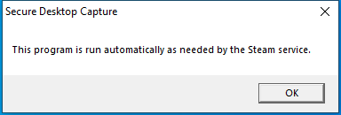

---
title: secure_desktop_capture.exe | secure_desktop_capture.exe
excerpt: What is secure_desktop_capture.exe?
---

# secure_desktop_capture.exe 

* File Path: `C:\Program Files (x86)\Steam\bin\secure_desktop_capture.exe`
* Description: secure_desktop_capture.exe

## Screenshot

## Hashes

Type | Hash
-- | --
MD5 | `904A348E99856C9729E6F2DEF56734B0`
SHA1 | `775DF26E726BD5D31C35DC81D9A50E1D5A21D28B`
SHA256 | `5CFD18E6FCB098D4B6025B9190729D5AB54744CA002DB32752FD116151BEACBB`
SHA384 | `D6C2C0AE96A450102DBE18D0BE2814E939363A793771F6CEED97B33DBE020618AEAC20D63CA6BD08264FAED973148669`
SHA512 | `CB2168418AFC367D40E3CB675B000BF072FC5D868642AC3E53CA5851C513E50292832E36F15281E99C6D02D78ED5E6BFA9529E32F92FE20F79C091493BB65609`
SSDEEP | `49152:0+HWJHe4Nb+NZVcrOc9/9JZ2/4gCSPbpHYMmRCeb2PmES:0UWJHjNb+bWrOc9+4gBxm9`

## Signature

* Status: Signature verified.
* Serial: `054F466CECCBE9D6BEE81F5435E64D47`
* Thumbprint: `F1565504FAFD15D14355A5D8D52C2BFF53ED15B3`
* Issuer: CN=DigiCert SHA2 Assured ID Code Signing CA, OU=www.digicert.com, O=DigiCert Inc, C=US
* Subject: CN=Valve, O=Valve, L=Bellevue, S=WA, C=US

## File Metadata

* Original Filename: secure_desktop_capture.exe
* Product Name: Steam
* Company Name: Valve Corporation
* File Version: 06.02.31.42
* Product Version: 01.00.00.01
* Language: English (United States)
* Legal Copyright: Copyright (C) 2018 Valve Corporation

MIT License. Copyright (c) 2020 Strontic.

