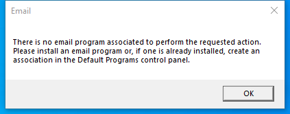

---
title: senddoc.exe | 
---

# senddoc.exe 

* File Path: `C:\Program Files\LibreOffice\program\senddoc.exe`

## Screenshot

## Hashes

Type | Hash
-- | --
MD5 | `AAD14E3E254C895D263CD446D4040644`
SHA1 | `0B360EE54425D183E3A6BCC4DC1D4F812A6FE0A4`
SHA256 | `5B4E35A1BBA2E32D81E90C45E9A67BA67C6B261E4AFEC58981F68070F7027184`
SHA384 | `5181B3BD1020C65F1C45EBB5788FC19272D7270E675E76217F3A6CC2FBFA6336CA0361CBDE76E6656D9B1842E6841384`
SHA512 | `D388B9B1644EE1C5401EF1A237E50AC2BC92ACAD90894505CE04455284E260630050BA46BDE7B2BE893FDA551BC617A0587F0ADF9A2819374F40AA8CF7D6C774`
SSDEEP | `1536:WmA6WRlWCnNzYHXO51F15iezY9d2F0sNrP/RkjrEpm:JA6Sl/uX61n5NkXqNrP/Rkjrum`

## Runtime Data

### Child Processes:
conhost.exe

## Signature

* Status: Signature verified.
* Serial: `049F5EBAA6B29CF6C79003917374242E`
* Thumbprint: `059BD34C72E8BE4FB19A80877268097C87F7D487`
* Issuer: CN=Certum Code Signing CA SHA2, OU=Certum Certification Authority, O=Unizeto Technologies S.A., C=PL
* Subject: E=info@documentfoundation.org, C=DE, S=Berlin, L=Berlin, OU=LibreOffice Build Team, O=The Document Foundation, CN=The Document Foundation

## File Metadata

* Original Filename: senddoc.exe
* Product Name: LibreOffice
* Company Name: The Document Foundation
* File Version: 7.0.0.3
* Product Version: 7.0.0.3
* Language: English (United States)
* Legal Copyright: Copyright  2000-2020 by LibreOffice contributors. All rights reserved.

MIT License. Copyright (c) 2020 Strontic.

