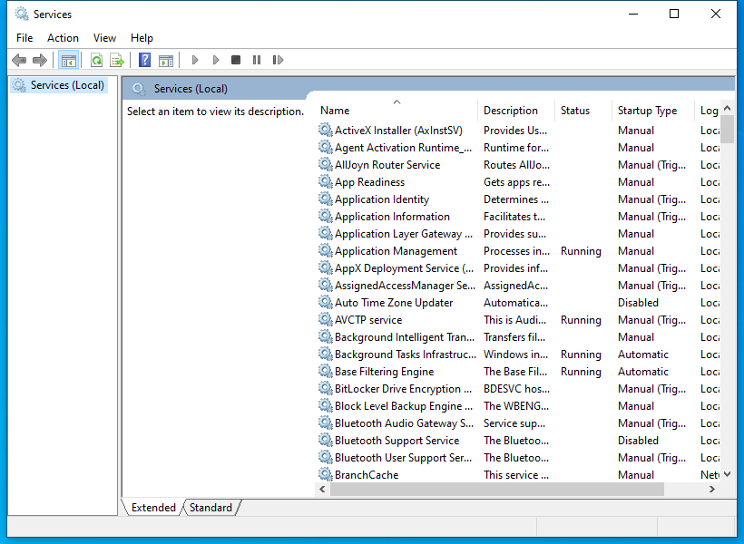

---
title: services.msc | 
excerpt: What is services.msc?
---

# services.msc 

* File Path: `C:\Windows\system32\services.msc`
* Description: Services (Window Title)

## Screenshot

## Hashes

Type | Hash
-- | --
MD5 | `2D8D95469EC26AAA986AAD1CE424E631`
SHA1 | `67BB8C749CD81B61C96B676525789D49D9BC9506`
SHA256 | `EB34E1DE291616F983BE230FE759324ACA5466C79CC393D0B3E80DE80914CCEF`
SHA384 | `325BDFBBFB694AFF581F277EF6589919C6446875669CD73804CDB6FB6C18A67CBB4095B47ABEE301B224225AEA001AFE`
SHA512 | `2BD8A9DBF5EE8927248142CE921BC1D9D7D3D887CBEC1213C01B324F6AA090D17A7FE811064598073A8F4127873727378AB2FFD4BACA4E43601A474E55AB9C2D`
SSDEEP | `192:cPWvvgKJGqEIpAwsfrecv0CjUTa5tPrKtYfcv0CjUTacoliI8RxkZkNxB9tdctjf:fvJ01rcba5tPr4YpbaXf`
PESHA1 | `67BB8C749CD81B61C96B676525789D49D9BC9506`
PE256 | `EB34E1DE291616F983BE230FE759324ACA5466C79CC393D0B3E80DE80914CCEF`

## Runtime Data

### Window Title:
Services

### Open Handles:

Path | Type
-- | --
(R-D)   C:\Windows\apppatch\DirectXApps_FOD.sdb | File
(R-D)   C:\Windows\Fonts\StaticCache.dat | File
(R-D)   C:\Windows\System32\atl.dll | File
(R-D)   C:\Windows\System32\en-US\filemgmt.dll.mui | File
(R-D)   C:\Windows\System32\en-US\ieframe.dll.mui | File
(R-D)   C:\Windows\System32\en-US\KernelBase.dll.mui | File
(R-D)   C:\Windows\System32\en-US\MFC42u.dll.mui | File
(R-D)   C:\Windows\System32\en-US\mmc.exe.mui | File
(R-D)   C:\Windows\System32\en-US\mmcbase.dll.mui | File
(R-D)   C:\Windows\System32\en-US\mmcndmgr.dll.mui | File
(R-D)   C:\Windows\System32\en-US\mshtml.dll.mui | File
(R-D)   C:\Windows\System32\en-US\urlmon.dll.mui | File
(R-D)   C:\Windows\System32\en-US\user32.dll.mui | File
(R-D)   C:\Windows\System32\en-US\winmm.dll.mui | File
(R-D)   C:\Windows\System32\mmc.exe | File
(R-D)   C:\Windows\System32\stdole2.tlb | File
(R-D)   C:\Windows\SystemResources\filemgmt.dll.mun | File
(R-D)   C:\Windows\SystemResources\mmcbase.dll.mun | File
(R-D)   C:\Windows\SystemResources\mmcndmgr.dll.mun | File
(RW-)   C:\Users\user | File
(RW-)   C:\Windows\WinSxS\amd64_microsoft.windows.common-controls_6595b64144ccf1df_5.82.19041.488_none_4238de57f6b64d28 | File
(RW-)   C:\Windows\WinSxS\amd64_microsoft.windows.common-controls_6595b64144ccf1df_6.0.19041.746_none_ca02b4b61b8320a4 | File
(RWD)   C:\Windows\Fonts\segoeui.ttf | File
\BaseNamedObjects\__ComCatalogCache__ | Section
\BaseNamedObjects\C:\*ProgramData\*Microsoft\*Windows\*Caches\*{6AF0698E-D558-4F6E-9B3C-3716689AF493}.2.ver0x0000000000000002.db | Section
\BaseNamedObjects\C:\*ProgramData\*Microsoft\*Windows\*Caches\*{DDF571F2-BE98-426D-8288-1A9A39C3FDA2}.2.ver0x0000000000000002.db | Section
\BaseNamedObjects\C:\*ProgramData\*Microsoft\*Windows\*Caches\*cversions.2 | Section
\BaseNamedObjects\NLS_CodePage_1252_3_2_0_0 | Section
\BaseNamedObjects\NLS_CodePage_437_3_2_0_0 | Section
\BaseNamedObjects\windows_shell_global_counters | Section
\Sessions\1\BaseNamedObjects\1018HWNDInterface:4604a2 | Section
\Sessions\1\BaseNamedObjects\1018HWNDInterface:4f04a0 | Section
\Sessions\1\BaseNamedObjects\1018HWNDInterface:b004c6 | Section
\Sessions\1\BaseNamedObjects\1018HWNDInterface:c9054c | Section
\Sessions\1\BaseNamedObjects\SessionImmersiveColorPreference | Section
\Sessions\1\BaseNamedObjects\UrlZonesSM_user | Section
\Sessions\1\BaseNamedObjects\windows_ie_global_counters | Section
\Sessions\1\BaseNamedObjects\windows_shell_global_counters | Section
\Sessions\1\BaseNamedObjects\windows_webcache_counters_{9B6AB5B3-91BC-4097-835C-EA2DEC95E9CC}_S-1-5-21-2047949552-857980807-821054962-504 | Section
\Sessions\1\Windows\Theme3205582532 | Section
\Windows\Theme3800351183 | Section

### Loaded Modules:

Path |
-- |
C:\Windows\SYSTEM32\apphelp.dll |
C:\Windows\System32\KERNEL32.DLL |
C:\Windows\System32\KERNELBASE.dll |
C:\Windows\SYSTEM32\mmc.exe |
C:\Windows\SYSTEM32\ntdll.dll |

## Signature

* Status: Signature verified.
* Serial: `3300000266BD1580EFA75CD6D3000000000266`
* Thumbprint: `A4341B9FD50FB9964283220A36A1EF6F6FAA7840`
* Issuer: CN=Microsoft Windows Production PCA 2011, O=Microsoft Corporation, L=Redmond, S=Washington, C=US
* Subject: CN=Microsoft Windows, O=Microsoft Corporation, L=Redmond, S=Washington, C=US

## File Metadata

* Original Filename: 
* Product Name: 
* Company Name: 
* File Version: 
* Product Version: 
* Language: 
* Legal Copyright: 

## File Scan

* VirusTotal Detections: 0/75
* VirusTotal Link: https://www.virustotal.com/gui/file/eb34e1de291616f983be230fe759324aca5466c79cc393d0b3e80de80914ccef/detection

## File Similarity (ssdeep match)

File | Score
-- | --
[C:\Windows\system32\en-US\services.msc](services.msc-2D8D95469EC26AAA986AAD1CE424E631.md) | 100
[C:\Windows\SysWOW64\services.msc](services.msc-2D8D95469EC26AAA986AAD1CE424E631.md) | 100

MIT License. Copyright (c) 2020-2021 Strontic.

