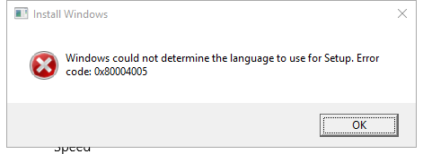
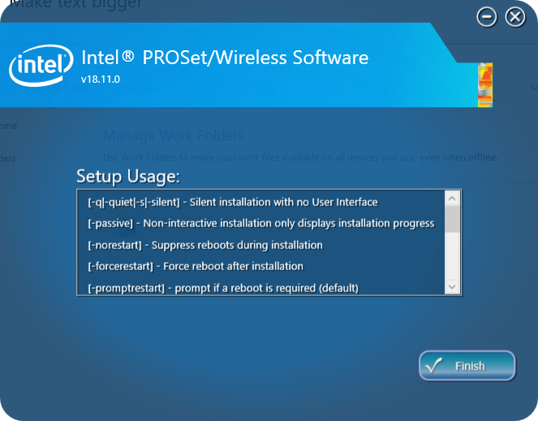
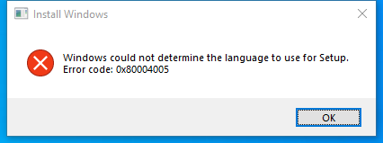

---
title: setup.exe | 32-bit Setup Launcher
excerpt: What is setup.exe?
---

# setup.exe 

* File Path: `C:\Windows\SysWOW64\InstallShield\setup.exe`
* Description: 32-bit Setup Launcher

## Screenshot

## Hashes

Type | Hash
-- | --
MD5 | `54A14F2C14537FA57BB31F52080733F4`
SHA1 | `9DD717434E2598F3EAB73032A500DE93558541FB`
SHA256 | `5D5CC12F985B30A43D79FA8D44EB6CB0CADDB47D2D33EC28FBC8416CFB7514DB`
SHA384 | `4A0C0AC1EB016CA4A5F20CF8AE7AEBE101E6DD71B03C7E94C904F7CF5D30F37B5231B20D6FCF9F575C9BF2DFAC19C1B6`
SHA512 | `0FD5A5C3E58D9160494772D193D6C0542C0089700A03F093217E4E4F9661825682F2F18F25CE5077FCB852DFF45D71505544B73D6AA341409C045C6333B99FFC`
SSDEEP | `1536:N8wNfktLYUqSfzC8wATsq3CRJMdzzOi3d0eFKg:N80ct8dSfmXosgCRJMdfO6FKg`
IMP | `09B39D9CC248E77D59A084898ED73E6C`
PESHA1 | `D759828F7F9C3CC9BAF19CD188D8A4F990AB2094`
PE256 | `D71B72FDAFADA48378D8F5E63A1B65A6EB16D8AFCDE65433C3B7FD7E25036933`

## Runtime Data

### Child Processes:
powershell_ise.exe

### Window Title:
Setup Initialization Error

### Open Handles:

Path | Type
-- | --
(R-D)   C:\Windows\Fonts\StaticCache.dat | File
(RW-)   C:\Users\user\Documents | File
(RW-)   C:\Windows | File
(RW-)   C:\Windows\WinSxS\x86_microsoft.windows.common-controls_6595b64144ccf1df_5.82.19041.488_none_89e6152f0b32762e | File
\BaseNamedObjects\NLS_CodePage_1252_3_2_0_0 | Section
\BaseNamedObjects\NLS_CodePage_437_3_2_0_0 | Section
\Sessions\1\Windows\Theme1703657751 | Section
\Windows\Theme1455388728 | Section

### Loaded Modules:

Path |
-- |
C:\Windows\SYSTEM32\ntdll.dll |
C:\Windows\System32\wow64.dll |
C:\Windows\System32\wow64cpu.dll |
C:\Windows\System32\wow64win.dll |
C:\Windows\SysWOW64\InstallShield\setup.exe |

## Signature

* Status: Signature verified.
* Serial: `330000023241FB59996DCC4DFF000000000232`
* Thumbprint: `FF82BC38E1DA5E596DF374C53E3617F7EDA36B06`
* Issuer: CN=Microsoft Windows Production PCA 2011, O=Microsoft Corporation, L=Redmond, S=Washington, C=US
* Subject: CN=Microsoft Windows, O=Microsoft Corporation, L=Redmond, S=Washington, C=US

## File Metadata

* Original Filename: 
* Product Name: InstallShield
* Company Name: InstallShield Software Corporation
* File Version: 5, 54, 001, 0
* Product Version: 5, 54
* Language: English (United States)
* Legal Copyright: Copyright 1990-2000 InstallShield Software Corporation, Phone: (847) 240-9111
* Machine Type: 32-bit

## File Scan

* VirusTotal Detections: 0/72
* VirusTotal Link: https://www.virustotal.com/gui/file/5d5cc12f985b30a43d79fa8d44eb6cb0caddb47d2d33ec28fbc8416cfb7514db/detection/

## File Similarity (ssdeep match)

File | Score
-- | --
[C:\Windows\SysWOW64\InstallShield\setup.exe](setup.exe-D3C5EB399AB4522ABF662EB72C23DB9B.md) | 99

## Possible Misuse

*The following table contains possible examples of `setup.exe` being misused. While `setup.exe` is **not** inherently malicious, its legitimate functionality can by abused for malicious purposes.*

Source | Source File | Example | License
-- | -- | -- | --
[sigma](https://github.com/Neo23x0/sigma) | [pypi-publish.yml](https://github.com/Neo23x0/sigma/blob/master/.github/workflows/pypi-publish.yml) | `uses: actions/setup-python@v1` | [DRL 1.0](https://github.com/Neo23x0/sigma/blob/master/LICENSE.Detection.Rules.md)
[sigma](https://github.com/Neo23x0/sigma) | [sigma-test.yml](https://github.com/Neo23x0/sigma/blob/master/.github/workflows/sigma-test.yml) | `uses: actions/setup-python@v1` | [DRL 1.0](https://github.com/Neo23x0/sigma/blob/master/LICENSE.Detection.Rules.md)
[sigma](https://github.com/Neo23x0/sigma) | [cisco_cli_net_sniff.yml](https://github.com/Neo23x0/sigma/blob/master/rules/network/cisco/aaa/cisco_cli_net_sniff.yml) | `description: Show when a monitor or a span/rspan is setup or modified` | [DRL 1.0](https://github.com/Neo23x0/sigma/blob/master/LICENSE.Detection.Rules.md)
[sigma](https://github.com/Neo23x0/sigma) | [cisco_cli_net_sniff.yml](https://github.com/Neo23x0/sigma/blob/master/rules/network/cisco/aaa/cisco_cli_net_sniff.yml) | `- Admins may setup new or modify old spans, or use a monitor for troubleshooting` | [DRL 1.0](https://github.com/Neo23x0/sigma/blob/master/LICENSE.Detection.Rules.md)
[sigma](https://github.com/Neo23x0/sigma) | [win_susp_security_eventlog_cleared.yml](https://github.com/Neo23x0/sigma/blob/master/rules/windows/builtin/win_susp_security_eventlog_cleared.yml) | `- Rollout of log collection agents (the setup routine often includes a reset of the local Eventlog)` | [DRL 1.0](https://github.com/Neo23x0/sigma/blob/master/LICENSE.Detection.Rules.md)
[sigma](https://github.com/Neo23x0/sigma) | [win_mal_flowcloud.yml](https://github.com/Neo23x0/sigma/blob/master/rules/windows/malware/win_mal_flowcloud.yml) | `- 'HKLM\SYSTEM\Setup\PrintResponsor\\*'` | [DRL 1.0](https://github.com/Neo23x0/sigma/blob/master/LICENSE.Detection.Rules.md)
[sigma](https://github.com/Neo23x0/sigma) | [win_apt_winnti_pipemon.yml](https://github.com/Neo23x0/sigma/blob/master/rules/windows/process_creation/win_apt_winnti_pipemon.yml) | `- 'setup.exe -x:0'` | [DRL 1.0](https://github.com/Neo23x0/sigma/blob/master/LICENSE.Detection.Rules.md)
[sigma](https://github.com/Neo23x0/sigma) | [win_apt_winnti_pipemon.yml](https://github.com/Neo23x0/sigma/blob/master/rules/windows/process_creation/win_apt_winnti_pipemon.yml) | `- 'setup.exe -x:1'` | [DRL 1.0](https://github.com/Neo23x0/sigma/blob/master/LICENSE.Detection.Rules.md)
[sigma](https://github.com/Neo23x0/sigma) | [win_apt_winnti_pipemon.yml](https://github.com/Neo23x0/sigma/blob/master/rules/windows/process_creation/win_apt_winnti_pipemon.yml) | `- 'setup.exe -x:2'` | [DRL 1.0](https://github.com/Neo23x0/sigma/blob/master/LICENSE.Detection.Rules.md)
[sigma](https://github.com/Neo23x0/sigma) | [win_exploit_cve_2019_1378.yml](https://github.com/Neo23x0/sigma/blob/master/rules/windows/process_creation/win_exploit_cve_2019_1378.yml) | `- '*\cmd.exe /c C:\Windows\Setup\Scripts\SetupComplete.cmd'` | [DRL 1.0](https://github.com/Neo23x0/sigma/blob/master/LICENSE.Detection.Rules.md)
[sigma](https://github.com/Neo23x0/sigma) | [win_exploit_cve_2019_1378.yml](https://github.com/Neo23x0/sigma/blob/master/rules/windows/process_creation/win_exploit_cve_2019_1378.yml) | `- '*\cmd.exe /c C:\Windows\Setup\Scripts\PartnerSetupComplete.cmd'` | [DRL 1.0](https://github.com/Neo23x0/sigma/blob/master/LICENSE.Detection.Rules.md)
[sigma](https://github.com/Neo23x0/sigma) | [win_exploit_cve_2019_1378.yml](https://github.com/Neo23x0/sigma/blob/master/rules/windows/process_creation/win_exploit_cve_2019_1378.yml) | `- 'C:\Windows\Setup\\*'` | [DRL 1.0](https://github.com/Neo23x0/sigma/blob/master/LICENSE.Detection.Rules.md)
[LOLBAS](https://github.com/LOLBAS-Project/LOLBAS) | [Setup.yml](https://github.com/LOLBAS-Project/LOLBAS/blob/master/yml/LOLUtilz/OtherBinaries/Setup.yml) | `Name: Setup.exe` | 
[LOLBAS](https://github.com/LOLBAS-Project/LOLBAS) | [Setup.yml](https://github.com/LOLBAS-Project/LOLBAS/blob/master/yml/LOLUtilz/OtherBinaries/Setup.yml) | `- Command: Run Setup.exe` | 
[LOLBAS](https://github.com/LOLBAS-Project/LOLBAS) | [Setup.yml](https://github.com/LOLBAS-Project/LOLBAS/blob/master/yml/LOLUtilz/OtherBinaries/Setup.yml) | `Description: Hijack hpbcsiServiceMarshaller.exe and run Setup.exe to launch a payload.` | 
[LOLBAS](https://github.com/LOLBAS-Project/LOLBAS) | [Runonce.yml](https://github.com/LOLBAS-Project/LOLBAS/blob/master/yml/OSBinaries/Runonce.yml) | `- IOC: HKLM\SOFTWARE\Microsoft\Active Setup\Installed Components\YOURKEY` | 
[LOLBAS](https://github.com/LOLBAS-Project/LOLBAS) | [Setupapi.yml](https://github.com/LOLBAS-Project/LOLBAS/blob/master/yml/OSLibraries/Setupapi.yml) | `Description: Windows Setup Application Programming Interface` | 
[LOLBAS](https://github.com/LOLBAS-Project/LOLBAS) | [Syssetup.yml](https://github.com/LOLBAS-Project/LOLBAS/blob/master/yml/OSLibraries/Syssetup.yml) | `Description: Windows NT System Setup` | 
[malware-ioc](https://github.com/eset/malware-ioc) | [attor](https://github.com/eset/malware-ioc/blob/master/attor/README.adoc) | `%COMMONAPPDATA%\Adobe\Setup\Replicate\US-sf` | [© ESET 2014-2018](https://github.com/eset/malware-ioc/blob/master/LICENSE)
[malware-ioc](https://github.com/eset/malware-ioc) | [attor](https://github.com/eset/malware-ioc/blob/master/attor/README.adoc) | `%COMMONAPPDATA%\Adobe\Setup\Replicate\US-nh` | [© ESET 2014-2018](https://github.com/eset/malware-ioc/blob/master/LICENSE)
[malware-ioc](https://github.com/eset/malware-ioc) | [attor](https://github.com/eset/malware-ioc/blob/master/attor/README.adoc) | `%COMMONAPPDATA%\Adobe\Setup\Replicate\US-zn` | [© ESET 2014-2018](https://github.com/eset/malware-ioc/blob/master/LICENSE)
[malware-ioc](https://github.com/eset/malware-ioc) | [attor](https://github.com/eset/malware-ioc/blob/master/attor/README.adoc) | `%COMMONAPPDATA%\Adobe\Setup\Replicate\US-pq` | [© ESET 2014-2018](https://github.com/eset/malware-ioc/blob/master/LICENSE)
[malware-ioc](https://github.com/eset/malware-ioc) | [glupteba.misp-event.json](https://github.com/eset/malware-ioc/blob/master/glupteba/glupteba.misp-event.json) | `"value": "setup.exe\|f7230b2cab4e4910bca473b39ee8fd4df394ce0d",` | [© ESET 2014-2018](https://github.com/eset/malware-ioc/blob/master/LICENSE)
[malware-ioc](https://github.com/eset/malware-ioc) | [glupteba](https://github.com/eset/malware-ioc/blob/master/glupteba/README.adoc) | `\|`F7230B2CAB4E4910BCA473B39EE8FD4DF394CE0D`\|setup.exe   \|MSIL/Adware.CsdiMonetize.AG` | [© ESET 2014-2018](https://github.com/eset/malware-ioc/blob/master/LICENSE)
[malware-ioc](https://github.com/eset/malware-ioc) | [misp-kryptocibule.json](https://github.com/eset/malware-ioc/blob/master/kryptocibule/misp-kryptocibule.json) | `"value": "%ProgramFiles(X86)%\\Adobe\\Acrobat Reader DC\\Reader\\Update\\Setup.dll",` | [© ESET 2014-2018](https://github.com/eset/malware-ioc/blob/master/LICENSE)
[malware-ioc](https://github.com/eset/malware-ioc) | [misp-kryptocibule.json](https://github.com/eset/malware-ioc/blob/master/kryptocibule/misp-kryptocibule.json) | `"value": "%ProgramFiles(X86)%\\Adobe\\Acrobat Reader DC\\Reader\\Update\\setup-version.json",` | [© ESET 2014-2018](https://github.com/eset/malware-ioc/blob/master/LICENSE)
[malware-ioc](https://github.com/eset/malware-ioc) | [kryptocibule](https://github.com/eset/malware-ioc/blob/master/kryptocibule/README.adoc) | `%ProgramFiles(X86)%\Adobe\Acrobat Reader DC\Reader\Update\Setup.dll` | [© ESET 2014-2018](https://github.com/eset/malware-ioc/blob/master/LICENSE)
[malware-ioc](https://github.com/eset/malware-ioc) | [kryptocibule](https://github.com/eset/malware-ioc/blob/master/kryptocibule/README.adoc) | `%ProgramFiles(X86)%\Adobe\Acrobat Reader DC\Reader\Update\setup-version.json` | [© ESET 2014-2018](https://github.com/eset/malware-ioc/blob/master/LICENSE)
[malware-ioc](https://github.com/eset/malware-ioc) | [potao](https://github.com/eset/malware-ioc/blob/master/potao/README.adoc) | `Fake TrueCrypt Setup:` | [© ESET 2014-2018](https://github.com/eset/malware-ioc/blob/master/LICENSE)
[malware-ioc](https://github.com/eset/malware-ioc) | [windigo](https://github.com/eset/malware-ioc/blob/master/windigo/README.adoc) | `depending on your setup. For example we know that `suPHP` uses shared memory.` | [© ESET 2014-2018](https://github.com/eset/malware-ioc/blob/master/LICENSE)
[malware-ioc](https://github.com/eset/malware-ioc) | [winnti_group](https://github.com/eset/malware-ioc/blob/master/winnti_group/README.adoc) | `setup.exe` | [© ESET 2014-2018](https://github.com/eset/malware-ioc/blob/master/LICENSE)
[atomic-red-team](https://github.com/redcanaryco/atomic-red-team) | [Atomic_Friday.md](https://github.com/redcanaryco/atomic-red-team/blob/master/ARTifacts/Atomic_Friday/2020-05-01/Atomic_Friday.md) | ## Setup | [MIT License. © 2018 Red Canary](https://github.com/redcanaryco/atomic-red-team/blob/master/LICENSE.txt)
[atomic-red-team](https://github.com/redcanaryco/atomic-red-team) | [Getting_Lateral.md](https://github.com/redcanaryco/atomic-red-team/blob/master/ARTifacts/Atomic_Friday/2020-05-01/Getting_Lateral.md) | ## Setup | [MIT License. © 2018 Red Canary](https://github.com/redcanaryco/atomic-red-team/blob/master/LICENSE.txt)
[atomic-red-team](https://github.com/redcanaryco/atomic-red-team) | [T1046.md](https://github.com/redcanaryco/atomic-red-team/blob/master/atomics/T1046/T1046.md) | \| nmap_url \| NMap installer download URL \| url \| https://nmap.org/dist/nmap-7.80-setup.exe\| | [MIT License. © 2018 Red Canary](https://github.com/redcanaryco/atomic-red-team/blob/master/LICENSE.txt)
[atomic-red-team](https://github.com/redcanaryco/atomic-red-team) | [T1046.md](https://github.com/redcanaryco/atomic-red-team/blob/master/atomics/T1046/T1046.md) | Invoke-WebRequest -OutFile $env:temp\nmap-7.80-setup.exe #{nmap_url} | [MIT License. © 2018 Red Canary](https://github.com/redcanaryco/atomic-red-team/blob/master/LICENSE.txt)
[atomic-red-team](https://github.com/redcanaryco/atomic-red-team) | [T1046.md](https://github.com/redcanaryco/atomic-red-team/blob/master/atomics/T1046/T1046.md) | Start-Process $env:temp\nmap-7.80-setup.exe /S | [MIT License. © 2018 Red Canary](https://github.com/redcanaryco/atomic-red-team/blob/master/LICENSE.txt)
[signature-base](https://github.com/Neo23x0/signature-base) | [airbnb_binaryalert.yar](https://github.com/Neo23x0/signature-base/blob/master/vendor/yara/airbnb_binaryalert.yar) | $a1 = "https://setup.icloud.com/setup/authenticate/" wide ascii | [CC BY-NC 4.0](https://github.com/Neo23x0/signature-base/blob/master/LICENSE)
[signature-base](https://github.com/Neo23x0/signature-base) | [airbnb_binaryalert.yar](https://github.com/Neo23x0/signature-base/blob/master/vendor/yara/airbnb_binaryalert.yar) | $s8 = "Setup a communication socket with the process by injecting" fullword ascii wide | [CC BY-NC 4.0](https://github.com/Neo23x0/signature-base/blob/master/LICENSE)
[signature-base](https://github.com/Neo23x0/signature-base) | [apt_bluetermite_emdivi.yar](https://github.com/Neo23x0/signature-base/blob/master/yara/apt_bluetermite_emdivi.yar) | $x1 = "Setup=unsecess.exe" fullword ascii | [CC BY-NC 4.0](https://github.com/Neo23x0/signature-base/blob/master/LICENSE)
[signature-base](https://github.com/Neo23x0/signature-base) | [apt_bluetermite_emdivi.yar](https://github.com/Neo23x0/signature-base/blob/master/yara/apt_bluetermite_emdivi.yar) | $x2 = "Setup=leassnp.exe" fullword ascii | [CC BY-NC 4.0](https://github.com/Neo23x0/signature-base/blob/master/LICENSE)
[signature-base](https://github.com/Neo23x0/signature-base) | [apt_irontiger.yar](https://github.com/Neo23x0/signature-base/blob/master/yara/apt_irontiger.yar) | $s0 = "\\setup.exe" fullword ascii | [CC BY-NC 4.0](https://github.com/Neo23x0/signature-base/blob/master/LICENSE)
[signature-base](https://github.com/Neo23x0/signature-base) | [apt_irontiger.yar](https://github.com/Neo23x0/signature-base/blob/master/yara/apt_irontiger.yar) | $s3 = "setup.exeUT" fullword ascii | [CC BY-NC 4.0](https://github.com/Neo23x0/signature-base/blob/master/LICENSE)
[signature-base](https://github.com/Neo23x0/signature-base) | [apt_miniasp.yar](https://github.com/Neo23x0/signature-base/blob/master/yara/apt_miniasp.yar) | $x2 = "run http://%s/logo.png setup.exe" fullword ascii /* PEStudio Blacklist: strings */ /* score: '37.02' */ | [CC BY-NC 4.0](https://github.com/Neo23x0/signature-base/blob/master/LICENSE)
[signature-base](https://github.com/Neo23x0/signature-base) | [apt_op_honeybee.yar](https://github.com/Neo23x0/signature-base/blob/master/yara/apt_op_honeybee.yar) | $x1 = "cmd /c expand %TEMP%\\setup.cab -F:* %SystemRoot%\\System32" | [CC BY-NC 4.0](https://github.com/Neo23x0/signature-base/blob/master/LICENSE)
[signature-base](https://github.com/Neo23x0/signature-base) | [apt_op_honeybee.yar](https://github.com/Neo23x0/signature-base/blob/master/yara/apt_op_honeybee.yar) | $x2 = "del /f /q %TEMP%\\setup.cab && cliconfg.exe" | [CC BY-NC 4.0](https://github.com/Neo23x0/signature-base/blob/master/LICENSE)
[signature-base](https://github.com/Neo23x0/signature-base) | [apt_op_honeybee.yar](https://github.com/Neo23x0/signature-base/blob/master/yara/apt_op_honeybee.yar) | $s6 = "\\setup.cab" fullword ascii | [CC BY-NC 4.0](https://github.com/Neo23x0/signature-base/blob/master/LICENSE)
[signature-base](https://github.com/Neo23x0/signature-base) | [apt_promethium_neodymium.yar](https://github.com/Neo23x0/signature-base/blob/master/yara/apt_promethium_neodymium.yar) | $s2 = "c:\\windows\\temp\\TrueCrypt-Setup-7.1a-tamindir.exe" fullword wide | [CC BY-NC 4.0](https://github.com/Neo23x0/signature-base/blob/master/LICENSE)
[signature-base](https://github.com/Neo23x0/signature-base) | [apt_sakula.yar](https://github.com/Neo23x0/signature-base/blob/master/yara/apt_sakula.yar) | description = "Sakula shellcode - taken from decoded setup.msi but may not be unique enough to identify Sakula" | [CC BY-NC 4.0](https://github.com/Neo23x0/signature-base/blob/master/LICENSE)
[signature-base](https://github.com/Neo23x0/signature-base) | [apt_threatgroup_3390.yar](https://github.com/Neo23x0/signature-base/blob/master/yara/apt_threatgroup_3390.yar) | $s7 = "setup.exeUT" fullword ascii  | [CC BY-NC 4.0](https://github.com/Neo23x0/signature-base/blob/master/LICENSE)
[signature-base](https://github.com/Neo23x0/signature-base) | [apt_threatgroup_3390.yar](https://github.com/Neo23x0/signature-base/blob/master/yara/apt_threatgroup_3390.yar) | $s6 = "\\setup.exe" fullword ascii  | [CC BY-NC 4.0](https://github.com/Neo23x0/signature-base/blob/master/LICENSE)
[signature-base](https://github.com/Neo23x0/signature-base) | [apt_winnti_burning_umbrella.yar](https://github.com/Neo23x0/signature-base/blob/master/yara/apt_winnti_burning_umbrella.yar) | $s1 = "c:\\windows\\ime\\setup.exe" fullword ascii | [CC BY-NC 4.0](https://github.com/Neo23x0/signature-base/blob/master/LICENSE)
[signature-base](https://github.com/Neo23x0/signature-base) | [cn_pentestset_tools.yar](https://github.com/Neo23x0/signature-base/blob/master/yara/cn_pentestset_tools.yar) | description = "Sample from CN Honker Pentest Toolset - file setup.exe" | [CC BY-NC 4.0](https://github.com/Neo23x0/signature-base/blob/master/LICENSE)
[signature-base](https://github.com/Neo23x0/signature-base) | [crime_fireball.yar](https://github.com/Neo23x0/signature-base/blob/master/yara/crime_fireball.yar) | $s3 = "\\SETUP.dll" fullword wide | [CC BY-NC 4.0](https://github.com/Neo23x0/signature-base/blob/master/LICENSE)
[signature-base](https://github.com/Neo23x0/signature-base) | [crime_nopetya_jun17.yar](https://github.com/Neo23x0/signature-base/blob/master/yara/crime_nopetya_jun17.yar) | $x6 = "wevtutil cl Setup & wevtutil cl System" ascii | [CC BY-NC 4.0](https://github.com/Neo23x0/signature-base/blob/master/LICENSE)
[signature-base](https://github.com/Neo23x0/signature-base) | [gen_anomalies_keyword_combos.yar](https://github.com/Neo23x0/signature-base/blob/master/yara/gen_anomalies_keyword_combos.yar) | $fp6 = "Paint.NET Setup" wide fullword | [CC BY-NC 4.0](https://github.com/Neo23x0/signature-base/blob/master/LICENSE)
[signature-base](https://github.com/Neo23x0/signature-base) | [gen_cn_hacktools.yar](https://github.com/Neo23x0/signature-base/blob/master/yara/gen_cn_hacktools.yar) | $s2 = "SwitchSniffer Setup" fullword wide | [CC BY-NC 4.0](https://github.com/Neo23x0/signature-base/blob/master/LICENSE)

MIT License. Copyright (c) 2020 Strontic.

