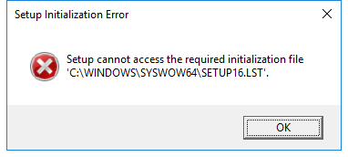

---
title: setup16.exe | MS-Setup Setup Exe
---

# setup16.exe 

* File Path: `C:\windows\SysWOW64\setup16.exe`
* Description: MS-Setup Setup Exe

## Screenshot

## Hashes

Type | Hash
-- | --
MD5 | `13DBC931C358F6F28E7B4145D53C4F95`
SHA1 | `15760AC9EFAC39804A46AC1314FE8913E16D273A`
SHA256 | `3D244E2BD05619FE4272E9E30C183E440CFF48BCDA8E24D62B12CAB68C9957E3`
SHA384 | `FB2898250BAD1ACFBA1261DB72FF2B9368D08F2749942DB4F3F4242B1DF6A93A8ECDF245823EAE2631AAC41B3A8CEE20`
SHA512 | `E06D2EB7C09939EE5B6680A280BE5CF70393DF546AE5E41A6DF74522B94F9BA80F19466E56DDD280C624E80402764A911D2FBD284139F494EB696E252167DF4D`
SSDEEP | `384:rFbbbTsT7N3sd4roLry/4lnoBnYZTG87g4I6B1LmRrVjsAq+FwWSpyW7E:ZyYNSsnEYZTG8eoLMRXqLk`

## Signature

* Status: Signature verified.
* Serial: `33000001C422B2F79B793DACB20000000001C4`
* Thumbprint: `AE9C1AE54763822EEC42474983D8B635116C8452`
* Issuer: CN=Microsoft Windows Production PCA 2011, O=Microsoft Corporation, L=Redmond, S=Washington, C=US
* Subject: CN=Microsoft Windows, O=Microsoft Corporation, L=Redmond, S=Washington, C=US

## File Metadata

* Original Filename: SETUP.EXE.MUI
* Product Name: Microsoft Windows Operating System
* Company Name: Microsoft Corporation
* File Version: 3.01 (WinBuild.160101.0800)
* Product Version: 10.0.17763.1
* Language: English (United States)
* Legal Copyright: Copyright  Microsoft Corp. 1991-1997

MIT License. Copyright (c) 2020 Strontic.

