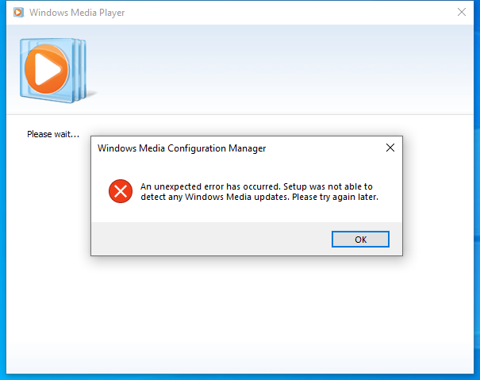

---
title: setup_wm.exe | Microsoft Windows Media Configuration Utility
excerpt: What is setup_wm.exe?
---

# setup_wm.exe 

* File Path: `C:\Program Files\Windows Media Player\setup_wm.exe`
* Description: Microsoft Windows Media Configuration Utility

## Screenshot

## Hashes

Type | Hash
-- | --
MD5 | `57D4AEB690D82A0DD1E98068CD9B952C`
SHA1 | `775EB42B60A7359FB4767B419058F12D7129F96A`
SHA256 | `5B3B574809CDB34EC08D8780512E3D65CED2FF18249BF783BC2EB43D65FD35AA`
SHA384 | `E29C46FB7279B2C6A6EAFFB74757B812F4CA4ABE738A380329A54CB139084216CD001E1E5DE65B6A3E974E020DED4975`
SHA512 | `44AFCA30B21CB9A02F5FC44AB992B78A328C374B861E5B61FF9E219BF868D86F74E874E893E105FD1AE4BC1EB8D4906FACCC394A941D6B1D1A9F0D3FF58B54DC`
SSDEEP | `12288:ZPZJ6KleBvpYtHWs+2KEkhRyPW3YQqLWtc0qpb0qD0xc:5dH9KEmyPW3YJLYq2qDF`
IMP | `8320F3E5239943346BDFCAC88457B52E`
PESHA1 | `E2C37CC691CB5004A18B0E23F683793AE396FB2B`
PE256 | `4F381140616AA7DF7CCA121BE52DAB00A3C9402A38A8BA0008BA72736D5F3C55`

## Runtime Data

### Window Title:
Windows Media Player

### Open Handles:

Path | Type
-- | --
(R--)   C:\Users\user\AppData\Local\Temp\wmsetup.log | File
(R-D)   C:\Program Files\Windows Media Player\en-US\setup_wm.exe.mui | File
(R-D)   C:\Windows\Fonts\StaticCache.dat | File
(R-D)   C:\Windows\System32\en-US\kernel32.dll.mui | File
(R-D)   C:\Windows\System32\en-US\mswsock.dll.mui | File
(R-D)   C:\Windows\System32\en-US\wininet.dll.mui | File
(R-D)   C:\Windows\SystemResources\imageres.dll.mun | File
(RW-)   C:\Users\user\Documents | File
(RW-)   C:\Windows\WinSxS\amd64_microsoft.windows.common-controls_6595b64144ccf1df_6.0.19041.488_none_ca04af081b815d21 | File
(RW-)   C:\Windows\WinSxS\amd64_microsoft.windows.gdiplus_6595b64144ccf1df_1.1.19041.508_none_faefa4f37613d18e | File
\BaseNamedObjects\__ComCatalogCache__ | Section
\BaseNamedObjects\F932B6C7-3A20-46A0-B8A0-8894AA421973 | Section
\BaseNamedObjects\NLS_CodePage_1252_3_2_0_0 | Section
\BaseNamedObjects\NLS_CodePage_437_3_2_0_0 | Section
\BaseNamedObjects\windows_shell_global_counters | Section
\Sessions\1\BaseNamedObjects\UrlZonesSM_user | Section
\Sessions\1\BaseNamedObjects\windows_shell_global_counters | Section
\Sessions\1\BaseNamedObjects\windows_webcache_counters_{9B6AB5B3-91BC-4097-835C-EA2DEC95E9CC}_S-1-5-21-2047949552-857980807-821054962-504 | Section
\Sessions\1\Windows\Theme64749523 | Section
\Windows\Theme1120315852 | Section

### Loaded Modules:

Path |
-- |
C:\Program Files\Windows Media Player\setup_wm.exe |
C:\Windows\System32\ADVAPI32.dll |
C:\Windows\SYSTEM32\ATL.DLL |
C:\Windows\System32\bcrypt.dll |
C:\Windows\System32\bcryptPrimitives.dll |
C:\Windows\System32\cfgmgr32.dll |
C:\Windows\System32\combase.dll |
C:\Windows\System32\CRYPT32.dll |
C:\Windows\System32\GDI32.dll |
C:\Windows\System32\gdi32full.dll |
C:\Windows\SYSTEM32\iertutil.dll |
C:\Windows\System32\IMM32.DLL |
C:\Windows\SYSTEM32\kernel.appcore.dll |
C:\Windows\System32\KERNEL32.DLL |
C:\Windows\System32\KERNELBASE.dll |
C:\Windows\SYSTEM32\MFPlat.DLL |
C:\Windows\SYSTEM32\MSASN1.dll |
C:\Windows\System32\msvcp_win.dll |
C:\Windows\System32\msvcrt.dll |
C:\Windows\SYSTEM32\ntdll.dll |
C:\Windows\System32\ole32.dll |
C:\Windows\System32\OLEAUT32.dll |
C:\Windows\SYSTEM32\pdh.dll |
C:\Windows\System32\RPCRT4.dll |
C:\Windows\SYSTEM32\RTWorkQ.DLL |
C:\Windows\System32\sechost.dll |
C:\Windows\SYSTEM32\Secur32.dll |
C:\Windows\System32\SETUPAPI.dll |
C:\Windows\System32\shcore.dll |
C:\Windows\System32\SHELL32.dll |
C:\Windows\System32\SHLWAPI.dll |
C:\Windows\SYSTEM32\SSPICLI.DLL |
C:\Windows\System32\ucrtbase.dll |
C:\Windows\SYSTEM32\urlmon.dll |
C:\Windows\System32\USER32.dll |
C:\Windows\SYSTEM32\USERENV.dll |
C:\Windows\system32\uxtheme.dll |
C:\Windows\SYSTEM32\VERSION.dll |
C:\Windows\System32\win32u.dll |
C:\Windows\SYSTEM32\WININET.dll |
C:\Windows\System32\WINTRUST.dll |
C:\Windows\WinSxS\amd64_microsoft.windows.common-controls_6595b64144ccf1df_6.0.19041.488_none_ca04af081b815d21\COMCTL32.dll |
C:\Windows\WinSxS\amd64_microsoft.windows.gdiplus_6595b64144ccf1df_1.1.19041.508_none_faefa4f37613d18e\gdiplus.dll |

## Signature

* Status: Signature verified.
* Serial: `3300000266BD1580EFA75CD6D3000000000266`
* Thumbprint: `A4341B9FD50FB9964283220A36A1EF6F6FAA7840`
* Issuer: CN=Microsoft Windows Production PCA 2011, O=Microsoft Corporation, L=Redmond, S=Washington, C=US
* Subject: CN=Microsoft Windows, O=Microsoft Corporation, L=Redmond, S=Washington, C=US

## File Metadata

* Original Filename: setup_wm.exe.mui
* Product Name: Microsoft Windows Operating System
* Company Name: Microsoft Corporation
* File Version: 12.0.19041.1 (WinBuild.160101.0800)
* Product Version: 12.0.19041.1
* Language: English (United States)
* Legal Copyright:  Microsoft Corporation. All rights reserved.
* Machine Type: 64-bit

## File Scan

* VirusTotal Detections: 0/68
* VirusTotal Link: https://www.virustotal.com/gui/file/5b3b574809cdb34ec08d8780512e3d65ced2ff18249bf783bc2eb43d65fd35aa/detection/

## File Similarity (ssdeep match)

File | Score
-- | --
[C:\Program Files (x86)\Windows Media Player\setup_wm.exe](setup_wm.exe-E9007E03F71E9651F89A49E4A1AD69A2.md) | 54

MIT License. Copyright (c) 2020 Strontic.

