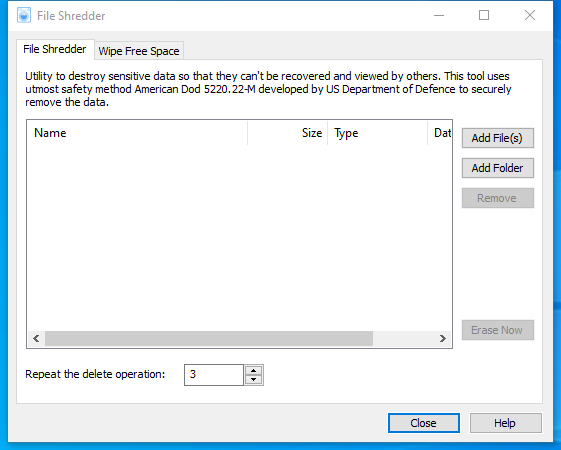

---
title: shredder.exe | Glary Utilities FileShredder
---

# shredder.exe 

* File Path: `C:\Program Files (x86)\Glary Utilities 5\shredder.exe`
* Description: Glary Utilities FileShredder

## Screenshot

## Hashes

Type | Hash
-- | --
MD5 | `91AC8DD454648C052E1E394D03215ADA`
SHA1 | `DF9D55B75A23D264BAC00B1EFD9DA6C2F10282EA`
SHA256 | `57890304540B32A4CA9B5973FB76903EC4E34ED3B2726420CB1B5467490B29EE`
SHA384 | `73E725703771082381114B314347E3926CE4C93600200C1F077008DCEA5361FB301EFFB9FEBA6C42D452B23CF6865ACC`
SHA512 | `F16D30821EBD7D62157BFBB5176827EA9DEC1B7F56CEA53F8D7A71FD0FB28D7E7CDAACB07C7219BE6461F7B48478C4AE7B49372033E6E276FB0526A76E8A6F1F`
SSDEEP | `3072:58cwGNVpHayDyDTBa3bgwbeqOZLMWwwpjWzuVo:58czp6WyDTgbgwbeqOZLt3wzd`

## Signature

* Status: Signature verified.
* Serial: `0F05AE21CDC17B9F3CF09D7BFC659BA3`
* Thumbprint: `362EBB303E088105BDCC07D94E6B7875D30C0D06`
* Issuer: CN=DigiCert Assured ID Code Signing CA-1, OU=www.digicert.com, O=DigiCert Inc, C=US
* Subject: CN=Glarysoft LTD, O=Glarysoft LTD, S=Beijing, C=CN

## File Metadata

* Original Filename: shredder.exe
* Product Name: Glary Utilities
* Company Name: Glarysoft Ltd
* File Version: 5.0.0.38
* Product Version: 5.0.0.1
* Language: Chinese (Simplified, China)
* Legal Copyright: Copyright (c) 2003-2020 Glarysoft Ltd

MIT License. Copyright (c) 2020 Strontic.

