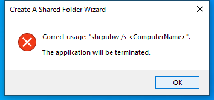
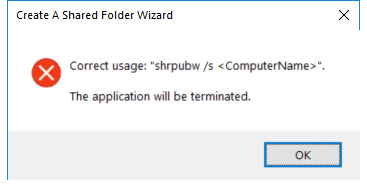

---
title: shrpubw.exe | Share Creation Wizard
excerpt: What is shrpubw.exe?
---

# shrpubw.exe 

* File Path: `C:\Windows\system32\shrpubw.exe`
* Description: Share Creation Wizard

## Screenshot

## Hashes

Type | Hash
-- | --
MD5 | `9910D5C62428EC5F92B04ABF9428EEC9`
SHA1 | `05F27D7515E8AE1FA3BC974EC65B864EC4C9AC8B`
SHA256 | `6B84E6E55D8572D7EDF0B6243D00ABB651FCB0CDDDDAC8461DE5F9BB80035A2E`
SHA384 | `41CD7222C52FF01B0DD3EF808AA4121F482286C5010C45B5AB41EFFEF75DDCE09EF1A2FC29B2E6AFEB2234090AD76C90`
SHA512 | `01BE043F7FF879A683E53962EEC58456BA200D6787EA66581BB62669AE65D5E58A5577CDF23441165F7A535FCE1DEC933E3AD2465C72172B4A1488B24CE722CB`
SSDEEP | `1536:YGanoDUow1Wt446VQFRlrDk7BOrkfRIUUgzwpRc:5nDKWt446VQF/r5k+jAww`
IMP | `521C24CDD31AC7EEAE6AE8E5130A93F2`
PESHA1 | `7F33EAE6682E46CCD339B586DD7C813589DA0B23`
PE256 | `7B5A4D025955681FE3E485F0B7167645EE497A4E3499C1FEC2613FD7225CAA6A`

## Runtime Data

### Child Processes:
RdpSa.exe

### Window Title:
Create A Shared Folder Wizard

### Open Handles:

Path | Type
-- | --
(R-D)   C:\Windows\Fonts\StaticCache.dat | File
(R-D)   C:\Windows\System32\en-US\aclui.dll.mui | File
(R-D)   C:\Windows\System32\en-US\MFC42u.dll.mui | File
(R-D)   C:\Windows\System32\en-US\shrpubw.exe.mui | File
(R-D)   C:\Windows\SystemResources\imageres.dll.mun | File
(RW-)   C:\Users\user | File
(RW-)   C:\Windows\WinSxS\amd64_microsoft.windows.common-controls_6595b64144ccf1df_6.0.19041.488_none_ca04af081b815d21 | File
\BaseNamedObjects\C:\*ProgramData\*Microsoft\*Windows\*Caches\*{6AF0698E-D558-4F6E-9B3C-3716689AF493}.2.ver0x0000000000000002.db | Section
\BaseNamedObjects\C:\*ProgramData\*Microsoft\*Windows\*Caches\*{DDF571F2-BE98-426D-8288-1A9A39C3FDA2}.2.ver0x0000000000000002.db | Section
\BaseNamedObjects\C:\*ProgramData\*Microsoft\*Windows\*Caches\*cversions.2 | Section
\BaseNamedObjects\NLS_CodePage_1252_3_2_0_0 | Section
\BaseNamedObjects\NLS_CodePage_437_3_2_0_0 | Section
\Sessions\1\Windows\Theme1800662698 | Section
\Windows\Theme722103516 | Section

### Loaded Modules:

Path |
-- |
C:\Windows\system32\ACLUI.dll |
C:\Windows\System32\ADVAPI32.dll |
C:\Windows\System32\combase.dll |
C:\Windows\System32\GDI32.dll |
C:\Windows\System32\gdi32full.dll |
C:\Windows\System32\IMM32.DLL |
C:\Windows\System32\KERNEL32.DLL |
C:\Windows\System32\KERNELBASE.dll |
C:\Windows\system32\MFC42u.dll |
C:\Windows\System32\msvcp_win.dll |
C:\Windows\System32\msvcrt.dll |
C:\Windows\system32\netutils.dll |
C:\Windows\SYSTEM32\ntdll.dll |
C:\Windows\system32\NTDSAPI.dll |
C:\Windows\System32\OLE32.dll |
C:\Windows\System32\OLEAUT32.dll |
C:\Windows\System32\RPCRT4.dll |
C:\Windows\System32\sechost.dll |
C:\Windows\System32\SHCORE.DLL |
C:\Windows\System32\SHELL32.dll |
C:\Windows\System32\SHLWAPI.dll |
C:\Windows\system32\shrpubw.exe |
C:\Windows\system32\srvcli.dll |
C:\Windows\System32\ucrtbase.dll |
C:\Windows\System32\USER32.dll |
C:\Windows\System32\win32u.dll |
C:\Windows\System32\WS2_32.dll |
C:\Windows\system32\XmlLite.dll |
C:\Windows\WinSxS\amd64_microsoft.windows.common-controls_6595b64144ccf1df_6.0.19041.488_none_ca04af081b815d21\COMCTL32.dll |

## Signature

* Status: Signature verified.
* Serial: `3300000266BD1580EFA75CD6D3000000000266`
* Thumbprint: `A4341B9FD50FB9964283220A36A1EF6F6FAA7840`
* Issuer: CN=Microsoft Windows Production PCA 2011, O=Microsoft Corporation, L=Redmond, S=Washington, C=US
* Subject: CN=Microsoft Windows, O=Microsoft Corporation, L=Redmond, S=Washington, C=US

## File Metadata

* Original Filename: shrpubw.exe.mui
* Product Name: Microsoft Windows Operating System
* Company Name: Microsoft Corporation
* File Version: 10.0.19041.1 (WinBuild.160101.0800)
* Product Version: 10.0.19041.1
* Language: English (United States)
* Legal Copyright:  Microsoft Corporation. All rights reserved.
* Machine Type: 64-bit

## File Scan

* VirusTotal Detections: 0/73
* VirusTotal Link: https://www.virustotal.com/gui/file/6b84e6e55d8572d7edf0b6243d00abb651fcb0cddddac8461de5f9bb80035a2e/detection

MIT License. Copyright (c) 2020 Strontic.

