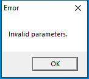

---
title: sllauncher.exe | Microsoft Silverlight Out-of-Browser Launcher
---

# sllauncher.exe 

* File Path: `C:\Program Files\Microsoft Silverlight\sllauncher.exe`
* Description: Microsoft Silverlight Out-of-Browser Launcher

## Screenshot

## Hashes

Type | Hash
-- | --
MD5 | `1FE1137DA5F4B27874483013ADC48E2C`
SHA1 | `E48B9D3EB2A30F1138129F421471ED6012F1FDBF`
SHA256 | `AE4F4CB0DAAB04CB4C7DD2D6182EA38DEE8B9CD3E0D7883C944E6CD7630A2F98`
SHA384 | `2F2890F15A6E8F5419867978E05F06C1758BC0182A779B01168598C8CE4C6129B5A7F85B07D44BED7B9271BD3B7C9552`
SHA512 | `2810D6B71EF623CC925C05C20B85C80B6AB0F4279D1340D2A5C95AFFFAFE2EC2C3F95A18CD12655ED2E6050C44E666B4A1277673F4975130D9A1F88195A7C28C`
SSDEEP | `12288:V2c62MvEAxOC87yLbjOO4NbmeBlVcjrIM:C2nP7yl4NqeBlVcjrIM`

## Signature

* Status: Signature verified.
* Serial: `33000001B1DDEDBA54E965B85F0001000001B1`
* Thumbprint: `9DC17888B5CFAD98B3CB35C1994E96227F061675`
* Issuer: CN=Microsoft Code Signing PCA, O=Microsoft Corporation, L=Redmond, S=Washington, C=US
* Subject: CN=Microsoft Corporation, O=Microsoft Corporation, L=Redmond, S=Washington, C=US

## File Metadata

* Original Filename: sllauncher.exe
* Product Name: Microsoft Silverlight
* Company Name: Microsoft Corporation
* File Version: 5.1.50918.0
* Product Version: 5.1.50918.0
* Language: English (United States)
* Legal Copyright:  Microsoft Corporation.  All rights reserved.

## Possible Misuse

*The following table contains possible examples of `sllauncher.exe` being misused. While `sllauncher.exe` is **not** inherently malicious, its legitimate functionality can by abused for malicious purposes.*

Source | Source File | Example | License
-- | -- | -- | --
[sigma](https://github.com/Neo23x0/sigma) | [win_apt_emissarypanda_sep19.yml](https://github.com/Neo23x0/sigma/blob/master/rules/windows/process_creation/win_apt_emissarypanda_sep19.yml) | `title: Emissary Panda Malware SLLauncher` | [DRL 1.0](https://github.com/Neo23x0/sigma/blob/master/LICENSE.Detection.Rules.md)
[sigma](https://github.com/Neo23x0/sigma) | [win_apt_emissarypanda_sep19.yml](https://github.com/Neo23x0/sigma/blob/master/rules/windows/process_creation/win_apt_emissarypanda_sep19.yml) | `        ParentImage: '*\sllauncher.exe'` | [DRL 1.0](https://github.com/Neo23x0/sigma/blob/master/LICENSE.Detection.Rules.md)

MIT License. Copyright (c) 2020 Strontic.

