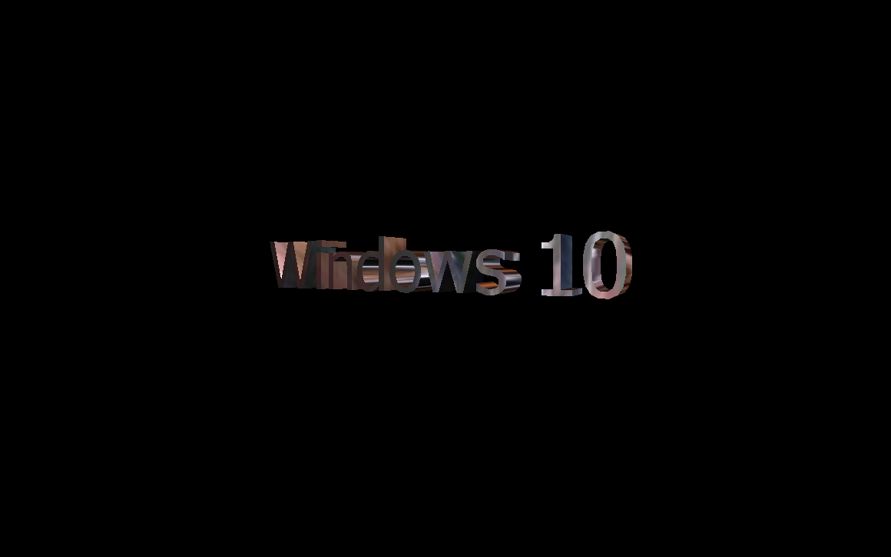
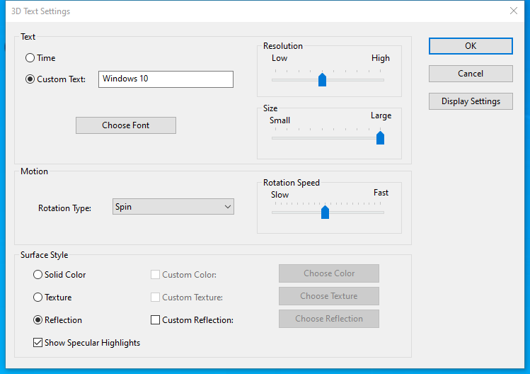

---
title: ssText3d.scr | 3D Text Screen Saver
excerpt: What is ssText3d.scr?
---

# ssText3d.scr 

* File Path: `C:\Windows\system32\ssText3d.scr`
* Description: 3D Text Screen Saver

## Screenshot

## Hashes

Type | Hash
-- | --
MD5 | `7631304F6B2B9DDCA51CE680A491A538`
SHA1 | `C674677C92A141C769920CFF5AC5BB013F8A94D5`
SHA256 | `CAB56DF04FF6CC92C563F167739904FE687E13189052E725049A6945FB62C48F`
SHA384 | `6FC98BDB5481D9FF4D892800E46523107091B057F038FC51951494FB040D5930D5595AF63E4404288F7389D54C6E75D4`
SHA512 | `2B7234CADBD0FDDEAFCE76E444E1380BBB45863AE8181FD537173E1222906544F1834A89C7AE9600D8D9B8733F9B60D97034AE72EC469A5F4BB8D37B8E97408B`
SSDEEP | `6144:vmhpDBT85lkeNxwX9d/g1DsEN/UVL0pe/dv8y:vODBgIesd/g1DsEN/Uq4/W`
IMP | `9E9C88F7957B51FAF8F42F5D49164745`
PESHA1 | `C65BD95FEAD47778454BF0D196804BF8F910000F`
PE256 | `D1B4AEA131BDCB675EA3E5847B0608686097F2AC608B9DAE2AAB2B84AE516B0E`

## Runtime Data

### Window Title:
3D Text

### Open Handles:

Path | Type
-- | --
(R-D)   C:\Windows\Fonts\StaticCache.dat | File
(R-D)   C:\Windows\System32\en-US\ssText3d.scr.mui | File
(RW-)   C:\Users\user | File
(RW-)   C:\Windows\WinSxS\amd64_microsoft.windows.common-controls_6595b64144ccf1df_6.0.19041.746_none_ca02b4b61b8320a4 | File
\BaseNamedObjects\__ComCatalogCache__ | Section
\BaseNamedObjects\C:\*ProgramData\*Microsoft\*Windows\*Caches\*{6AF0698E-D558-4F6E-9B3C-3716689AF493}.2.ver0x0000000000000002.db | Section
\BaseNamedObjects\C:\*ProgramData\*Microsoft\*Windows\*Caches\*{DDF571F2-BE98-426D-8288-1A9A39C3FDA2}.2.ver0x0000000000000002.db | Section
\BaseNamedObjects\C:\*ProgramData\*Microsoft\*Windows\*Caches\*cversions.2 | Section
\BaseNamedObjects\NLS_CodePage_1252_3_2_0_0 | Section
\BaseNamedObjects\NLS_CodePage_437_3_2_0_0 | Section
\Sessions\1\Windows\Theme3205582532 | Section
\Windows\Theme3800351183 | Section

### Loaded Modules:

Path |
-- |
C:\Windows\System32\ADVAPI32.dll |
C:\Windows\System32\GDI32.dll |
C:\Windows\System32\KERNEL32.DLL |
C:\Windows\System32\KERNELBASE.dll |
C:\Windows\System32\msvcrt.dll |
C:\Windows\SYSTEM32\ntdll.dll |
C:\Windows\System32\RPCRT4.dll |
C:\Windows\System32\sechost.dll |
C:\Windows\system32\ssText3d.scr |

## Signature

* Status: Signature verified.
* Serial: `3300000266BD1580EFA75CD6D3000000000266`
* Thumbprint: `A4341B9FD50FB9964283220A36A1EF6F6FAA7840`
* Issuer: CN=Microsoft Windows Production PCA 2011, O=Microsoft Corporation, L=Redmond, S=Washington, C=US
* Subject: CN=Microsoft Windows, O=Microsoft Corporation, L=Redmond, S=Washington, C=US

## File Metadata

* Original Filename: Text3D
* Product Name: Microsoft Windows Operating System
* Company Name: Microsoft Corporation
* File Version: 10.0.19041.1 (WinBuild.160101.0800)
* Product Version: 10.0.19041.1
* Language: English (United States)
* Legal Copyright:  Microsoft Corporation. All rights reserved.
* Machine Type: 64-bit

## File Scan

* VirusTotal Detections: 0/75
* VirusTotal Link: https://www.virustotal.com/gui/file/cab56df04ff6cc92c563f167739904fe687e13189052e725049a6945fb62c48f/detection

MIT License. Copyright (c) 2020-2021 Strontic.

