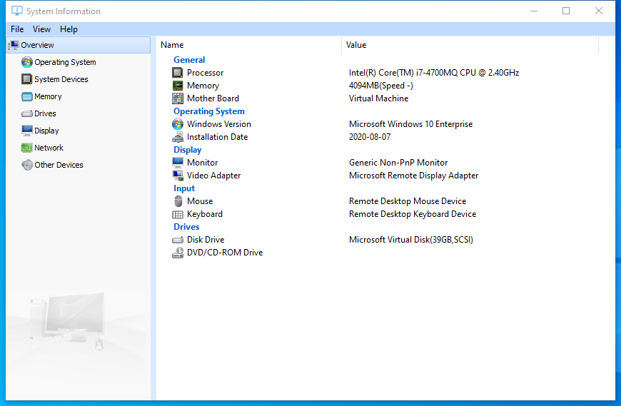

---
title: sysinfo.exe | Glary Utilities SystemInformation
excerpt: What is sysinfo.exe?
---

# sysinfo.exe 

* File Path: `C:\program files (x86)\Glary Utilities 5\sysinfo.exe`
* Description: Glary Utilities SystemInformation

## Screenshot

## Hashes

Type | Hash
-- | --
MD5 | `200D8F681765D6EC71F7744099938C40`
SHA1 | `6B23FF086EFB432358AB171AB54F97D630F72428`
SHA256 | `DCDB33CEE4605D0BB3631A9B32CB67BB7F276BE412FE67EC17B8372926C9ACAD`
SHA384 | `0A05433B025B0C91F3A2AFB425F476FA5E745F85C0C3E77A5E880C8F8551ABCD9D13267CE49220C7C7ED450F822980F1`
SHA512 | `E2C623B85F008B27B97B7C861C6193F24F9AE1256E2E68E285F9FDAF4459D01A7B76AF0314D826389D4F04F21AC5C9D0EB026438288AD64AD36EFF77F3D7AF02`
SSDEEP | `12288:yLXfrr8Jl/XR1MoVpib8UdUzA+wAzaoKu:KXfX8Jl/XIocdU0+wAzaoKu`

## Runtime Data

### Window Title:
System Information

### Open Handles:

Path | Type
-- | --
(R-D)   C:\Windows\Fonts\StaticCache.dat | File
(R-D)   C:\Windows\SysWOW64\en-US\user32.dll.mui | File
(RW-)   C:\Program Files (x86)\Glary Utilities 5 | File
(RW-)   C:\Users\user\Documents | File
(RW-)   C:\Windows | File
(RW-)   C:\Windows\WinSxS\x86_microsoft.vc90.crt_1fc8b3b9a1e18e3b_9.0.30729.9625_none_508ef7e4bcbbe589 | File
(RW-)   C:\Windows\WinSxS\x86_microsoft.windows.common-controls_6595b64144ccf1df_6.0.19041.1_none_fd031af45b0106f2 | File
(RW-)   C:\Windows\WinSxS\x86_microsoft.windows.gdiplus_6595b64144ccf1df_1.1.19041.450_none_4294d6e08a97344a | File
\BaseNamedObjects\__ComCatalogCache__ | Section
\BaseNamedObjects\NLS_CodePage_1252_3_2_0_0 | Section
\BaseNamedObjects\NLS_CodePage_437_3_2_0_0 | Section
\Sessions\1\Windows\Theme4048709601 | Section
\Windows\Theme603176458 | Section

### Loaded Modules:

Path |
-- |
C:\program files (x86)\Glary Utilities 5\sysinfo.exe |
C:\Windows\SYSTEM32\ntdll.dll |
C:\Windows\System32\wow64.dll |
C:\Windows\System32\wow64cpu.dll |
C:\Windows\System32\wow64win.dll |

## Signature

* Status: Signature verified.
* Serial: `0F05AE21CDC17B9F3CF09D7BFC659BA3`
* Thumbprint: `362EBB303E088105BDCC07D94E6B7875D30C0D06`
* Issuer: CN=DigiCert Assured ID Code Signing CA-1, OU=www.digicert.com, O=DigiCert Inc, C=US
* Subject: CN=Glarysoft LTD, O=Glarysoft LTD, S=Beijing, C=CN

## File Metadata

* Original Filename: SysInfo.exe
* Product Name: Glary Utilities
* Company Name: Glarysoft Ltd
* File Version: 5.0.0.22
* Product Version: 5.0.0.1
* Language: Chinese (Simplified, China)
* Legal Copyright: Copyright (c) 2003-2020 Glarysoft Ltd

## Possible Misuse

*The following table contains possible examples of `sysinfo.exe` being misused. While `sysinfo.exe` is **not** inherently malicious, its legitimate functionality can be abused for malicious purposes.*

Source | Source File | Example | License
-- | -- | -- | --
[malware-ioc](https://github.com/eset/malware-ioc) | [nukesped_lazarus](https://github.com/eset/malware-ioc/blob/master/nukesped_lazarus/README.adoc) | `.`sysinfo.exe`` | [© ESET 2014-2018](https://github.com/eset/malware-ioc/blob/master/LICENSE)

MIT License. Copyright (c) 2020 Strontic.

