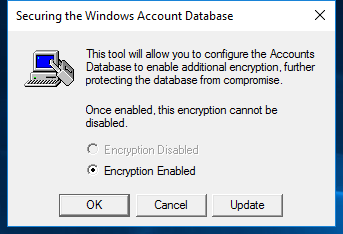
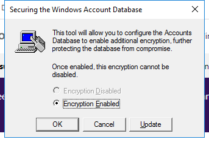

---
title: syskey.exe | SAM Lock Tool
---

# syskey.exe 

* File Path: `C:\windows\system32\syskey.exe`
* Description: SAM Lock Tool
* Comments: 

## Screenshot




## Hashes

Type | Hash
-- | --
MD5 | `DA66E801F6A77E5FD1EFDA4EFAB3660F`
SHA1 | `32334162B557E7FB6FFFDB291BF4619F0829C9A1`
SHA256 | `27CE005BE8EF9A40BE2E041C55886FE84F37E445F0DC46F7BFA45E0D49B9C536`
SHA384 | `C6F48852425F5DEC073CD97321BD4D099832B4BE6F6B1CE1A89E8D36006B50638C2AE749AD63BD80CFB257BA831E8398`
SHA512 | `31E89059BA60B432C8A54F81529D5126DFE671D8E45C284D4E2C3798A8107B414F2CAD6F710C119E4D4A24190B120F8CA802EFFA4C75C7AAA64B09EDB3440C3C`
SSDEEP | `768:+JdVzO1l8yXr2yyVOru0Brk0h3LW610g:QUJr2yY/sk0hj10g`

## Runtime Data

### Usage (stdout):
```Batchfile

```

### Usage (stderr):
```Batchfile

```

### Child Processes:


## Signature

* Status: The file C:\windows\system32\syskey.exe is not digitally signed. You cannot run this script on the current system. For more information about running scripts and setting execution policy, see about_Execution_Policies at http://go.microsoft.com/fwlink/?LinkID=135170
* Serial: ``
* Thumbprint: ``
* Issuer: 
* Subject: 

## File Metadata

* Original Filename: samlock.exe.mui
* Product Name: Microsoft Windows Operating System
* Company Name: Microsoft Corporation
* File Version: 6.3.9600.16384 (winblue_rtm.130821-1623)
* Product Version: 6.3.9600.16384
* Language: English (United States)
* Legal Copyright:  Microsoft Corporation. All rights reserved.


## Possible Misuse

*The following table contains possible examples of `syskey.exe` being misused. While `syskey.exe` is **not** inherently malicious, its legitimate functionality can by abused for malicious purposes.*

Source | Source File | Example | License
-- | -- | -- | --
[sigma](https://github.com/Neo23x0/sigma) | [godmode_sigma_rule.yml](https://github.com/Neo23x0/sigma/blob/master/other/godmode_sigma_rule.yml) | `            - 'reg SAVE HKLM\SAM'  # save registry SAM - syskey extraction` | [DRL 1.0](https://github.com/Neo23x0/sigma/blob/master/LICENSE.Detection.Rules.md)
[sigma](https://github.com/Neo23x0/sigma) | [win_syskey_registry_access.yml](https://github.com/Neo23x0/sigma/blob/master/rules/windows/builtin/win_syskey_registry_access.yml) | `title: SysKey Registry Keys Access` | [DRL 1.0](https://github.com/Neo23x0/sigma/blob/master/LICENSE.Detection.Rules.md)
[sigma](https://github.com/Neo23x0/sigma) | [win_syskey_registry_access.yml](https://github.com/Neo23x0/sigma/blob/master/rules/windows/builtin/win_syskey_registry_access.yml) | `description: Detects handle requests and access operations to specific registry keys to calculate the SysKey` | [DRL 1.0](https://github.com/Neo23x0/sigma/blob/master/LICENSE.Detection.Rules.md)


MIT License. Copyright (c) 2020 Strontic.


