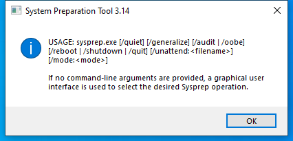

---
title: sysprep.exe | System Preparation Tool
excerpt: What is sysprep.exe?
---

# sysprep.exe 

* File Path: `C:\Windows\system32\Sysprep\sysprep.exe`
* Description: System Preparation Tool

## Screenshot

## Hashes

Type | Hash
-- | --
MD5 | `1FB9E48CBC693940B6CEF6D63779D4D9`
SHA1 | `339E039A26D65219124E069CA64832EA2D943622`
SHA256 | `B63D4E3AA65EE9D70A88C21E4FFB0476C0DCD1BD058E0DD44F8202AFF4D543B5`
SHA384 | `A6901C1E04A2214E25C042582BB45BACF41F44008EFC8F1B052EE4BE2DBC2373B2442DB0FC20266E744C3B4CDAB4E366`
SHA512 | `15D40FFD9E223D7D25FB3795296A2F15E2F87DCC981C66B0AC16D7191B5B1CBD0E3A33F53F50AB5D27DD2696598A1534C1FEC2FC8789AC6E377023E744D54494`
SSDEEP | `3072:hMWXvgGdez3MT6SLIJMS831VZOmEZKZyNdMqD8hESwzNeK4tcd0qsuL1/z2jZBwt:1gKegTmefEZKZMMqDrMRQ7KBR+em7j`

## Signature

* Status: Signature verified.
* Serial: `3300000266BD1580EFA75CD6D3000000000266`
* Thumbprint: `A4341B9FD50FB9964283220A36A1EF6F6FAA7840`
* Issuer: CN=Microsoft Windows Production PCA 2011, O=Microsoft Corporation, L=Redmond, S=Washington, C=US
* Subject: CN=Microsoft Windows, O=Microsoft Corporation, L=Redmond, S=Washington, C=US

## File Metadata

* Original Filename: sysprep.EXE.MUI
* Product Name: Microsoft Windows Operating System
* Company Name: Microsoft Corporation
* File Version: 10.0.14393.0 (rs1_release.160715-1616)
* Product Version: 10.0.14393.0
* Language: English (United States)
* Legal Copyright:  Microsoft Corporation. All rights reserved.

## Possible Misuse

*The following table contains possible examples of `sysprep.exe` being misused. While `sysprep.exe` is **not** inherently malicious, its legitimate functionality can by abused for malicious purposes.*

Source | Source File | Example | License
-- | -- | -- | --
[sigma](https://github.com/Neo23x0/sigma) | [win_susp_sysprep_appdata.yml](https://github.com/Neo23x0/sigma/blob/master/rules/windows/process_creation/win_susp_sysprep_appdata.yml) | `title: Sysprep on AppData Folder` | [DRL 1.0](https://github.com/Neo23x0/sigma/blob/master/LICENSE.Detection.Rules.md)
[sigma](https://github.com/Neo23x0/sigma) | [win_susp_sysprep_appdata.yml](https://github.com/Neo23x0/sigma/blob/master/rules/windows/process_creation/win_susp_sysprep_appdata.yml) | `description: Detects suspicious sysprep process start with AppData folder as target (as used by Trojan Syndicasec in Thrip report by Symantec)` | [DRL 1.0](https://github.com/Neo23x0/sigma/blob/master/LICENSE.Detection.Rules.md)
[sigma](https://github.com/Neo23x0/sigma) | [win_susp_sysprep_appdata.yml](https://github.com/Neo23x0/sigma/blob/master/rules/windows/process_creation/win_susp_sysprep_appdata.yml) | `- '*\sysprep.exe *\AppData\\*'` | [DRL 1.0](https://github.com/Neo23x0/sigma/blob/master/LICENSE.Detection.Rules.md)
[sigma](https://github.com/Neo23x0/sigma) | [win_susp_sysprep_appdata.yml](https://github.com/Neo23x0/sigma/blob/master/rules/windows/process_creation/win_susp_sysprep_appdata.yml) | `- sysprep.exe *\AppData\\*` | [DRL 1.0](https://github.com/Neo23x0/sigma/blob/master/LICENSE.Detection.Rules.md)
[signature-base](https://github.com/Neo23x0/signature-base) | [apt_codoso.yar](https://github.com/Neo23x0/signature-base/blob/master/yara/apt_codoso.yar) | $c3 = "\\sysprep\\sysprep.exe" fullword wide | [CC BY-NC 4.0](https://github.com/Neo23x0/signature-base/blob/master/LICENSE)
[signature-base](https://github.com/Neo23x0/signature-base) | [apt_codoso.yar](https://github.com/Neo23x0/signature-base/blob/master/yara/apt_codoso.yar) | $c4 = "\\sysprep\\CRYPTBASE.dll" fullword wide | [CC BY-NC 4.0](https://github.com/Neo23x0/signature-base/blob/master/LICENSE)
[signature-base](https://github.com/Neo23x0/signature-base) | [apt_codoso.yar](https://github.com/Neo23x0/signature-base/blob/master/yara/apt_codoso.yar) | $c7 = "\\sysprep" fullword wide | [CC BY-NC 4.0](https://github.com/Neo23x0/signature-base/blob/master/LICENSE)
[signature-base](https://github.com/Neo23x0/signature-base) | [apt_hellsing_kaspersky.yar](https://github.com/Neo23x0/signature-base/blob/master/yara/apt_hellsing_kaspersky.yar) | $a9 = "C:\\Windows\\System32\\sysprep\\sysprep.exe" wide  | [CC BY-NC 4.0](https://github.com/Neo23x0/signature-base/blob/master/LICENSE)
[signature-base](https://github.com/Neo23x0/signature-base) | [apt_thrip.yar](https://github.com/Neo23x0/signature-base/blob/master/yara/apt_thrip.yar) | $s1 = "C:\\WINDOWS\\system32\\sysprep\\cryptbase.dll" fullword ascii | [CC BY-NC 4.0](https://github.com/Neo23x0/signature-base/blob/master/LICENSE)
[signature-base](https://github.com/Neo23x0/signature-base) | [apt_thrip.yar](https://github.com/Neo23x0/signature-base/blob/master/yara/apt_thrip.yar) | $s2 = "C:\\Windows\\SysNative\\sysprep\\cryptbase.dll" fullword ascii | [CC BY-NC 4.0](https://github.com/Neo23x0/signature-base/blob/master/LICENSE)
[signature-base](https://github.com/Neo23x0/signature-base) | [apt_thrip.yar](https://github.com/Neo23x0/signature-base/blob/master/yara/apt_thrip.yar) | $s2 = "C:\\Windows\\system32\\sysprep\\cryptbase.dll" fullword ascii | [CC BY-NC 4.0](https://github.com/Neo23x0/signature-base/blob/master/LICENSE)
[signature-base](https://github.com/Neo23x0/signature-base) | [apt_win_plugx.yar](https://github.com/Neo23x0/signature-base/blob/master/yara/apt_win_plugx.yar) | $s3 = "l%s\\sysprep\\CRYPTBASE.DLL" fullword wide | [CC BY-NC 4.0](https://github.com/Neo23x0/signature-base/blob/master/LICENSE)
[signature-base](https://github.com/Neo23x0/signature-base) | [apt_win_plugx.yar](https://github.com/Neo23x0/signature-base/blob/master/yara/apt_win_plugx.yar) | $s7 = "%s\\sysprep\\sysprep.exe" fullword wide | [CC BY-NC 4.0](https://github.com/Neo23x0/signature-base/blob/master/LICENSE)
[signature-base](https://github.com/Neo23x0/signature-base) | [exploit_uac_elevators.yar](https://github.com/Neo23x0/signature-base/blob/master/yara/exploit_uac_elevators.yar) | $s3 = "%systemroot%\\system32\\sysprep\\sysprep.exe" fullword wide | [CC BY-NC 4.0](https://github.com/Neo23x0/signature-base/blob/master/LICENSE)
[signature-base](https://github.com/Neo23x0/signature-base) | [exploit_uac_elevators.yar](https://github.com/Neo23x0/signature-base/blob/master/yara/exploit_uac_elevators.yar) | $s4 = "/c wusa %ws /extract:%%windir%%\\system32\\sysprep" fullword wide | [CC BY-NC 4.0](https://github.com/Neo23x0/signature-base/blob/master/LICENSE)
[signature-base](https://github.com/Neo23x0/signature-base) | [exploit_uac_elevators.yar](https://github.com/Neo23x0/signature-base/blob/master/yara/exploit_uac_elevators.yar) | $s6 = "loadFrom=\"%systemroot%\\system32\\sysprep\\cryptbase.DLL\"" fullword ascii | [CC BY-NC 4.0](https://github.com/Neo23x0/signature-base/blob/master/LICENSE)

MIT License. Copyright (c) 2020 Strontic.

