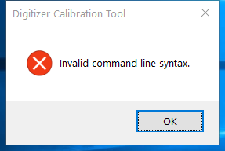

---
title: tabcal.exe | Digitizer Calibration Tool
excerpt: What is tabcal.exe?
---

# tabcal.exe 

* File Path: `C:\windows\system32\tabcal.exe`
* Description: Digitizer Calibration Tool

## Screenshot

## Hashes

Type | Hash
-- | --
MD5 | `53BC366750428053AF6BCE174BE021A6`
SHA1 | `FE54B68343D754480F040C225EFCA90E661D728A`
SHA256 | `F8BB94E382806820F6493DED8466F2AE8045A3B06B66FECBEAA9239BD0A32754`
SHA384 | `4009FC5589AC144F6789D9409C2A375AC34B161CE3E7E452AD37CD3E0CCF74778A2EA3265A748EDC0A16121388EBEA30`
SHA512 | `67ED2B255C74EC246004FEF79BD9EBEE25891BBE8717B891CEC5F051EA13DECAC1712635C9795E9AB4CDAE475698AD46E1E1D5BFC895D307917B48D1A9775D1F`
SSDEEP | `1536:AI+3D4Up0l6b0CmChvsMQ+rHOekYoG1dfW2jbJK:AI+3EUp0l6wC93ruzYB1dfZbs`

## Signature

* Status: The file C:\windows\system32\tabcal.exe is not digitally signed. You cannot run this script on the current system. For more information about running scripts and setting execution policy, see about_Execution_Policies at http://go.microsoft.com/fwlink/?LinkID=135170
* Serial: ``
* Thumbprint: ``
* Issuer: 
* Subject: 

## File Metadata

* Original Filename: tabcal.exe.mui
* Product Name: Microsoft Windows Operating System
* Company Name: Microsoft Corporation
* File Version: 6.3.9600.16384 (winblue_rtm.130821-1623)
* Product Version: 6.3.9600.16384
* Language: English (United States)
* Legal Copyright:  Microsoft Corporation. All rights reserved.

## File Similarity (ssdeep match)

File | Score
-- | --
[C:\Windows\system32\MultiDigiMon.exe](MultiDigiMon.exe-22E44F19E1150076CC57D13EA2AD1299.md) | 38
[C:\WINDOWS\system32\MultiDigiMon.exe](MultiDigiMon.exe-56DF403385A132A536B2192D09DEBFCD.md) | 30
[C:\windows\system32\MultiDigiMon.exe](MultiDigiMon.exe-ADCAA1A801398178EBFE38447D5A24E0.md) | 36
[C:\WINDOWS\system32\MultiDigiMon.exe](MultiDigiMon.exe-C20A8C29A5A64854E01771BE46056B41.md) | 38
[C:\Windows\system32\MultiDigiMon.exe](MultiDigiMon.exe-D4528F060A28F12A6BEB746785D77193.md) | 43
[C:\Windows\system32\MultiDigiMon.exe](MultiDigiMon.exe-DF6AA1B1C7732809E42EC4B28738B813.md) | 46
[C:\Windows\system32\tabcal.exe](tabcal.exe-0F1D05D267CB743E0C1FCB7C9BE3920A.md) | 38
[C:\WINDOWS\system32\tabcal.exe](tabcal.exe-3F704AC828A45FC06CE144FB1754F672.md) | 33
[C:\Windows\system32\tabcal.exe](tabcal.exe-40F4014416FF0CBF92A9509F67A69754.md) | 35
[C:\WINDOWS\system32\tabcal.exe](tabcal.exe-C6D89BAA07C0779C2F21B1072FAD2C02.md) | 36
[C:\Windows\system32\tabcal.exe](tabcal.exe-E32FFD826EFE0B0620244A64362CC275.md) | 38

MIT License. Copyright (c) 2020-2021 Strontic.

