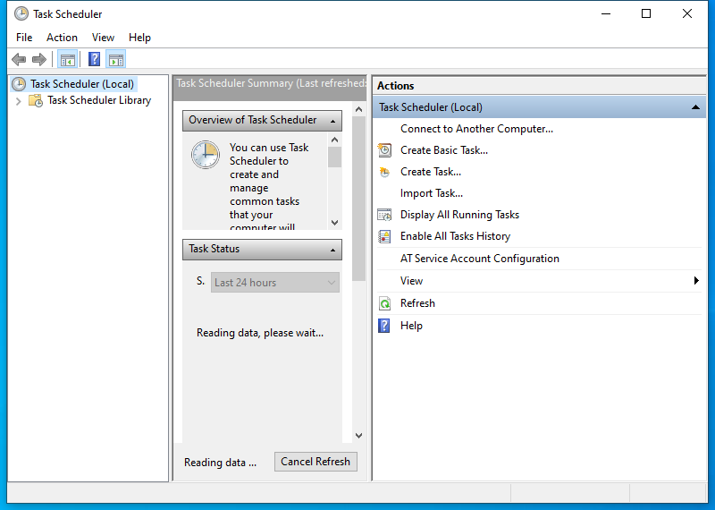

---
title: taskschd.msc | 
excerpt: What is taskschd.msc?
---

# taskschd.msc 

* File Path: `C:\Windows\system32\taskschd.msc`
* Description: Task Scheduler (Window Title)

## Screenshot

## Hashes

Type | Hash
-- | --
MD5 | `AB2A58839814D2EA5EE621B5DBF944FF`
SHA1 | `A4D39D77550A48BEFB7AC28EF531E531F42C3E2E`
SHA256 | `B774CFB62A596D7BF663B76652AB8C0AECD8C7E702A0D5D1919D03117AC32C21`
SHA384 | `96D7E1079909BB57F0417C70ACEEBC0F9E02EAFF4FE20A3940941888F2B4318085F1FC3D5645A07E13433AB4883AEB6F`
SHA512 | `047E10DEDF9D1CBE9B75D889189A3073709501726C55F3AB74C5DE34994938F075BB63941E309CBB9ECDEEEDA7C7CEC5EBDBDC5078FE2FD098B2E14D40F548AD`
SSDEEP | `384:hybtfDuqk3wak16g2nq26IbRkxwmPYCgb9mK1Jn7N7KUjTuw4grAdshRC:CrDkg2Jb+KmgCgmYJnrjTuw4VWbC`
PESHA1 | `A4D39D77550A48BEFB7AC28EF531E531F42C3E2E`
PE256 | `B774CFB62A596D7BF663B76652AB8C0AECD8C7E702A0D5D1919D03117AC32C21`

## Runtime Data

### Window Title:
Task Scheduler

### Open Handles:

Path | Type
-- | --
(R-D)   C:\Windows\assembly\GAC_MSIL\Microsoft.ManagementConsole\3.0.0.0__31bf3856ad364e35\Microsoft.ManagementConsole.dll | File
(R-D)   C:\Windows\assembly\GAC_MSIL\MMCEx\3.0.0.0__31bf3856ad364e35\MMCEx.dll | File
(R-D)   C:\Windows\assembly\GAC_MSIL\MMCFxCommon\3.0.0.0__31bf3856ad364e35\MMCFxCommon.dll | File
(R-D)   C:\Windows\Fonts\StaticCache.dat | File
(R-D)   C:\Windows\Microsoft.NET\assembly\GAC_64\CustomMarshalers\v4.0_4.0.0.0__b03f5f7f11d50a3a\CustomMarshalers.dll | File
(R-D)   C:\Windows\Microsoft.NET\assembly\GAC_64\mscorlib\v4.0_4.0.0.0__b77a5c561934e089\mscorlib.dll | File
(R-D)   C:\Windows\Microsoft.NET\assembly\GAC_MSIL\Accessibility\v4.0_4.0.0.0__b03f5f7f11d50a3a\Accessibility.dll | File
(R-D)   C:\Windows\Microsoft.NET\assembly\GAC_MSIL\MiguiControls\v4.0_1.0.0.0__31bf3856ad364e35\MIGUIControls.dll | File
(R-D)   C:\Windows\Microsoft.NET\assembly\GAC_MSIL\System.Configuration\v4.0_4.0.0.0__b03f5f7f11d50a3a\System.Configuration.dll | File
(R-D)   C:\Windows\Microsoft.NET\assembly\GAC_MSIL\System.Drawing\v4.0_4.0.0.0__b03f5f7f11d50a3a\System.Drawing.dll | File
(R-D)   C:\Windows\Microsoft.NET\assembly\GAC_MSIL\System.Windows.Forms\v4.0_4.0.0.0__b77a5c561934e089\System.Windows.Forms.dll | File
(R-D)   C:\Windows\Microsoft.NET\assembly\GAC_MSIL\System.Xml\v4.0_4.0.0.0__b77a5c561934e089\System.XML.dll | File
(R-D)   C:\Windows\Microsoft.NET\assembly\GAC_MSIL\System\v4.0_4.0.0.0__b77a5c561934e089\System.dll | File
(R-D)   C:\Windows\Microsoft.NET\assembly\GAC_MSIL\TaskScheduler\v4.0_10.0.0.0__31bf3856ad364e35\TaskScheduler.dll | File
(R-D)   C:\Windows\System32\en-US\KernelBase.dll.mui | File
(R-D)   C:\Windows\System32\en-US\MFC42u.dll.mui | File
(R-D)   C:\Windows\System32\en-US\mmc.exe.mui | File
(R-D)   C:\Windows\System32\en-US\mmcbase.dll.mui | File
(R-D)   C:\Windows\System32\en-US\mmcndmgr.dll.mui | File
(R-D)   C:\Windows\System32\en-US\user32.dll.mui | File
(R-D)   C:\Windows\SystemResources\mmcbase.dll.mun | File
(R-D)   C:\Windows\SystemResources\mmcndmgr.dll.mun | File
(RW-)   C:\Users\user | File
(RW-)   C:\Windows\WinSxS\amd64_microsoft.windows.common-controls_6595b64144ccf1df_5.82.19041.488_none_4238de57f6b64d28 | File
(RW-)   C:\Windows\WinSxS\amd64_microsoft.windows.common-controls_6595b64144ccf1df_6.0.19041.746_none_ca02b4b61b8320a4 | File
(RW-)   C:\Windows\WinSxS\amd64_microsoft.windows.gdiplus_6595b64144ccf1df_1.1.19041.789_none_faf0a7e97612e7bb | File
(RWD)   C:\Windows\Fonts\micross.ttf | File
(RWD)   C:\Windows\Fonts\segoeui.ttf | File
(RWD)   C:\Windows\Fonts\segoeuib.ttf | File
(RWD)   C:\Windows\Fonts\segoeuii.ttf | File
(RWD)   C:\Windows\Fonts\segoeuiz.ttf | File
\...\Cor_SxSPublic_IPCBlock | Section
\BaseNamedObjects\__ComCatalogCache__ | Section
\BaseNamedObjects\C:\*ProgramData\*Microsoft\*Windows\*Caches\*{6AF0698E-D558-4F6E-9B3C-3716689AF493}.2.ver0x0000000000000002.db | Section
\BaseNamedObjects\C:\*ProgramData\*Microsoft\*Windows\*Caches\*{DDF571F2-BE98-426D-8288-1A9A39C3FDA2}.2.ver0x0000000000000002.db | Section
\BaseNamedObjects\C:\*ProgramData\*Microsoft\*Windows\*Caches\*cversions.2 | Section
\BaseNamedObjects\Cor_Private_IPCBlock_v4_8752 | Section
\BaseNamedObjects\NLS_CodePage_1252_3_2_0_0 | Section
\BaseNamedObjects\NLS_CodePage_437_3_2_0_0 | Section
\BaseNamedObjects\windows_shell_global_counters | Section
\Sessions\1\BaseNamedObjects\2230HWNDInterface:240446 | Section
\Sessions\1\BaseNamedObjects\2230HWNDInterface:5604a0 | Section
\Sessions\1\BaseNamedObjects\SessionImmersiveColorPreference | Section
\Sessions\1\BaseNamedObjects\windows_shell_global_counters | Section
\Sessions\1\Windows\Theme3205582532 | Section
\Windows\Theme3800351183 | Section

### Loaded Modules:

Path |
-- |
C:\Windows\SYSTEM32\apphelp.dll |
C:\Windows\System32\KERNEL32.DLL |
C:\Windows\System32\KERNELBASE.dll |
C:\Windows\SYSTEM32\mmc.exe |
C:\Windows\SYSTEM32\ntdll.dll |

## Signature

* Status: Signature verified.
* Serial: `330000023241FB59996DCC4DFF000000000232`
* Thumbprint: `FF82BC38E1DA5E596DF374C53E3617F7EDA36B06`
* Issuer: CN=Microsoft Windows Production PCA 2011, O=Microsoft Corporation, L=Redmond, S=Washington, C=US
* Subject: CN=Microsoft Windows, O=Microsoft Corporation, L=Redmond, S=Washington, C=US

## File Metadata

* Original Filename: 
* Product Name: 
* Company Name: 
* File Version: 
* Product Version: 
* Language: 
* Legal Copyright: 

## File Scan

* VirusTotal Detections: 0/74
* VirusTotal Link: https://www.virustotal.com/gui/file/b774cfb62a596d7bf663b76652ab8c0aecd8c7e702a0d5d1919d03117ac32c21/detection

## File Similarity (ssdeep match)

File | Score
-- | --
[C:\Windows\system32\en-US\taskschd.msc](taskschd.msc-AB2A58839814D2EA5EE621B5DBF944FF.md) | 100
[C:\Windows\SysWOW64\en-US\taskschd.msc](taskschd.msc-AB2A58839814D2EA5EE621B5DBF944FF.md) | 100
[C:\Windows\SysWOW64\taskschd.msc](taskschd.msc-AB2A58839814D2EA5EE621B5DBF944FF.md) | 100

MIT License. Copyright (c) 2020-2021 Strontic.

