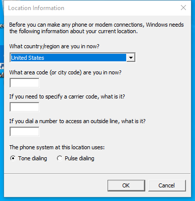

---
title: telephon.cpl | Telephony Control Panel
excerpt: What is telephon.cpl?
---

# telephon.cpl 

* File Path: `C:\Windows\system32\telephon.cpl`
* Description: Telephony Control Panel

## Screenshot

## Hashes

Type | Hash
-- | --
MD5 | `F8921C30953A7446C4B6FE08EB2AA57B`
SHA1 | `023295373E9A6D2587B76A47F1602F472883C018`
SHA256 | `3D3E0E27726E1799F95EE9DD5B1E0FF95F466AAE610F9560A0AF5B8C9DFBFB23`
SHA384 | `B35A843D9E3FF3CE2E882F7A2252918EE299032E172ECC2E2C5DF636EF7285E4D2CF2D88A4488D588EEC363915D949D6`
SHA512 | `A299A05C15FAF7A19698182F6C8B417A08FF67A43F62F8AAB341F5D0759324368F0C412D0215D118755630EA02FD5E0ECA9CDBD2A52556B257A51F3C93B78986`
SSDEEP | `1536:z+Q+dXhXFKAwpvOgDPG3726ylE04TaiM+HS9IlyxLKjGM0+3Uo:CXVFKAwJOp3ilr4Hy9IlEKjGMz3d`
IMP | `46657A002525C40690316C695467FAC7`
PESHA1 | `59AD955AD625BA35AFC64DDDB9F723402E738CCB`
PE256 | `DD14D434B2DB72556EF3BD641E5FD80784E28A50CF83DAF0F76C929B4346F220`

## Runtime Data

### Window Title:
Location Information

### Open Handles:

Path | Type
-- | --
(R-D)   C:\Windows\Fonts\StaticCache.dat | File
(R-D)   C:\Windows\System32\en-US\rundll32.exe.mui | File
(R-D)   C:\Windows\System32\en-US\tapiui.dll.mui | File
(R-D)   C:\Windows\System32\en-US\telephon.cpl.mui | File
(RW-)   C:\Users\user | File
(RW-)   C:\Windows\WinSxS\amd64_microsoft.windows.common-controls_6595b64144ccf1df_6.0.19041.746_none_ca02b4b61b8320a4 | File
\BaseNamedObjects\C:\*ProgramData\*Microsoft\*Windows\*Caches\*{6AF0698E-D558-4F6E-9B3C-3716689AF493}.2.ver0x0000000000000002.db | Section
\BaseNamedObjects\C:\*ProgramData\*Microsoft\*Windows\*Caches\*{DDF571F2-BE98-426D-8288-1A9A39C3FDA2}.2.ver0x0000000000000002.db | Section
\BaseNamedObjects\C:\*ProgramData\*Microsoft\*Windows\*Caches\*cversions.2 | Section
\BaseNamedObjects\NLS_CodePage_1252_3_2_0_0 | Section
\BaseNamedObjects\NLS_CodePage_437_3_2_0_0 | Section
\Sessions\1\BaseNamedObjects\windows_shell_global_counters | Section
\Sessions\1\Windows\Theme3205582532 | Section
\Windows\Theme3800351183 | Section

### Loaded Modules:

Path |
-- |
C:\Windows\System32\combase.dll |
C:\Windows\System32\imagehlp.dll |
C:\Windows\System32\KERNEL32.DLL |
C:\Windows\System32\KERNELBASE.dll |
C:\Windows\System32\msvcrt.dll |
C:\Windows\SYSTEM32\ntdll.dll |
C:\Windows\System32\RPCRT4.dll |
C:\Windows\SYSTEM32\rundll32.exe |
C:\Windows\System32\shcore.dll |
C:\Windows\System32\ucrtbase.dll |

## Signature

* Status: Signature verified.
* Serial: `3300000266BD1580EFA75CD6D3000000000266`
* Thumbprint: `A4341B9FD50FB9964283220A36A1EF6F6FAA7840`
* Issuer: CN=Microsoft Windows Production PCA 2011, O=Microsoft Corporation, L=Redmond, S=Washington, C=US
* Subject: CN=Microsoft Windows, O=Microsoft Corporation, L=Redmond, S=Washington, C=US

## File Metadata

* Original Filename: telephon.cpl.mui
* Product Name: Microsoft Windows Operating System
* Company Name: Microsoft Corporation
* File Version: 10.0.19041.1 (WinBuild.160101.0800)
* Product Version: 10.0.19041.1
* Language: English (United States)
* Legal Copyright:  Microsoft Corporation. All rights reserved.
* Machine Type: 64-bit

## File Scan

* VirusTotal Detections: 0/74
* VirusTotal Link: https://www.virustotal.com/gui/file/3d3e0e27726e1799f95ee9dd5b1e0ff95f466aae610f9560a0af5b8c9dfbfb23/detection

## File Similarity (ssdeep match)

File | Score
-- | --
[C:\Windows\SysWOW64\telephon.cpl](telephon.cpl-DC1188C78FA540830808015D3430CBBF.md) | 96

MIT License. Copyright (c) 2020-2021 Strontic.

