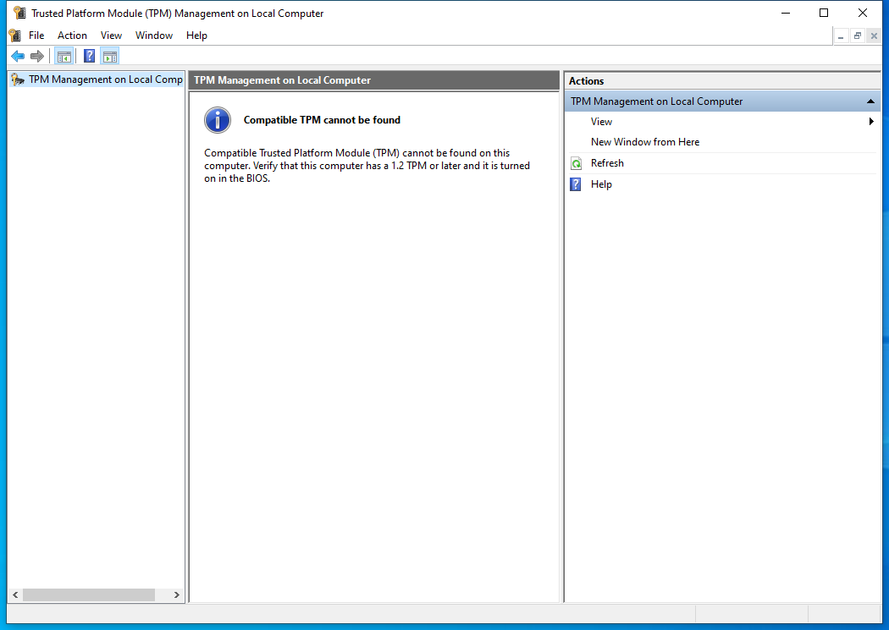

---
title: tpm.msc | 
excerpt: What is tpm.msc?
---

# tpm.msc 

* File Path: `C:\Windows\system32\tpm.msc`
* Description: Trusted Platform Module (TPM) Management on Local Computer (Window Title)

## Screenshot

## Hashes

Type | Hash
-- | --
MD5 | `9359341F78E00134B527814B4868ECD5`
SHA1 | `270E00219A7DD7660D630339485D6CA25CEF9316`
SHA256 | `D09973F5C95AD25E91EB0DF4330DCC595DEEF6ED538EA5FD84E1A76719EBA52F`
SHA384 | `D26B1CD8D740BCC93244A8F5DC690D1F3D05112FAFFEB8F32AEBD448DCA96F9ED25757F1CCEC19D0CCEC955B94CEC5FB`
SHA512 | `E9CFDC527743E2873580ECBCCF36F9E0A5760BE35F6E63DFEF2C710999FC32C76E9BA1E753FED868DBFFD389C176A2732C33E0D1EA648A2AEF89951EC15610C1`
SSDEEP | `384:JzH4pDom3YvFuDH5HaqPBeJeAmKy63+jIYKvy9rghufEDrLDomkPHo9dXS79N3xX:BTeDHB3B14MIYmIKDrgjPI9NMlkS`
PESHA1 | `270E00219A7DD7660D630339485D6CA25CEF9316`
PE256 | `D09973F5C95AD25E91EB0DF4330DCC595DEEF6ED538EA5FD84E1A76719EBA52F`

## Runtime Data

### Window Title:
Trusted Platform Module (TPM) Management on Local Computer

### Open Handles:

Path | Type
-- | --
(R-D)   C:\Windows\assembly\GAC_MSIL\Microsoft.ManagementConsole\3.0.0.0__31bf3856ad364e35\Microsoft.ManagementConsole.dll | File
(R-D)   C:\Windows\assembly\GAC_MSIL\MMCEx\3.0.0.0__31bf3856ad364e35\MMCEx.dll | File
(R-D)   C:\Windows\assembly\GAC_MSIL\MMCFxCommon\3.0.0.0__31bf3856ad364e35\MMCFxCommon.dll | File
(R-D)   C:\Windows\Fonts\StaticCache.dat | File
(R-D)   C:\Windows\Microsoft.NET\assembly\GAC_64\mscorlib\v4.0_4.0.0.0__b77a5c561934e089\mscorlib.dll | File
(R-D)   C:\Windows\Microsoft.NET\assembly\GAC_MSIL\Accessibility\v4.0_4.0.0.0__b03f5f7f11d50a3a\Accessibility.dll | File
(R-D)   C:\Windows\Microsoft.NET\assembly\GAC_MSIL\Microsoft.Tpm\v4.0_10.0.0.0__31bf3856ad364e35\Microsoft.Tpm.dll | File
(R-D)   C:\Windows\Microsoft.NET\assembly\GAC_MSIL\System.Configuration\v4.0_4.0.0.0__b03f5f7f11d50a3a\System.Configuration.dll | File
(R-D)   C:\Windows\Microsoft.NET\assembly\GAC_MSIL\System.Drawing\v4.0_4.0.0.0__b03f5f7f11d50a3a\System.Drawing.dll | File
(R-D)   C:\Windows\Microsoft.NET\assembly\GAC_MSIL\System.Management\v4.0_4.0.0.0__b03f5f7f11d50a3a\System.Management.dll | File
(R-D)   C:\Windows\Microsoft.NET\assembly\GAC_MSIL\System.Windows.Forms\v4.0_4.0.0.0__b77a5c561934e089\System.Windows.Forms.dll | File
(R-D)   C:\Windows\Microsoft.NET\assembly\GAC_MSIL\System.Xml\v4.0_4.0.0.0__b77a5c561934e089\System.XML.dll | File
(R-D)   C:\Windows\Microsoft.NET\assembly\GAC_MSIL\System\v4.0_4.0.0.0__b77a5c561934e089\System.dll | File
(R-D)   C:\Windows\System32\en-US\KernelBase.dll.mui | File
(R-D)   C:\Windows\System32\en-US\MFC42u.dll.mui | File
(R-D)   C:\Windows\System32\en-US\mmc.exe.mui | File
(R-D)   C:\Windows\System32\en-US\mmcbase.dll.mui | File
(R-D)   C:\Windows\System32\en-US\mmcndmgr.dll.mui | File
(R-D)   C:\Windows\System32\en-US\user32.dll.mui | File
(R-D)   C:\Windows\System32\wbem\en-US\wmiutils.dll.mui | File
(R-D)   C:\Windows\SystemResources\mmcbase.dll.mun | File
(R-D)   C:\Windows\SystemResources\mmcndmgr.dll.mun | File
(RW-)   C:\Users\user | File
(RW-)   C:\Windows\WinSxS\amd64_microsoft.windows.common-controls_6595b64144ccf1df_5.82.19041.488_none_4238de57f6b64d28 | File
(RW-)   C:\Windows\WinSxS\amd64_microsoft.windows.common-controls_6595b64144ccf1df_6.0.19041.746_none_ca02b4b61b8320a4 | File
(RW-)   C:\Windows\WinSxS\amd64_microsoft.windows.gdiplus_6595b64144ccf1df_1.1.19041.789_none_faf0a7e97612e7bb | File
(RWD)   C:\Windows\Fonts\marlett.ttf | File
(RWD)   C:\Windows\Fonts\micross.ttf | File
\...\Cor_SxSPublic_IPCBlock | Section
\BaseNamedObjects\__ComCatalogCache__ | Section
\BaseNamedObjects\C:\*ProgramData\*Microsoft\*Windows\*Caches\*{6AF0698E-D558-4F6E-9B3C-3716689AF493}.2.ver0x0000000000000002.db | Section
\BaseNamedObjects\C:\*ProgramData\*Microsoft\*Windows\*Caches\*{DDF571F2-BE98-426D-8288-1A9A39C3FDA2}.2.ver0x0000000000000002.db | Section
\BaseNamedObjects\C:\*ProgramData\*Microsoft\*Windows\*Caches\*cversions.2 | Section
\BaseNamedObjects\Cor_Private_IPCBlock_v4_9012 | Section
\BaseNamedObjects\NLS_CodePage_1252_3_2_0_0 | Section
\BaseNamedObjects\NLS_CodePage_437_3_2_0_0 | Section
\BaseNamedObjects\windows_shell_global_counters | Section
\Sessions\1\BaseNamedObjects\2334HWNDInterface:440548 | Section
\Sessions\1\BaseNamedObjects\2334HWNDInterface:690692 | Section
\Sessions\1\BaseNamedObjects\2334HWNDInterface:ac04b8 | Section
\Sessions\1\BaseNamedObjects\2334HWNDInterface:b90552 | Section
\Sessions\1\BaseNamedObjects\2334HWNDInterface:cd087c | Section
\Sessions\1\BaseNamedObjects\2334HWNDInterface:da05a4 | Section
\Sessions\1\BaseNamedObjects\SessionImmersiveColorPreference | Section
\Sessions\1\BaseNamedObjects\windows_shell_global_counters | Section
\Sessions\1\Windows\Theme3205582532 | Section
\Windows\Theme3800351183 | Section

### Loaded Modules:

Path |
-- |
C:\Windows\SYSTEM32\AcGenral.dll |
C:\Windows\SYSTEM32\apphelp.dll |
C:\Windows\System32\KERNEL32.DLL |
C:\Windows\System32\KERNELBASE.dll |
C:\Windows\SYSTEM32\mmc.exe |
C:\Windows\System32\msvcrt.dll |
C:\Windows\SYSTEM32\ntdll.dll |
C:\Windows\System32\RPCRT4.dll |
C:\Windows\System32\sechost.dll |

## Signature

* Status: Signature verified.
* Serial: `3300000266BD1580EFA75CD6D3000000000266`
* Thumbprint: `A4341B9FD50FB9964283220A36A1EF6F6FAA7840`
* Issuer: CN=Microsoft Windows Production PCA 2011, O=Microsoft Corporation, L=Redmond, S=Washington, C=US
* Subject: CN=Microsoft Windows, O=Microsoft Corporation, L=Redmond, S=Washington, C=US

## File Metadata

* Original Filename: 
* Product Name: 
* Company Name: 
* File Version: 
* Product Version: 
* Language: 
* Legal Copyright: 

## File Scan

* VirusTotal Detections: 0/75
* VirusTotal Link: https://www.virustotal.com/gui/file/d09973f5c95ad25e91eb0df4330dcc595deef6ed538ea5fd84e1a76719eba52f/detection

## File Similarity (ssdeep match)

File | Score
-- | --
[C:\Windows\system32\certlm.msc](certlm.msc-DCCA682FEA47192106EC4F2001EAE182.md) | 44
[C:\Windows\system32\certmgr.msc](certmgr.msc-4C7390A1FF613FBBF59141CA0BE8AE89.md) | 44
[C:\Windows\system32\en-US\certlm.msc](certlm.msc-DCCA682FEA47192106EC4F2001EAE182.md) | 44
[C:\Windows\system32\en-US\certmgr.msc](certmgr.msc-4C7390A1FF613FBBF59141CA0BE8AE89.md) | 44
[C:\Windows\system32\en-US\gpedit.msc](gpedit.msc-6C054DA115C2CA2C523ABD159ED7814B.md) | 35
[C:\Windows\system32\en-US\printmanagement.msc](printmanagement.msc-4856202475EFE0D66FA11EE1DCF6D0D3.md) | 40
[C:\Windows\system32\en-US\tpm.msc](tpm.msc-9359341F78E00134B527814B4868ECD5.md) | 100
[C:\Windows\system32\gpedit.msc](gpedit.msc-6C054DA115C2CA2C523ABD159ED7814B.md) | 35
[C:\Windows\system32\printmanagement.msc](printmanagement.msc-4856202475EFE0D66FA11EE1DCF6D0D3.md) | 40
[C:\Windows\SysWOW64\certlm.msc](certlm.msc-DCCA682FEA47192106EC4F2001EAE182.md) | 44
[C:\Windows\SysWOW64\certmgr.msc](certmgr.msc-4C7390A1FF613FBBF59141CA0BE8AE89.md) | 44
[C:\Windows\SysWOW64\en-US\gpedit.msc](gpedit.msc-6C054DA115C2CA2C523ABD159ED7814B.md) | 35
[C:\Windows\SysWOW64\gpedit.msc](gpedit.msc-6C054DA115C2CA2C523ABD159ED7814B.md) | 35
[C:\Windows\SysWOW64\tpm.msc](tpm.msc-9359341F78E00134B527814B4868ECD5.md) | 100

MIT License. Copyright (c) 2020-2021 Strontic.

