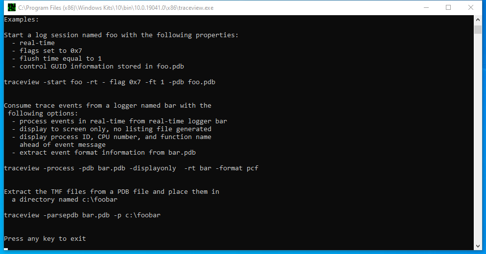

---
title: traceview.exe | TraceView Application
excerpt: What is traceview.exe?
---

# traceview.exe 

* File Path: `C:\Program Files (x86)\Windows Kits\10\bin\10.0.19041.0\x86\traceview.exe`
* Description: TraceView Application
* Comments: V2.1.1

## Screenshot

## Hashes

Type | Hash
-- | --
MD5 | `2A319762C2B8BF0D564032AE6A591925`
SHA1 | `397E30B86899E11F811B218CE63033941CE9504F`
SHA256 | `E0D595B9B46CDC6166F9493918D78FE7643873E3C97B36AC6D3EC4E609B19DB7`
SHA384 | `FB0B99E82BA64CB3DA28EFC7504F6E4E8F91F7725E4CE49C611EA93EDC1DA6FFA1AD9B01D8A6185D2DB3EAF328CC748E`
SHA512 | `13FAE3D5680AB53F06620E5FC450D1DFEA4C94BB7F2F04F5C23E1A08B7DEB148245277D60A2B745572515C48A238AB314C0345BEB7A34315CDA6567147F701FD`
SSDEEP | `24576:X+L7tged1e9g5YCLVx0wUa7wGok0b+HPmgE+iTaAOWG2CWG2mWG2mWGVF1lZ7bO:Xatged1rM2PmXTaAOWG2CWG2mWG2mWGU`
IMP | `D6283301022C5593FE614C3B8F321A03`
PESHA1 | `5F9D86370A35238F615A1E3A4F71E88D6D89386B`
PE256 | `4FDB90B7178C3B79822F9D8044BB5A7DF6A3EF6FDDD0FDBCC23E0B3795C613CB`

## Runtime Data

### Child Processes:
conhost.exe

### Window Title:
C:\Program Files (x86)\Windows Kits\10\bin\10.0.19041.0\x86\traceview.exe

### Open Handles:

Path | Type
-- | --
(R-D)   C:\Windows\System32\en-US\MFC42u.dll.mui | File
(RW-)   C:\Users\user | File
(RW-)   C:\Users\user\CONERR$ | File
(RW-)   C:\Windows | File
(RW-)   C:\Windows\WinSxS\x86_microsoft.windows.common-controls_6595b64144ccf1df_6.0.19041.488_none_11b1e5df2ffd8627 | File
\BaseNamedObjects\C:\*ProgramData\*Microsoft\*Windows\*Caches\*{6AF0698E-D558-4F6E-9B3C-3716689AF493}.2.ver0x0000000000000002.db | Section
\BaseNamedObjects\C:\*ProgramData\*Microsoft\*Windows\*Caches\*{DDF571F2-BE98-426D-8288-1A9A39C3FDA2}.2.ver0x0000000000000002.db | Section
\BaseNamedObjects\C:\*ProgramData\*Microsoft\*Windows\*Caches\*cversions.2 | Section
\BaseNamedObjects\NLS_CodePage_1252_3_2_0_0 | Section
\BaseNamedObjects\NLS_CodePage_437_3_2_0_0 | Section

### Loaded Modules:

Path |
-- |
C:\Program Files (x86)\Windows Kits\10\bin\10.0.19041.0\x86\traceview.exe |
C:\Windows\SYSTEM32\ntdll.dll |
C:\Windows\System32\wow64.dll |
C:\Windows\System32\wow64cpu.dll |
C:\Windows\System32\wow64win.dll |

## Signature

* Status: Signature verified.
* Serial: `33000002CF6D2CC57CAA65A6D80000000002CF`
* Thumbprint: `1A221B3B4FEF088B17BA6704FD088DF192D9E0EF`
* Issuer: CN=Microsoft Code Signing PCA 2010, O=Microsoft Corporation, L=Redmond, S=Washington, C=US
* Subject: CN=Microsoft Corporation, O=Microsoft Corporation, L=Redmond, S=Washington, C=US

## File Metadata

* Original Filename: TraceView.exe
* Product Name: 
* Company Name: Microsoft Corporation
* File Version: V2.1.1
* Product Version: 2, 1, 1, 0
* Language: English (United States)
* Legal Copyright: Copyright  2002-2005, Microsoft Corporation.  All rights reserved.
* Machine Type: 32-bit

## File Scan

* VirusTotal Detections: Unknown

## File Similarity (ssdeep match)

File | Score
-- | --
[C:\Program Files (x86)\Windows Kits\10\Debuggers\arm\winext\usb3kd.dll](usb3kd.dll-BE4278539E50BED430DAC1CE513013B3.md) | 38

MIT License. Copyright (c) 2020-2021 Strontic.

