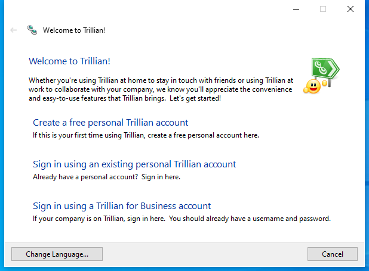

---
title: trillian.exe | Trillian
excerpt: What is trillian.exe?
---

# trillian.exe 

* File Path: `C:\program files (x86)\Trillian\trillian.exe`
* Description: Trillian

## Screenshot



## Hashes

Type | Hash
-- | --
MD5 | `7939076A6A5F4159D8FA4EDEA8D62B17`
SHA1 | `FFDD633CA4317D8460CEB79AA3C16E11E8B66A71`
SHA256 | `04BBEAE34381E575C0431E6E7AA214F6785AE915DBC478B533F901318BE90BCC`
SHA384 | `5921809E161A15C72D4C37F32A41FE6EFFBDF6840FCA1BDE50204C94126111501E4B28A6E3F333F9642799A0E544963C`
SHA512 | `4706514B2F1AE50FA518E85BE6DF66479916C29E2873E6E9841651D634F6FE16467A836AF83FD34F0D429412F19BE12723AE9545AAF7E7177196C4C043BB6AA0`
SSDEEP | `49152:iApIODFy50dwLw0/ANfAQBJ+1VEZAs17YXOO1Jw:vpIODoWaw0ufAQBobEGs1dO1Jw`

## Runtime Data

### Usage (stderr):
```cmhg
libpng warning: iCCP: known incorrect sRGB profile
libpng warning: iCCP: known incorrect sRGB profile
libpng warning: iCCP: known incorrect sRGB profile
libpng warning: iCCP: known incorrect sRGB profile
libpng warning: iCCP: known incorrect sRGB profile

```

### Window Title:
Welcome to Trillian!

### Open Handles:

Path | Type
-- | --
(R-D)   C:\Windows\Fonts\StaticCache.dat | File
(RW-)   C:\Users\user\Documents | File
(RW-)   C:\Windows | File
(RW-)   C:\Windows\WinSxS\x86_microsoft.windows.common-controls_6595b64144ccf1df_6.0.19041.1_none_fd031af45b0106f2 | File
(RW-)   C:\Windows\WinSxS\x86_microsoft.windows.gdiplus_6595b64144ccf1df_1.1.19041.450_none_4294d6e08a97344a | File
\BaseNamedObjects\__ComCatalogCache__ | Section
\BaseNamedObjects\NLS_CodePage_1252_3_2_0_0 | Section
\BaseNamedObjects\NLS_CodePage_437_3_2_0_0 | Section
\Sessions\1\BaseNamedObjects\windows_shell_global_counters | Section
\Sessions\1\Windows\Theme4048709601 | Section
\Windows\Theme603176458 | Section


### Loaded Modules:

Path |
-- |
C:\program files (x86)\Trillian\trillian.exe |
C:\Windows\SYSTEM32\ntdll.dll |
C:\Windows\System32\wow64.dll |
C:\Windows\System32\wow64cpu.dll |
C:\Windows\System32\wow64win.dll |


## Signature

* Status: Signature verified.
* Serial: `08B071E9D940B38948257B8050AE67C7`
* Thumbprint: `4E2CA38FF223396D32477823D2E6DEB844F4219F`
* Issuer: CN=DigiCert SHA2 Assured ID Code Signing CA, OU=www.digicert.com, O=DigiCert Inc, C=US
* Subject: CN="Cerulean Studios, LLC", O="Cerulean Studios, LLC", L=Brookfield, S=Connecticut, C=US

## File Metadata

* Original Filename: Trillian.exe
* Product Name: Trillian
* Company Name: Cerulean Studios
* File Version: 6.3.0.6
* Product Version: 6.3.0.6
* Language: English (United States)
* Legal Copyright:  Cerulean Studios, LLC.  All rights reserved.


MIT License. Copyright (c) 2020 Strontic.


