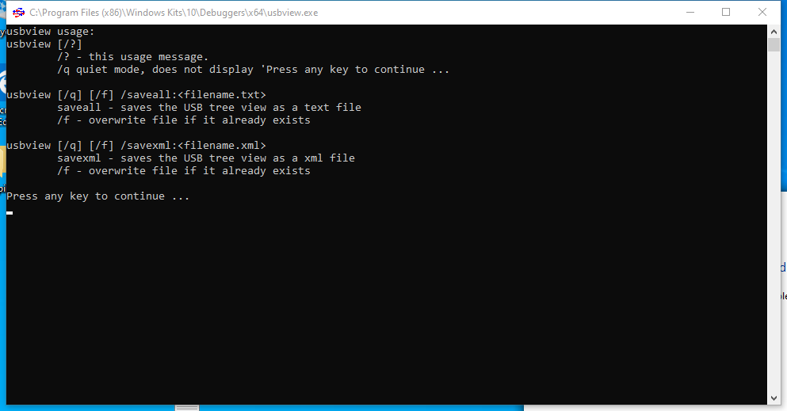

---
title: usbview.exe | Microsoft Windows(TM) USB device viewer
excerpt: What is usbview.exe?
---

# usbview.exe 

* File Path: `C:\Program Files (x86)\Windows Kits\10\Debuggers\x64\usbview.exe`
* Description: Microsoft Windows(TM) USB device viewer

## Screenshot

## Hashes

Type | Hash
-- | --
MD5 | `1B770404A886BFDCF3FB6CBB9E3117E2`
SHA1 | `87BA53876C455BB7463F41059FFB23515B0A8F5A`
SHA256 | `4EB5DADFA86CCFFE209A050E20A526BEEB7C3A116229CF0465DE4278B3875080`
SHA384 | `8F63CBBB4993DE33990C7C39F8E739F114842C59977080FE77BBC0B2C1D2AB8129DCA506D340F966B33DB9AF38CBE711`
SHA512 | `3BFC56AAFBD3F11792D1EA41D6115189F2870A998A5015CCF0689209293BE38F491B6A7CF9CD8E8AAE69B3DF86F897AE8DEFDA2477F6986EE1EB96C9C70CFE64`
SSDEEP | `12288:16EXeAZVBYCCdVQ5VJ6TEzseESK6DPkTHGwKlfInd9ohJ7nS:8aRunVQ5VHzseESCmwmInd9ohJrS`
IMP | `99933A1B95E7F1C3452501E96962FF4C`
PESHA1 | `979B8AE6437C7C389A5E1887F6B4E8102FE2EFE5`
PE256 | `99CC2BA4A76711B44D8E4085FF00DCA95761036FAD9439AA52120735471823E8`

## Runtime Data

### Child Processes:
conhost.exe

### Window Title:
C:\Program Files (x86)\Windows Kits\10\Debuggers\x64\usbview.exe

### Open Handles:

Path | Type
-- | --
(R-D)   C:\Windows\Microsoft.NET\assembly\GAC_64\mscorlib\v4.0_4.0.0.0__b77a5c561934e089\mscorlib.dll | File
(RW-)   C:\Users\user | File
(RW-)   C:\Windows\WinSxS\amd64_microsoft.windows.common-controls_6595b64144ccf1df_5.82.19041.488_none_4238de57f6b64d28 | File
\...\Cor_SxSPublic_IPCBlock | Section
\BaseNamedObjects\C:\*ProgramData\*Microsoft\*Windows\*Caches\*{6AF0698E-D558-4F6E-9B3C-3716689AF493}.2.ver0x0000000000000002.db | Section
\BaseNamedObjects\C:\*ProgramData\*Microsoft\*Windows\*Caches\*{DDF571F2-BE98-426D-8288-1A9A39C3FDA2}.2.ver0x0000000000000002.db | Section
\BaseNamedObjects\C:\*ProgramData\*Microsoft\*Windows\*Caches\*cversions.2 | Section
\BaseNamedObjects\Cor_Private_IPCBlock_v4_8936 | Section
\BaseNamedObjects\NLS_CodePage_1252_3_2_0_0 | Section
\BaseNamedObjects\NLS_CodePage_437_3_2_0_0 | Section

### Loaded Modules:

Path |
-- |
C:\Program Files (x86)\Windows Kits\10\Debuggers\x64\usbview.exe |
C:\Windows\System32\GDI32.dll |
C:\Windows\System32\gdi32full.dll |
C:\Windows\System32\KERNEL32.dll |
C:\Windows\System32\KERNELBASE.dll |
C:\Windows\SYSTEM32\MSCOREE.DLL |
C:\Windows\System32\msvcp_win.dll |
C:\Windows\SYSTEM32\ntdll.dll |
C:\Windows\System32\ole32.dll |
C:\Windows\System32\ucrtbase.dll |
C:\Windows\System32\USER32.dll |
C:\Windows\System32\win32u.dll |

## Signature

* Status: Signature verified.
* Serial: `33000002CF6D2CC57CAA65A6D80000000002CF`
* Thumbprint: `1A221B3B4FEF088B17BA6704FD088DF192D9E0EF`
* Issuer: CN=Microsoft Code Signing PCA 2010, O=Microsoft Corporation, L=Redmond, S=Washington, C=US
* Subject: CN=Microsoft Corporation, O=Microsoft Corporation, L=Redmond, S=Washington, C=US

## File Metadata

* Original Filename: USBView
* Product Name: Microsoft Windows Operating System
* Company Name: Microsoft Corporation
* File Version: 10.0.19041.1 (WinBuild.160101.0800)
* Product Version: 10.0.19041.1
* Language: English (United States)
* Legal Copyright: Copyright  Microsoft Corporation 1996-2011  All Rights Reserved.
* Machine Type: 64-bit

## File Scan

* VirusTotal Detections: 0/75
* VirusTotal Link: https://www.virustotal.com/gui/file/4eb5dadfa86ccffe209a050e20a526beeb7c3a116229cf0465de4278b3875080/detection

## File Similarity (ssdeep match)

File | Score
-- | --
[C:\Program Files (x86)\Windows Kits\10\Debuggers\arm64\winext\hidkd.dll](hidkd.dll-B2E7DA1BDE71AFF35E5A83C4D145230D.md) | 36
[C:\Program Files (x86)\Windows Kits\10\Debuggers\x64\winext\hidkd.dll](hidkd.dll-F542E21A2F7F06163C63082C8FD2BE0D.md) | 30

MIT License. Copyright (c) 2020 Strontic.

