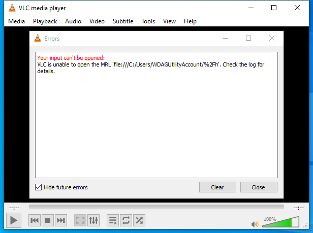
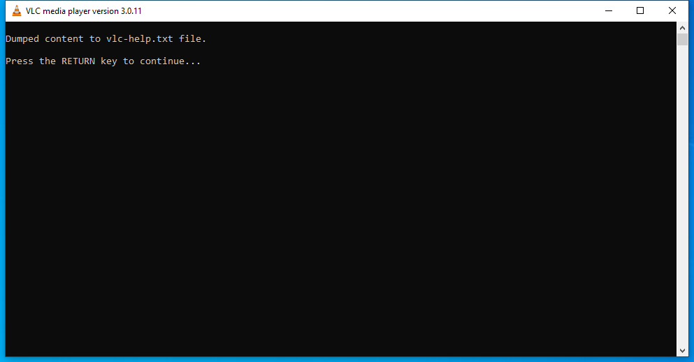
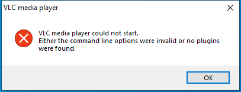

---
title: vlc.exe | VLC media player
excerpt: What is vlc.exe?
---

# vlc.exe 

* File Path: `C:\Program Files\VideoLAN\VLC\vlc.exe`
* Description: VLC media player

## Screenshot

## Hashes

Type | Hash
-- | --
MD5 | `3FB97050A420F75BC2FFA7AFE0457448`
SHA1 | `245FED3416B3F15DC99117A7054D3D70DAFEB8D4`
SHA256 | `4A6DEA6A201472896281201006DFD65DE7FF325E9DE02AE0B0C5C45A647D5F99`
SHA384 | `3B5F75ECE1F4D20EFE6D2C67696F037E9F6AEF2D366257E90434D423420793CBC97FD6E1E5DCBCAD15B8E7DE3C0E1996`
SHA512 | `03402299BA0EEFBD9E418A8332214E3A6B96EA2ECA65ED31632E1CFD46CE5ED7A131D36C1686C30B66BBFBB136D66AEB6017C402CB3ED2DC9752A36EFE3B0F02`
SSDEEP | `24576:FZ3LAiio85Z15DWtBgz1L1uUJ8pzzzYzzz0zzz3zzzb9:rLAiioEZ15WtB3pt9`
IMP | `8E8DD7AD3D2126158CBCB6C64D7F49DB`
PESHA1 | `06ACD3C21DFA11A17E79EA0AB2332F7AA112789B`
PE256 | `604B82C1E477C3B16441EE40B3E110C4448626CC7FF3CE356B2726EDE751418E`

## Runtime Data

### Child Processes:
conhost.exe

### Window Title:
VLC media player

### Open Handles:

Path | Type
-- | --
(R-D)   C:\Windows\Fonts\StaticCache.dat | File
(R-D)   C:\Windows\System32\en-US\KernelBase.dll.mui | File
(R-D)   C:\Windows\System32\en-US\user32.dll.mui | File
(RW-)   C:\Windows\WinSxS\amd64_microsoft.windows.common-controls_6595b64144ccf1df_6.0.19041.488_none_ca04af081b815d21 | File
(RW-)   C:\xCyclopedia | File
\BaseNamedObjects\__ComCatalogCache__ | Section
\BaseNamedObjects\NLS_CodePage_1252_3_2_0_0 | Section
\BaseNamedObjects\NLS_CodePage_437_3_2_0_0 | Section
\BaseNamedObjects\windows_shell_global_counters | Section
\Sessions\1\BaseNamedObjects\1abcHWNDInterface:10d08aa | Section
\Sessions\1\BaseNamedObjects\1abcHWNDInterface:15708fa | Section
\Sessions\1\BaseNamedObjects\1abcHWNDInterface:8b0900 | Section
\Sessions\1\BaseNamedObjects\windows_shell_global_counters | Section
\Sessions\1\Windows\Theme2547664911 | Section
\Windows\Theme3854699184 | Section

### Loaded Modules:

Path |
-- |
C:\Program Files\VideoLAN\VLC\libvlc.dll |
C:\Program Files\VideoLAN\VLC\libvlccore.dll |
C:\Program Files\VideoLAN\VLC\vlc.exe |
C:\Windows\System32\ADVAPI32.dll |
C:\Windows\System32\GDI32.dll |
C:\Windows\System32\gdi32full.dll |
C:\Windows\System32\KERNEL32.DLL |
C:\Windows\System32\KERNELBASE.dll |
C:\Windows\System32\msvcp_win.dll |
C:\Windows\System32\msvcrt.dll |
C:\Windows\SYSTEM32\ntdll.dll |
C:\Windows\System32\RPCRT4.dll |
C:\Windows\System32\sechost.dll |
C:\Windows\System32\SHELL32.dll |
C:\Windows\System32\ucrtbase.dll |
C:\Windows\System32\USER32.dll |
C:\Windows\System32\win32u.dll |
C:\Windows\SYSTEM32\WININET.dll |
C:\Windows\System32\WS2_32.dll |

## Signature

* Status: Signature verified.
* Serial: `0FA5B80428F4624CF9672211E1956FBE`
* Thumbprint: `42EC9B8FF9A4770E09A4D2F40F4EBCFA10380FC1`
* Issuer: CN=DigiCert SHA2 Assured ID Code Signing CA, OU=www.digicert.com, O=DigiCert Inc, C=US
* Subject: CN=VideoLAN, O=VideoLAN, L=Paris, C=FR

## File Metadata

* Original Filename: vlc.exe
* Product Name: VLC media player
* Company Name: VideoLAN
* File Version: 3.0.11
* Product Version: 3,0,11,0
* Language: English (United States)
* Legal Copyright: Copyright  1996-2020 VideoLAN and VLC Authors
* Machine Type: 64-bit

## File Scan

* VirusTotal Detections: 0/66
* VirusTotal Link: https://www.virustotal.com/gui/file/4a6dea6a201472896281201006dfd65de7ff325e9de02ae0b0c5c45a647d5f99/detection/

MIT License. Copyright (c) 2020 Strontic.

