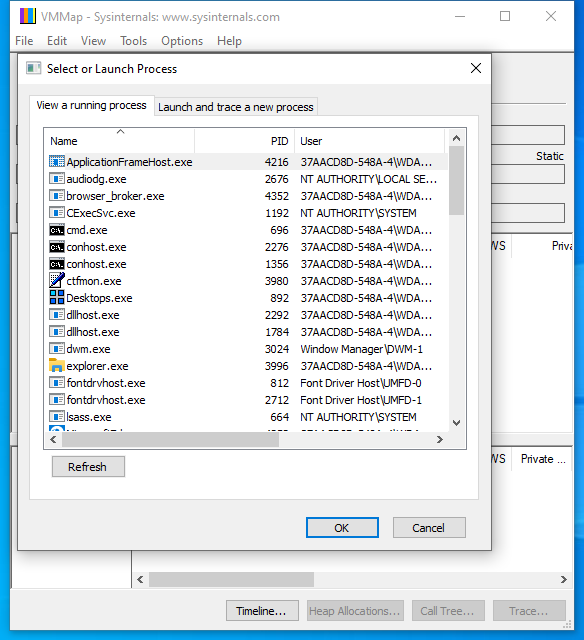
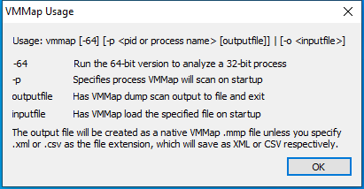

---
title: vmmap64.exe | Vmmap - process memory analyzer
excerpt: What is vmmap64.exe?
---

# vmmap64.exe 

* File Path: `C:\SysinternalsSuite\vmmap64.exe`
* Description: Vmmap - process memory analyzer

## Screenshot

## Hashes

Type | Hash
-- | --
MD5 | `46265A5B8B362D94D818005877672839`
SHA1 | `F93C6E0BC6F9111E3242E2A3C7B4363A54D73267`
SHA256 | `7741EA312099ACA6C9BBFE4004A832C01921CC46B73A8116A9913D8047D9DC1A`
SHA384 | `8C0BC87148FB10D848B735C43049828ED3EE8A1796CF65DEDD3D473D21F23D249991277B6618B2F05E731B4DD4F9977F`
SHA512 | `7C09BC750C4042EEDAA3372EEA945C346D865A1BCBA1BE6EA7CFBC51FD95595CA90844EB582D63F363F45A455528277431D64F06217645D04942C2740101D849`
SSDEEP | `12288:DHqWrYh0P5mEnZoy5tVBFksY09imflmJW2EnHf2buylG:DHqWrYh0hvn15tTF+eim9yW2EVy`
IMP | `038325277E3D830160EECEA375AC32B0`
PESHA1 | `5A1752F9D50FB066F102B67F9A260E66C7F456D4`
PE256 | `C7A07D1FF3FF79363E4FD1F410C1777F4F35CF6FB08127CF828E6C0441FF99B0`

## Runtime Data

### Window Title:
VMMap Usage

### Open Handles:

Path | Type
-- | --
(R-D)   C:\Windows\Fonts\StaticCache.dat | File
(RW-)   C:\Windows\WinSxS\amd64_microsoft.windows.common-controls_6595b64144ccf1df_6.0.19041.488_none_ca04af081b815d21 | File
(RW-)   C:\Windows\WinSxS\amd64_microsoft.windows.gdiplus_6595b64144ccf1df_1.1.19041.508_none_faefa4f37613d18e | File
(RW-)   C:\xCyclopedia | File
\BaseNamedObjects\NLS_CodePage_1252_3_2_0_0 | Section
\BaseNamedObjects\NLS_CodePage_437_3_2_0_0 | Section
\Sessions\1\Windows\Theme2036293991 | Section
\Windows\Theme1324212991 | Section

### Loaded Modules:

Path |
-- |
C:\SysinternalsSuite\vmmap64.exe |
C:\Windows\System32\ADVAPI32.dll |
C:\Windows\System32\combase.dll |
C:\Windows\System32\COMDLG32.dll |
C:\Windows\System32\GDI32.dll |
C:\Windows\System32\gdi32full.dll |
C:\Windows\System32\IMM32.DLL |
C:\Windows\System32\KERNEL32.DLL |
C:\Windows\System32\KERNELBASE.dll |
C:\Windows\System32\msvcp_win.dll |
C:\Windows\System32\msvcrt.dll |
C:\Windows\SYSTEM32\ntdll.dll |
C:\Windows\System32\ole32.dll |
C:\Windows\System32\OLEAUT32.dll |
C:\Windows\System32\psapi.dll |
C:\Windows\System32\RPCRT4.dll |
C:\Windows\System32\sechost.dll |
C:\Windows\System32\shcore.dll |
C:\Windows\System32\SHELL32.dll |
C:\Windows\System32\SHLWAPI.dll |
C:\Windows\System32\ucrtbase.dll |
C:\Windows\System32\USER32.dll |
C:\Windows\SYSTEM32\uxtheme.dll |
C:\Windows\SYSTEM32\VERSION.dll |
C:\Windows\System32\win32u.dll |
C:\Windows\WinSxS\amd64_microsoft.windows.common-controls_6595b64144ccf1df_6.0.19041.488_none_ca04af081b815d21\COMCTL32.dll |
C:\Windows\WinSxS\amd64_microsoft.windows.gdiplus_6595b64144ccf1df_1.1.19041.508_none_faefa4f37613d18e\gdiplus.dll |

## Signature

* Status: Signature verified.
* Serial: `3300000187721772155940C709000000000187`
* Thumbprint: `2485A7AFA98E178CB8F30C9838346B514AEA4769`
* Issuer: CN=Microsoft Code Signing PCA 2011, O=Microsoft Corporation, L=Redmond, S=Washington, C=US
* Subject: CN=Microsoft Corporation, O=Microsoft Corporation, L=Redmond, S=Washington, C=US

## File Metadata

* Original Filename: Vmmap
* Product Name: Vmmap
* Company Name: Sysinternals - www.sysinternals.com
* File Version: 3.26
* Product Version: 3.26
* Language: English (United States)
* Legal Copyright: Copyright (C) 2009-2019 Mark Russinovich
* Machine Type: 64-bit

## File Scan

* VirusTotal Detections: 0/66
* VirusTotal Link: https://www.virustotal.com/gui/file/7741ea312099aca6c9bbfe4004a832c01921cc46b73a8116a9913d8047d9dc1a/detection/

## File Similarity (ssdeep match)

File | Score
-- | --
[C:\SysinternalsSuite\vmmap.exe](vmmap.exe-7618E5E6B04300DF689C6B360FE97B58.md) | 68

MIT License. Copyright (c) 2020-2021 Strontic.

