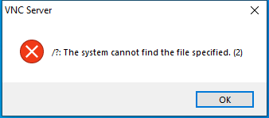
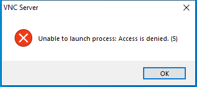

---
title: vncguihelper.exe | VNC Server
excerpt: What is vncguihelper.exe?
---

# vncguihelper.exe 

* File Path: `C:\program files\RealVNC\VNC Server\vncguihelper.exe`
* Description: VNC Server

## Screenshot

## Hashes

Type | Hash
-- | --
MD5 | `A0C4553BD12E4FE66432EA240236E5AB`
SHA1 | `E1BBF046CA49298CDC30448A810D04F9B56FB341`
SHA256 | `CC0B4DBD278443E4B2533E81B40B442A7A63F3CBF395665BC03991DB6F776399`
SHA384 | `C93E7C7B2FC1359053B2CFECBE1C15745B464EBAE598F6A377B825DA69DF21BFF00510BFC784E7E268D5876125B00C98`
SHA512 | `604D6EA1573A3408E57658E8B754B09EF75AA80E7E3D68003A68B193A2B2E49BF70D0E88F05BA1C25B4E9F227E56F70F80669960223C808A12CA5A74D76E8AE0`
SSDEEP | `12288:E6H9N29Ks8NPVougpdeCHzS4D3qZUdLjgtyAmNsNZvL6q:E6H9I9dkdmpdDT9ToUdoto0vL6q`

## Runtime Data

### Window Title:
VNC Server

### Open Handles:

Path | Type
-- | --
(R-D)   C:\Windows\Fonts\StaticCache.dat | File
(R-D)   C:\Windows\System32\en-US\KernelBase.dll.mui | File
(R-D)   C:\Windows\SystemResources\imageres.dll.mun | File
(RW-)   C:\Users\user\Documents | File
(RW-)   C:\Windows\WinSxS\amd64_microsoft.windows.common-controls_6595b64144ccf1df_6.0.19041.1_none_b555e41d4684ddec | File
\BaseNamedObjects\NLS_CodePage_1252_3_2_0_0 | Section
\BaseNamedObjects\NLS_CodePage_437_3_2_0_0 | Section
\Sessions\1\Windows\Theme4048709601 | Section
\Windows\Theme603176458 | Section

### Loaded Modules:

Path |
-- |
C:\program files\RealVNC\VNC Server\vncguihelper.exe |
C:\Windows\System32\ADVAPI32.dll |
C:\Windows\System32\combase.dll |
C:\Windows\System32\GDI32.dll |
C:\Windows\System32\gdi32full.dll |
C:\Windows\System32\KERNEL32.DLL |
C:\Windows\System32\KERNELBASE.dll |
C:\Windows\System32\msvcp_win.dll |
C:\Windows\System32\msvcrt.dll |
C:\Windows\SYSTEM32\NETAPI32.dll |
C:\Windows\SYSTEM32\ntdll.dll |
C:\Windows\System32\ole32.dll |
C:\Windows\System32\OLEAUT32.dll |
C:\Windows\System32\RPCRT4.dll |
C:\Windows\SYSTEM32\SAMCLI.DLL |
C:\Windows\System32\sechost.dll |
C:\Windows\System32\SHELL32.dll |
C:\Windows\System32\ucrtbase.dll |
C:\Windows\System32\USER32.dll |
C:\Windows\System32\win32u.dll |

## Signature

* Status: Signature verified.
* Serial: `2EB260DBC51427A731CD2519701AE3C0`
* Thumbprint: `9A6B5D6FC7D2F940C91AF3875B61849B129F85A6`
* Issuer: CN=VeriSign Class 3 Code Signing 2010 CA, OU=Terms of use at https://www.verisign.com/rpa (c)10, OU=VeriSign Trust Network, O="VeriSign, Inc.", C=US
* Subject: CN=RealVNC Ltd, O=RealVNC Ltd, L=Cambridge, S=Cambridgeshire, C=GB

## File Metadata

* Original Filename: vncguihelper.exe
* Product Name: VNC
* Company Name: RealVNC Ltd
* File Version: 6.1.1 (r28093)
* Product Version: 6.1.1 (r28093)
* Language: English (United Kingdom)
* Legal Copyright: Copyright  2002-2017 RealVNC Ltd.

MIT License. Copyright (c) 2020 Strontic.

