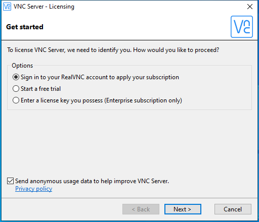

---
title: vnclicensewiz.exe | VNC Server Licensing
excerpt: What is vnclicensewiz.exe?
---

# vnclicensewiz.exe 

* File Path: `C:\Program Files\RealVNC\VNC Server\vnclicensewiz.exe`
* Description: VNC Server Licensing

## Screenshot

## Hashes

Type | Hash
-- | --
MD5 | `03ABF271C225FF746FACB7012D5FA664`
SHA1 | `E821CA4D38B3E17D734B44422D3E41A78477D93B`
SHA256 | `7DBF0644D230508BB30F26A37C68D1DE664C816682B15D9070D64A98671ED625`
SHA384 | `86605431ECEAF52A553D4448CF340EB9C4CD662AABAFF55B70FF902632839E66C3AD145E2D90CEBC2982A3F766A2B862`
SHA512 | `20A2A1D7AB2A1D29CFAED5AC195E2E1985FE3EAFA86B995D8857A0E5814C7D51118573F911F6D8759AB9F3277AA028E9EFE09619848C0139345CC36092ED16DF`
SSDEEP | `49152:VB+nu27CGf/bn+KUYQHF9XbNR8YOfu4Lia05EKcpZTWrwoZJ46FMiLe9GzdrIqqz:k7Cq+kQPofu3awuZSP7S+Zqz`
IMP | `67BBAD10C541BA59647219CD290FBC0D`
PESHA1 | `A5F8EC4FDB98DFBE1835DC1E860638FD0EA43220`
PE256 | `123BA54006AF54F2DCDCC5C49C421617FEAB166BE482A647FFEA960E91FACF80`

## Runtime Data

### Window Title:
VNC Server - Licensing

### Open Handles:

Path | Type
-- | --
(R-D)   C:\Windows\Fonts\StaticCache.dat | File
(R-D)   C:\Windows\System32\en-US\KernelBase.dll.mui | File
(RW-)   C:\Windows\WinSxS\amd64_microsoft.windows.common-controls_6595b64144ccf1df_6.0.19041.488_none_ca04af081b815d21 | File
(RW-)   C:\xCyclopedia | File
\BaseNamedObjects\NLS_CodePage_1252_3_2_0_0 | Section
\BaseNamedObjects\NLS_CodePage_437_3_2_0_0 | Section
\Sessions\1\BaseNamedObjects\windows_shell_global_counters | Section
\Sessions\1\Windows\Theme2547664911 | Section
\Windows\Theme3854699184 | Section

### Loaded Modules:

Path |
-- |
C:\Program Files\RealVNC\VNC Server\vnclicensewiz.exe |
C:\Windows\System32\ADVAPI32.dll |
C:\Windows\System32\combase.dll |
C:\Windows\System32\CRYPT32.dll |
C:\Windows\SYSTEM32\DSROLE.DLL |
C:\Windows\System32\GDI32.dll |
C:\Windows\System32\gdi32full.dll |
C:\Windows\System32\IMM32.DLL |
C:\Windows\System32\KERNEL32.DLL |
C:\Windows\System32\KERNELBASE.dll |
C:\Windows\SYSTEM32\LOGONCLI.DLL |
C:\Windows\System32\msvcp_win.dll |
C:\Windows\System32\msvcrt.dll |
C:\Windows\SYSTEM32\NETAPI32.dll |
C:\Windows\SYSTEM32\NETUTILS.DLL |
C:\Windows\SYSTEM32\ntdll.dll |
C:\Windows\System32\ole32.dll |
C:\Windows\System32\OLEAUT32.dll |
C:\Windows\System32\RPCRT4.dll |
C:\Windows\SYSTEM32\SAMCLI.DLL |
C:\Windows\System32\sechost.dll |
C:\Windows\System32\SHELL32.dll |
C:\Windows\SYSTEM32\SRVCLI.DLL |
C:\Windows\System32\ucrtbase.dll |
C:\Windows\System32\USER32.dll |
C:\Windows\System32\win32u.dll |
C:\Windows\System32\WS2_32.dll |
C:\Windows\WinSxS\amd64_microsoft.windows.common-controls_6595b64144ccf1df_6.0.19041.488_none_ca04af081b815d21\COMCTL32.dll |

## Signature

* Status: Signature verified.
* Serial: `2EB260DBC51427A731CD2519701AE3C0`
* Thumbprint: `9A6B5D6FC7D2F940C91AF3875B61849B129F85A6`
* Issuer: CN=VeriSign Class 3 Code Signing 2010 CA, OU=Terms of use at https://www.verisign.com/rpa (c)10, OU=VeriSign Trust Network, O="VeriSign, Inc.", C=US
* Subject: CN=RealVNC Ltd, O=RealVNC Ltd, L=Cambridge, S=Cambridgeshire, C=GB

## File Metadata

* Original Filename: vnclicensewiz.exe
* Product Name: VNC
* Company Name: RealVNC Ltd
* File Version: 6.1.1 (r28093)
* Product Version: 6.1.1 (r28093)
* Language: English (United Kingdom)
* Legal Copyright: Copyright  2002-2017 RealVNC Ltd.
* Machine Type: 64-bit

## File Scan

* VirusTotal Detections: 0/68
* VirusTotal Link: https://www.virustotal.com/gui/file/7dbf0644d230508bb30f26a37c68d1de664c816682b15d9070d64a98671ed625/detection/

MIT License. Copyright (c) 2020 Strontic.

