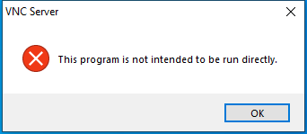

---
title: vncserverui.exe | VNC Server
excerpt: What is vncserverui.exe?
---

# vncserverui.exe 

* File Path: `C:\program files\RealVNC\VNC Server\vncserverui.exe`
* Description: VNC Server

## Screenshot

## Hashes

Type | Hash
-- | --
MD5 | `9522A7365F0884599A5A07B3FFDDFD1A`
SHA1 | `3DB85E3472DF0637658426CCA2D07608F940DCF3`
SHA256 | `0D5A1632B2E3C80EEA0C1378DE9C8ACA8F140E881F8A676E31602C25CE3F02D9`
SHA384 | `48C91B15C1031F98B950D7372B3A43DFA2D494214ABE4FED0E8D125B404251A15EBA8DA66FB1CDEBA699E78382CBF8E3`
SHA512 | `88A5ABFB423DF080FEEBAE9C1FE3FDF6A00097C2213593065BF1DDD5DAF46F4388FC45BED3291216E896E9BC070611920A0714ACC3C5F2F1C023C41560C3D377`
SSDEEP | `49152:nIN57mKjUWPZuCnW+TchXNi8k6q9eJqM8kYfnBEHtEC0kdfnwwUm5XQvXhyuFPPN:nIBnbsg8otfnEE3YtUzXFGkxhgBz4`

## Runtime Data

### Window Title:
VNC Server

### Open Handles:

Path | Type
-- | --
(R-D)   C:\Windows\Fonts\StaticCache.dat | File
(R-D)   C:\Windows\System32\en-US\KernelBase.dll.mui | File
(R-D)   C:\Windows\SystemResources\imageres.dll.mun | File
(RW-)   C:\Users\user\Documents | File
(RW-)   C:\Windows\WinSxS\amd64_microsoft.windows.common-controls_6595b64144ccf1df_6.0.19041.1_none_b555e41d4684ddec | File
\BaseNamedObjects\NLS_CodePage_1252_3_2_0_0 | Section
\BaseNamedObjects\NLS_CodePage_437_3_2_0_0 | Section
\Sessions\1\BaseNamedObjects\windows_shell_global_counters | Section
\Sessions\1\Windows\Theme4048709601 | Section
\Windows\Theme603176458 | Section

### Loaded Modules:

Path |
-- |
C:\program files\RealVNC\VNC Server\vncserverui.exe |
C:\Windows\System32\KERNEL32.DLL |
C:\Windows\System32\KERNELBASE.dll |
C:\Windows\SYSTEM32\ntdll.dll |

## Signature

* Status: Signature verified.
* Serial: `2EB260DBC51427A731CD2519701AE3C0`
* Thumbprint: `9A6B5D6FC7D2F940C91AF3875B61849B129F85A6`
* Issuer: CN=VeriSign Class 3 Code Signing 2010 CA, OU=Terms of use at https://www.verisign.com/rpa (c)10, OU=VeriSign Trust Network, O="VeriSign, Inc.", C=US
* Subject: CN=RealVNC Ltd, O=RealVNC Ltd, L=Cambridge, S=Cambridgeshire, C=GB

## File Metadata

* Original Filename: vncserverui.exe
* Product Name: VNC
* Company Name: RealVNC Ltd
* File Version: 6.1.1 (r28093)
* Product Version: 6.1.1 (r28093)
* Language: English (United Kingdom)
* Legal Copyright: Copyright  2002-2017 RealVNC Ltd.

MIT License. Copyright (c) 2020 Strontic.

