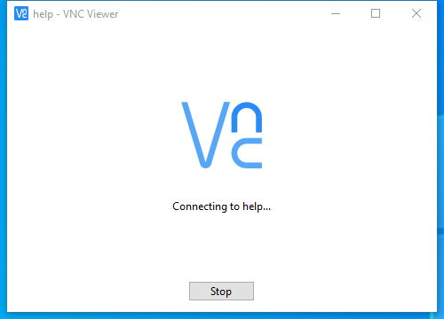

---
title: vncviewer.exe | VNC Viewer
excerpt: What is vncviewer.exe?
---

# vncviewer.exe 

* File Path: `C:\Program Files\RealVNC\VNC Viewer\vncviewer.exe`
* Description: VNC Viewer

## Screenshot



## Hashes

Type | Hash
-- | --
MD5 | `6FAFF16938EEF2CB00E96A5CF410FD9C`
SHA1 | `F0A02A30DCAD1E5B5A8718A2BE624BB533E13114`
SHA256 | `E42481F62FBD0D63E506CB01E97CD4DEA33BF005FFFC890BF967B0E52B3282A9`
SHA384 | `4BE7209B348C97E561D171BC39683E72C76F89A0B35F0677CD678184ED6CD21D20EDAA032B1B7886370513D1340B464B`
SHA512 | `A8E15E98D7FB33208A069F61E62A0CAD9EBCB04D7F3F033B934A5BF2A49F2D749668E04DAC75D2743FF7513F0C2A59639C6115753625E1A611E3B34DF40BE3A6`
SSDEEP | `98304:EVsNBuNy9pfguno8f298UmrZLz2A26+5ioHDqeoT:EuNB9pfgunh2iUm9Lz2AcH3oT`
IMP | `C83F3BFBCBDE44BDFA49644AAB0BAFE3`
PESHA1 | `375001AF6BD5315BC4823B996E0A7296120779C6`
PE256 | `9C765E8B2A21082179A1B3B2328FE85BF65D9D994BCBF6E1AFADBC1D13DAB7A1`

## Runtime Data

### Usage (stderr):
```cmhg
VNC(R) Viewer 6.1.1 (r28093) x64 (May 19 2017 12:40:09)
Copyright (C) 2002-2017 RealVNC Ltd.
RealVNC and VNC are trademarks of RealVNC Ltd and are protected by trademark
registrations and/or pending trademark applications in the European Union,
United States of America and other jurisdictions.
Protected by UK patent 2481870; US patent 8760366; EU patent 2652951.
See https://www.realvnc.com for information on VNC.
For third party acknowledgements see:
https://www.realvnc.com/docs/6.1/foss.html
<11> 2020-09-24T22:28:03.060Z 37AACD8D-548A-4 vncviewer[7976]: vncviewer: fileOpen(C:\temp\strontic-xcyclopedia\notepad.exe): Access is denied. (5)

```

### Window Title:
VNC Viewer

### Open Handles:

Path | Type
-- | --
(R-D)   C:\Windows\Fonts\StaticCache.dat | File
(R-D)   C:\Windows\System32\en-US\KernelBase.dll.mui | File
(R-D)   C:\Windows\SystemResources\imageres.dll.mun | File
(RW-)   C:\Windows\WinSxS\amd64_microsoft.windows.common-controls_6595b64144ccf1df_6.0.19041.488_none_ca04af081b815d21 | File
(RW-)   C:\xCyclopedia | File
\BaseNamedObjects\NLS_CodePage_1252_3_2_0_0 | Section
\BaseNamedObjects\NLS_CodePage_437_3_2_0_0 | Section
\Sessions\1\BaseNamedObjects\windows_shell_global_counters | Section
\Sessions\1\Windows\Theme2547664911 | Section
\Windows\Theme3854699184 | Section


### Loaded Modules:

Path |
-- |
C:\Program Files\RealVNC\VNC Viewer\vncviewer.exe |
C:\Windows\System32\CRYPT32.dll |
C:\Windows\System32\GDI32.dll |
C:\Windows\System32\IMM32.dll |
C:\Windows\System32\KERNEL32.DLL |
C:\Windows\System32\KERNELBASE.dll |
C:\Windows\System32\msvcrt.dll |
C:\Windows\SYSTEM32\NETAPI32.dll |
C:\Windows\SYSTEM32\ntdll.dll |
C:\Windows\System32\RPCRT4.dll |
C:\Windows\System32\ucrtbase.dll |
C:\Windows\System32\USER32.dll |
C:\Windows\SYSTEM32\VERSION.dll |
C:\Windows\System32\win32u.dll |
C:\Windows\System32\WS2_32.dll |
C:\Windows\WinSxS\amd64_microsoft.windows.common-controls_6595b64144ccf1df_6.0.19041.488_none_ca04af081b815d21\COMCTL32.dll |


## Signature

* Status: Signature verified.
* Serial: `2EB260DBC51427A731CD2519701AE3C0`
* Thumbprint: `9A6B5D6FC7D2F940C91AF3875B61849B129F85A6`
* Issuer: CN=VeriSign Class 3 Code Signing 2010 CA, OU=Terms of use at https://www.verisign.com/rpa (c)10, OU=VeriSign Trust Network, O="VeriSign, Inc.", C=US
* Subject: CN=RealVNC Ltd, O=RealVNC Ltd, L=Cambridge, S=Cambridgeshire, C=GB

## File Metadata

* Original Filename: vncviewer.exe
* Product Name: VNC
* Company Name: RealVNC Ltd
* File Version: 6.1.1 (r28093)
* Product Version: 6.1.1 (r28093)
* Language: English (United Kingdom)
* Legal Copyright: Copyright  2002-2017 RealVNC Ltd.
* Machine Type: 64-bit

## File Scan

* VirusTotal Detections: 0/72
* VirusTotal Link: https://www.virustotal.com/gui/file/e42481f62fbd0d63e506cb01e97cd4dea33bf005fffc890bf967b0e52b3282a9/detection/


MIT License. Copyright (c) 2020-2021 Strontic.


